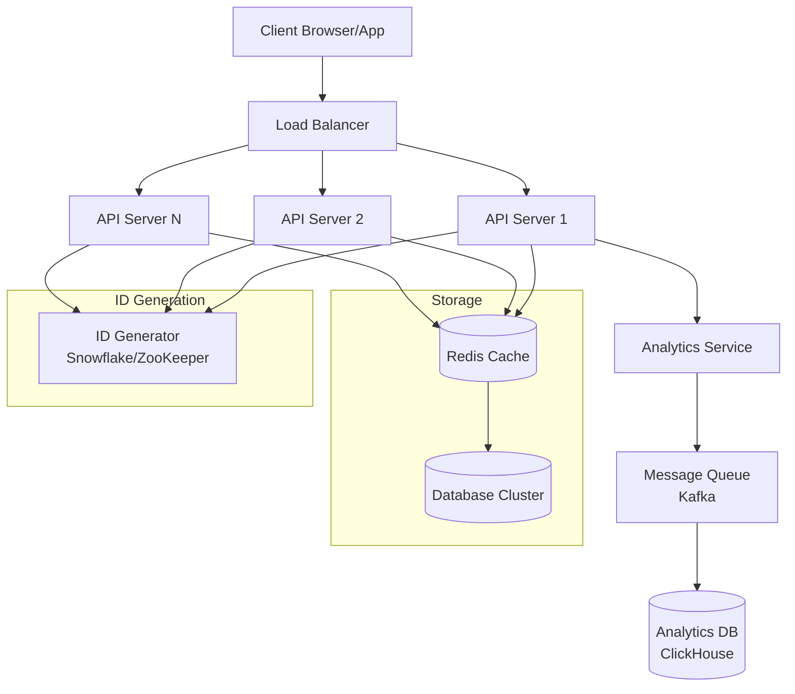
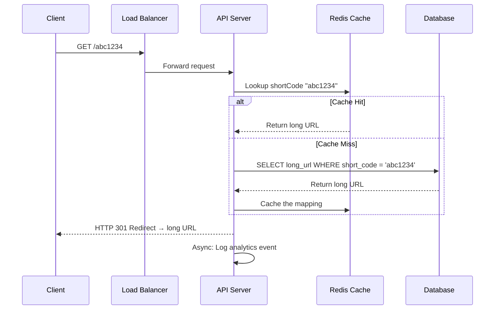
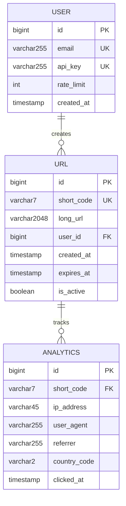
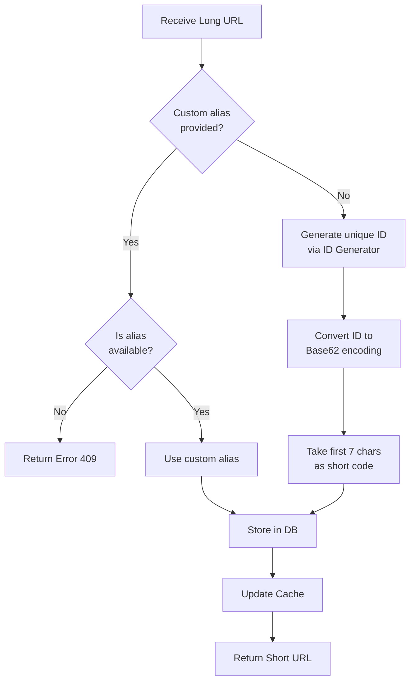
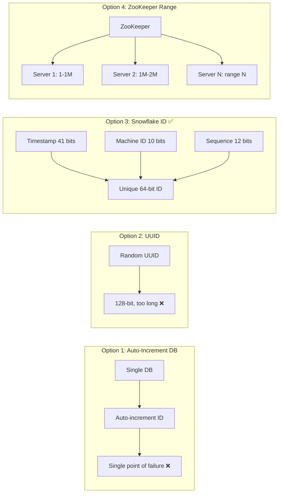
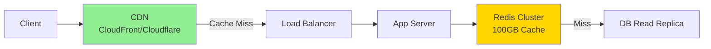
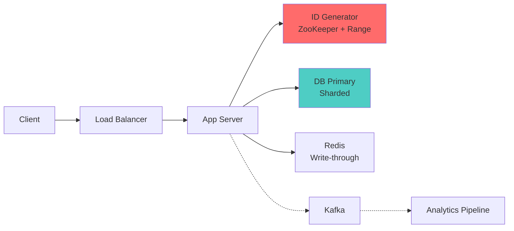

# 1. URL Shortener (TinyURL)

> **Difficulty**: Medium | **Asked by**: Google, Meta, Amazon, Microsoft, Bloomberg

## Table of Contents
- [Requirements](#requirements)
- [Capacity Estimation](#capacity-estimation)
- [High-Level Design](#high-level-design)
- [Low-Level Design](#low-level-design)
- [Implementation](#implementation)
- [Limitations & Improvements](#limitations--improvements)

---

## Requirements

### Functional Requirements
1. Given a long URL, generate a shorter unique alias (short link)
2. When user accesses the short link, redirect to the original URL
3. Users can optionally pick a custom short link
4. Links expire after a configurable timespan (default: 5 years)
5. Analytics: track click count, referrer, geolocation

### Non-Functional Requirements
1. **High Availability**: System should be 99.99% available
2. **Low Latency**: Redirection should happen in < 100ms
3. **Short URLs should not be predictable** (security)
4. **Scale**: 100M URLs created per day, 10:1 read:write ratio

---

## Capacity Estimation

```
Write requests: 100M / day = ~1160 URLs/sec
Read requests:  1B / day   = ~11,600 redirects/sec

URL storage (5 years):
  100M * 365 * 5 = 182.5 Billion URLs
  Average URL size: 500 bytes
  Total storage: 182.5B * 500 bytes ≈ 91.25 TB

Cache (80/20 rule - 20% hot URLs):
  Daily reads: 1B * 500 bytes = 500 GB/day
  Cache: 20% * 500 GB = 100 GB (fits in memory)

Short URL length:
  Base62 encoding: [a-zA-Z0-9] = 62 characters
  62^7 ≈ 3.5 Trillion combinations (sufficient)
```

---

## High-Level Design

### Architecture Overview



### API Design

```
POST /api/v1/shorten
  Request:  { "long_url": "https://example.com/very/long/path", "custom_alias": "mylink", "expiry": "2029-01-01" }
  Response: { "short_url": "https://tinyurl.com/abc1234", "expires_at": "2029-01-01T00:00:00Z" }

GET /:shortCode
  Response: HTTP 301 (Permanent) or 302 (Temporary) Redirect
  Header:   Location: https://example.com/very/long/path

GET /api/v1/stats/:shortCode
  Response: { "clicks": 15234, "created_at": "...", "top_countries": [...] }

DELETE /api/v1/url/:shortCode
  Response: { "status": "deleted" }
```

### Redirect Flow



---

## Low-Level Design

### Database Schema



### URL Shortening Algorithm



### Base62 Encoding

```
Characters: a-z (26) + A-Z (26) + 0-9 (10) = 62

Example: ID = 12345678
  12345678 / 62 = 199124 remainder 50 → 'Y'
  199124   / 62 = 3211   remainder 42 → 'q'
  3211     / 62 = 51     remainder 49 → 'X'
  51       / 62 = 0      remainder 51 → 'Z'
  
  Result: "ZXqY" (padded to 7 chars: "000ZXqY")
```

### ID Generation Strategies



### Component Details

#### Cache Strategy
- **Technology**: Redis Cluster
- **Eviction Policy**: LRU (Least Recently Used)
- **TTL**: Match URL expiry time
- **Pattern**: Cache-aside (read) + Write-through (create)

#### Database Choice
- **Primary**: PostgreSQL (ACID, strong consistency)
- **Sharding Key**: `short_code` (hash-based sharding)
- **Index**: B-Tree index on `short_code` (O(log n) lookup)
- **Read Replicas**: 3-5 replicas per shard for read scaling

---

## Implementation

### Core Service (Python)

```python
import hashlib
import time
import redis
import psycopg2
from flask import Flask, redirect, request, jsonify

app = Flask(__name__)
redis_client = redis.Redis(host='localhost', port=6379, db=0)

BASE62 = "abcdefghijklmnopqrstuvwxyzABCDEFGHIJKLMNOPQRSTUVWXYZ0123456789"

def encode_base62(num: int) -> str:
    """Convert integer to base62 string."""
    if num == 0:
        return BASE62[0]
    result = []
    while num > 0:
        result.append(BASE62[num % 62])
        num //= 62
    return ''.join(reversed(result)).zfill(7)

def generate_short_code(long_url: str, user_id: int) -> str:
    """Generate unique short code using Snowflake-like ID."""
    # Simplified: In production, use distributed ID generator
    unique_id = int(time.time() * 1000) << 22  # timestamp
    unique_id |= (user_id % 1024) << 12         # machine/user bits
    unique_id |= int(time.time() * 1000000) % 4096  # sequence
    return encode_base62(unique_id)[:7]

@app.route('/api/v1/shorten', methods=['POST'])
def shorten_url():
    data = request.get_json()
    long_url = data.get('long_url')
    custom_alias = data.get('custom_alias')
    
    if custom_alias:
        # Check if custom alias is available
        if redis_client.exists(custom_alias) or db_lookup(custom_alias):
            return jsonify({"error": "Alias already taken"}), 409
        short_code = custom_alias
    else:
        short_code = generate_short_code(long_url, user_id=1)
    
    # Store in DB and Cache
    db_store(short_code, long_url)
    redis_client.setex(short_code, 86400 * 365, long_url)  # 1 year TTL
    
    return jsonify({
        "short_url": f"https://tinyurl.com/{short_code}",
        "short_code": short_code
    }), 201

@app.route('/<short_code>')
def redirect_url(short_code: str):
    # Try cache first
    long_url = redis_client.get(short_code)
    
    if not long_url:
        # Cache miss - query DB
        long_url = db_lookup(short_code)
        if long_url:
            redis_client.setex(short_code, 86400, long_url)  # Cache for 1 day
    
    if long_url:
        # Async: log analytics
        log_analytics(short_code, request)
        return redirect(long_url.decode() if isinstance(long_url, bytes) else long_url, code=301)
    
    return jsonify({"error": "URL not found"}), 404
```

### Rate Limiting Middleware

```python
from functools import wraps

def rate_limit(max_requests=100, window=3600):
    """Rate limit decorator using Redis sliding window."""
    def decorator(f):
        @wraps(f)
        def wrapped(*args, **kwargs):
            key = f"rate:{request.remote_addr}"
            current = redis_client.get(key)
            if current and int(current) >= max_requests:
                return jsonify({"error": "Rate limit exceeded"}), 429
            pipe = redis_client.pipeline()
            pipe.incr(key)
            pipe.expire(key, window)
            pipe.execute()
            return f(*args, **kwargs)
        return wrapped
    return decorator
```

---

## Scalability Deep Dive

### Read Path Optimization



### Write Path Optimization



---

## Limitations & Improvements

### Current Limitations

| Limitation | Impact | Severity |
|-----------|--------|----------|
| Single region deployment | High latency for global users | High |
| Base62 collision possibility | URL generation failure | Medium |
| No link preview/metadata | Poor social media sharing | Low |
| Rate limiting per IP only | Bypassable with multiple IPs | Medium |
| 301 redirect loses analytics | Cannot track repeat visits | Medium |

### Improvement Areas

1. **Multi-Region Deployment**
   - Deploy in 3+ AWS regions with Route53 latency-based routing
   - Use DynamoDB Global Tables for cross-region replication
   - CDN edge caching for redirects (sub-10ms latency)

2. **Enhanced Security**
   - Anti-abuse: ML-based malicious URL detection
   - CAPTCHA for high-volume creation
   - Link scanning with Google Safe Browsing API
   - API key authentication + OAuth2

3. **Analytics Enhancement**
   - Real-time dashboard with ClickHouse/Druid
   - A/B testing support (multiple long URLs per short URL)
   - QR code generation
   - UTM parameter tracking

4. **Reliability**
   - Circuit breaker pattern for DB failures
   - Graceful degradation: serve from cache when DB is down
   - Bloom filter to quickly check non-existent short codes
   - Regular data backup and disaster recovery plan

5. **Cost Optimization**
   - Archive expired URLs to cold storage (S3 Glacier)
   - Tiered caching: L1 (local) → L2 (Redis) → L3 (DB)
   - Auto-scaling based on traffic patterns

---

## Key Interview Discussion Points

1. **Why Base62 over Base64?** Base62 avoids `+` and `/` which cause URL encoding issues
2. **301 vs 302 redirect?** 301 = permanent (browser caches, less analytics); 302 = temporary (always hits server, better analytics)
3. **How to handle hash collisions?** Append incremental counter, rehash, or use unique ID generator
4. **CAP theorem choice?** AP (Availability + Partition tolerance) — eventual consistency is acceptable
5. **How to prevent abuse?** Rate limiting + API keys + URL scanning + CAPTCHA
