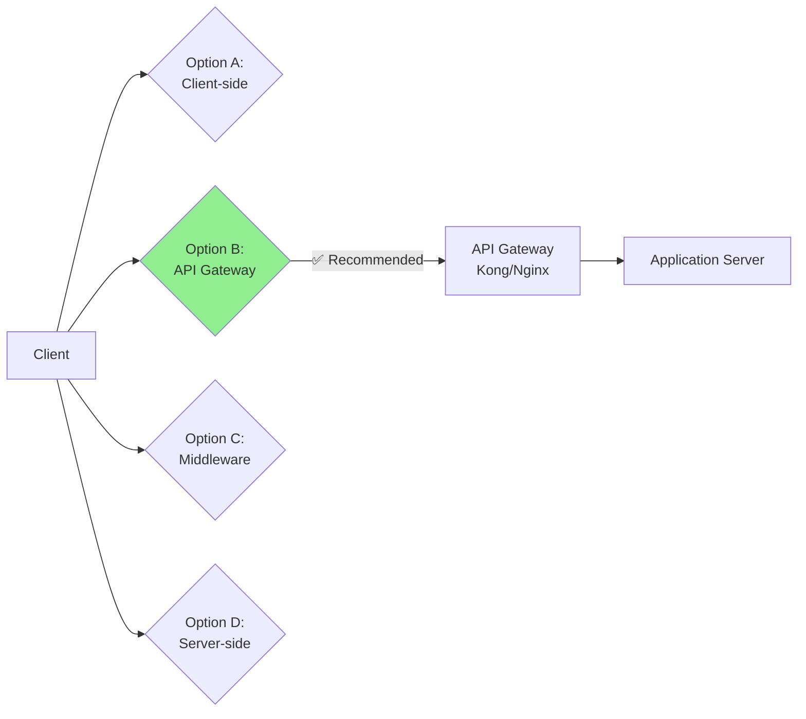
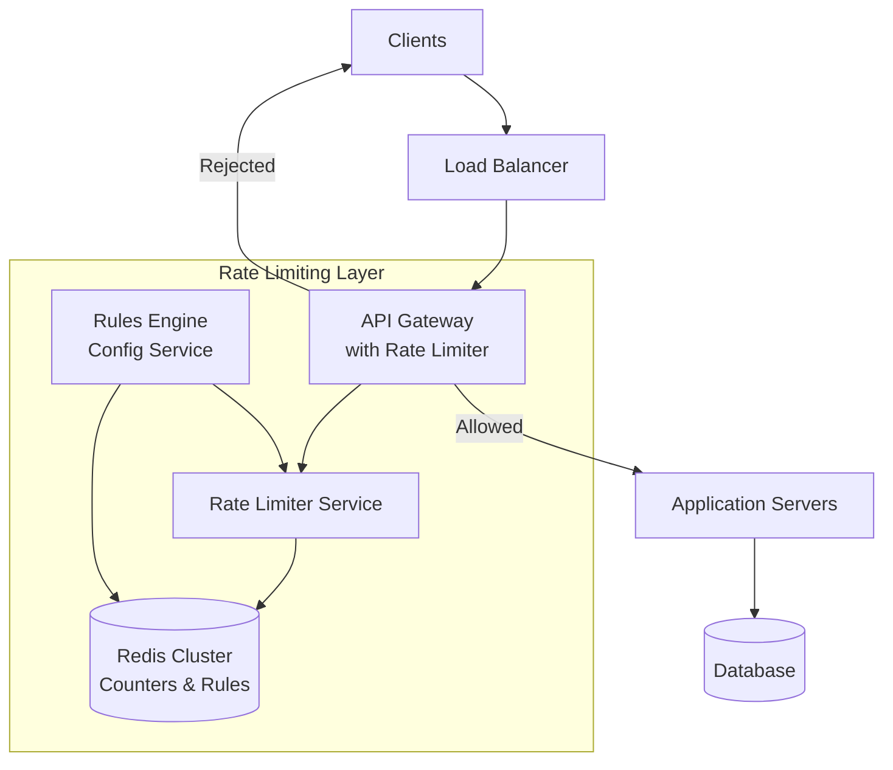
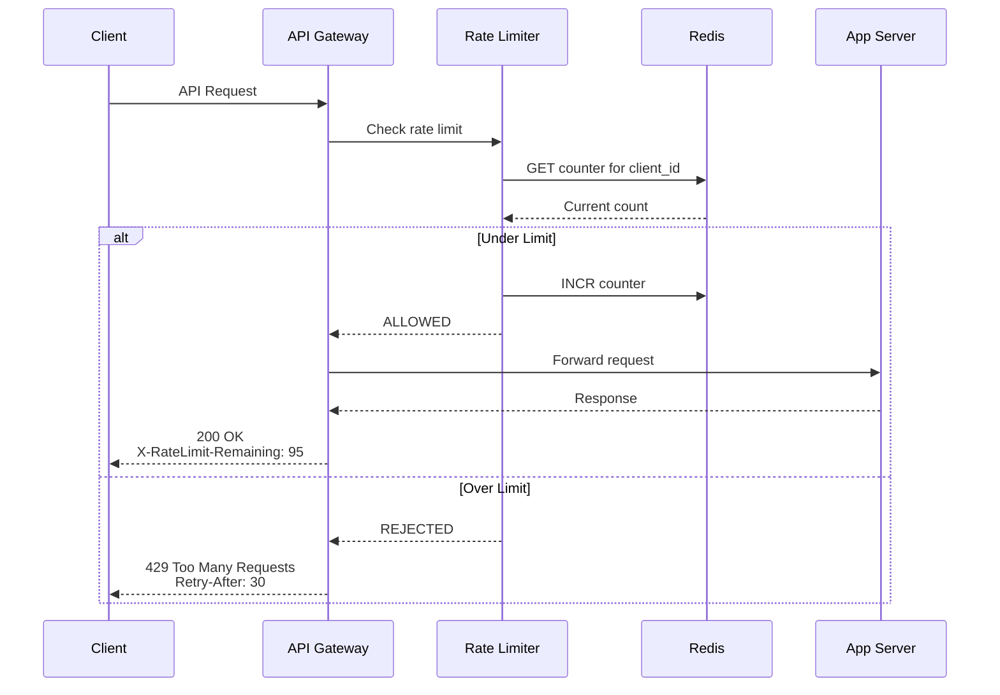
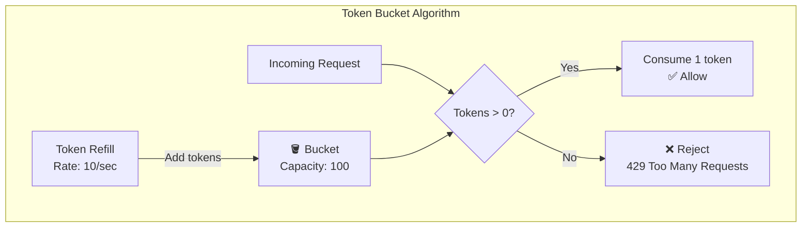
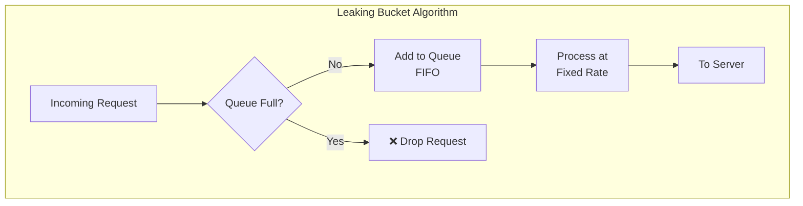
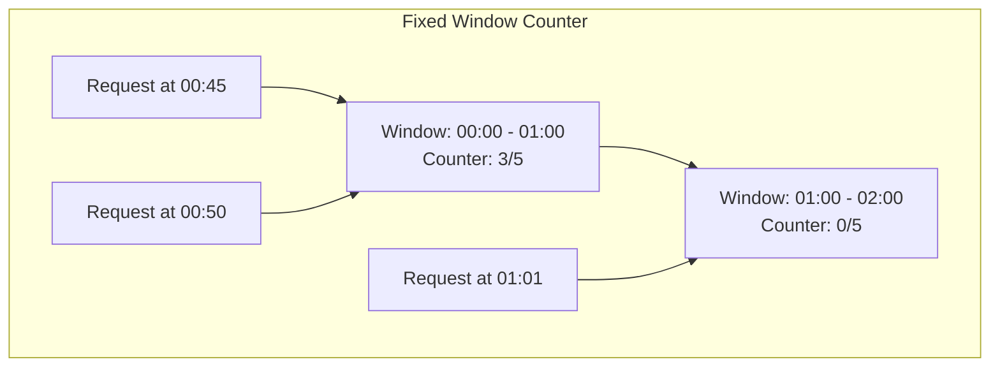
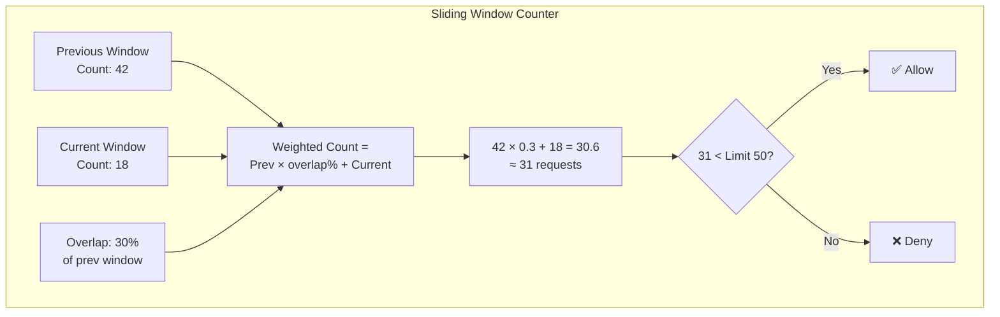
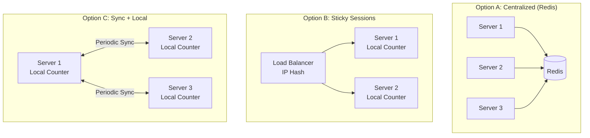
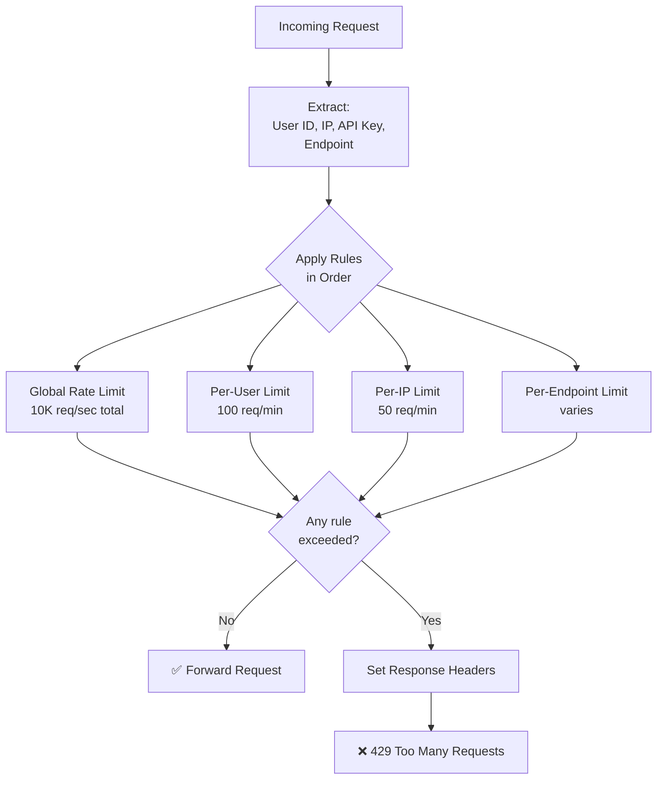

# 2. Rate Limiter

> **Difficulty**: Medium | **Asked by**: Stripe, Amazon, Google, Uber, Cloudflare

## Table of Contents
- [Requirements](#requirements)
- [Capacity Estimation](#capacity-estimation)
- [High-Level Design](#high-level-design)
- [Low-Level Design](#low-level-design)
- [Implementation](#implementation)
- [Limitations & Improvements](#limitations--improvements)

---

## Requirements

### Functional Requirements
1. Limit the number of requests a client can send within a time window
2. Support multiple rate limiting rules (per user, per IP, per API endpoint)
3. Return appropriate HTTP headers (X-RateLimit-Remaining, Retry-After)
4. Support both hard and soft limits (throttling vs rejection)

### Non-Functional Requirements
1. **Low Latency**: < 1ms overhead per request
2. **High Availability**: Rate limiter failure should not block requests (fail-open)
3. **Distributed**: Work across multiple servers consistently
4. **Accurate**: Minimal race conditions in counting
5. **Memory Efficient**: Handle millions of users with bounded memory

---

## Capacity Estimation

```
Users: 100M active users
Requests: Average 500 requests/user/day
Total: 50B requests/day ≈ 580K requests/sec

Rate limit rules per user: ~10 rules
Memory per rule: 20 bytes (counter + timestamp)
Total memory: 100M * 10 * 20 bytes = 20 GB (fits in Redis cluster)
```

---

## High-Level Design

### Where to Place the Rate Limiter



### Architecture Overview



### Request Flow



---

## Low-Level Design

### Rate Limiting Algorithms

#### 1. Token Bucket



**Pros**: Allows bursts, smooth rate limiting, memory efficient  
**Cons**: Two parameters to tune (bucket size, refill rate)

#### 2. Leaking Bucket



**Pros**: Fixed output rate, smooths bursts  
**Cons**: Burst of traffic fills queue with old requests, recent requests starved

#### 3. Fixed Window Counter



**Issue**: Boundary problem — 2x burst at window edges

#### 4. Sliding Window Log

```mermaid
graph TD
    subgraph "Sliding Window Log"
        Log["Sorted Set of Timestamps<br/>[1:00:01, 1:00:15, 1:00:30, 1:00:45]"]
        Request[New Request at 1:01:00] --> Clean[Remove entries older<br/>than window (1 min)]
        Clean --> Count{Count < Limit?}
        Count -->|Yes| Add[Add timestamp<br/>✅ Allow]
        Count -->|No| Reject[❌ Reject]
        Log --> Clean
    end
```

#### 5. Sliding Window Counter (Recommended ✅)



### Algorithm Comparison

| Algorithm | Memory | Accuracy | Burst Handling | Complexity |
|-----------|--------|----------|---------------|------------|
| Token Bucket | Low | High | Allows controlled bursts | Low |
| Leaking Bucket | Low | High | Smooths bursts | Low |
| Fixed Window | Low | Low (boundary issue) | Poor | Very Low |
| Sliding Window Log | High | Very High | Exact | Medium |
| Sliding Window Counter | Low | High | Good approximation | Low |

### Data Model (Redis)

```
# Token Bucket
KEY: rate_limit:{user_id}:{endpoint}
VALUE: { "tokens": 95, "last_refill": 1690000000 }
TTL: window_size

# Sliding Window Counter  
KEY: rate_limit:{user_id}:{endpoint}:{window_start}
VALUE: count (integer)
TTL: 2 * window_size

# Rules Configuration
KEY: rate_rules:{api_tier}
VALUE: {
  "requests_per_second": 100,
  "requests_per_minute": 3000,
  "requests_per_hour": 50000,
  "burst_size": 200
}
```

### Distributed Rate Limiting



### Rate Limiting Rules Engine



---

## Implementation

### Token Bucket (Redis + Lua Script)

```python
import time
import redis

class TokenBucketRateLimiter:
    """Distributed token bucket rate limiter using Redis + Lua."""
    
    # Lua script for atomic token bucket operation
    LUA_SCRIPT = """
    local key = KEYS[1]
    local max_tokens = tonumber(ARGV[1])
    local refill_rate = tonumber(ARGV[2])  -- tokens per second
    local now = tonumber(ARGV[3])
    local requested = tonumber(ARGV[4])
    
    local data = redis.call('HMGET', key, 'tokens', 'last_refill')
    local tokens = tonumber(data[1])
    local last_refill = tonumber(data[2])
    
    if tokens == nil then
        -- First request: initialize bucket
        tokens = max_tokens
        last_refill = now
    end
    
    -- Refill tokens based on elapsed time
    local elapsed = now - last_refill
    local new_tokens = elapsed * refill_rate
    tokens = math.min(max_tokens, tokens + new_tokens)
    
    local allowed = 0
    local remaining = tokens
    
    if tokens >= requested then
        tokens = tokens - requested
        allowed = 1
        remaining = tokens
    end
    
    -- Update Redis
    redis.call('HMSET', key, 'tokens', tokens, 'last_refill', now)
    redis.call('EXPIRE', key, 3600)  -- Cleanup after 1 hour
    
    return {allowed, math.floor(remaining)}
    """
    
    def __init__(self, redis_client, max_tokens=100, refill_rate=10):
        self.redis = redis_client
        self.max_tokens = max_tokens
        self.refill_rate = refill_rate
        self.script = self.redis.register_script(self.LUA_SCRIPT)
    
    def is_allowed(self, client_id: str, endpoint: str = "default") -> tuple:
        """Check if request is allowed. Returns (allowed: bool, remaining: int)."""
        key = f"rate_limit:{client_id}:{endpoint}"
        now = time.time()
        
        result = self.script(
            keys=[key],
            args=[self.max_tokens, self.refill_rate, now, 1]
        )
        
        allowed = bool(result[0])
        remaining = int(result[1])
        return allowed, remaining


class SlidingWindowRateLimiter:
    """Sliding window counter rate limiter."""
    
    def __init__(self, redis_client, limit=100, window_seconds=60):
        self.redis = redis_client
        self.limit = limit
        self.window = window_seconds
    
    def is_allowed(self, client_id: str) -> tuple:
        now = time.time()
        current_window = int(now // self.window) * self.window
        prev_window = current_window - self.window
        
        # Get counts for current and previous windows
        pipe = self.redis.pipeline()
        curr_key = f"rl:{client_id}:{current_window}"
        prev_key = f"rl:{client_id}:{prev_window}"
        pipe.get(curr_key)
        pipe.get(prev_key)
        curr_count, prev_count = pipe.execute()
        
        curr_count = int(curr_count or 0)
        prev_count = int(prev_count or 0)
        
        # Calculate weighted count
        elapsed_in_window = now - current_window
        weight = 1 - (elapsed_in_window / self.window)
        weighted_count = prev_count * weight + curr_count
        
        if weighted_count < self.limit:
            # Increment current window counter atomically
            pipe = self.redis.pipeline()
            pipe.incr(curr_key)
            pipe.expire(curr_key, self.window * 2)
            pipe.execute()
            return True, int(self.limit - weighted_count - 1)
        
        retry_after = self.window - elapsed_in_window
        return False, 0
```

### HTTP Middleware

```python
from flask import Flask, request, jsonify, make_response

app = Flask(__name__)
rate_limiter = TokenBucketRateLimiter(redis.Redis(), max_tokens=100, refill_rate=10)

@app.before_request
def check_rate_limit():
    client_id = request.headers.get('X-API-Key', request.remote_addr)
    allowed, remaining = rate_limiter.is_allowed(client_id, request.endpoint)
    
    if not allowed:
        response = make_response(
            jsonify({"error": "Rate limit exceeded", "retry_after": 60}), 429
        )
        response.headers['X-RateLimit-Limit'] = '100'
        response.headers['X-RateLimit-Remaining'] = '0'
        response.headers['Retry-After'] = '60'
        return response
    
    # Store remaining for after_request
    request.rate_limit_remaining = remaining

@app.after_request
def add_rate_limit_headers(response):
    if hasattr(request, 'rate_limit_remaining'):
        response.headers['X-RateLimit-Limit'] = '100'
        response.headers['X-RateLimit-Remaining'] = str(request.rate_limit_remaining)
    return response
```

---

## Limitations & Improvements

### Current Limitations

| Limitation | Impact | Severity |
|-----------|--------|----------|
| Redis single point of failure | Rate limiting stops working | High |
| Race conditions in distributed setting | Slightly inaccurate counts | Medium |
| Fixed rules (not adaptive) | Cannot handle traffic spikes intelligently | Medium |
| IP-based limiting bypassable | Distributed attacks bypass limits | High |
| No per-endpoint granularity | Uniform limits for all endpoints | Medium |

### Improvement Areas

1. **High Availability**
   - Redis Sentinel/Cluster for failover
   - Local rate limiter fallback when Redis is unavailable
   - Fail-open policy: allow requests if rate limiter is down

2. **Adaptive Rate Limiting**
   - Monitor server load and dynamically adjust limits
   - Machine learning to detect anomalous traffic patterns
   - Gradual throttling instead of hard cutoff (priority queuing)

3. **Multi-Layer Rate Limiting**
   - L1: CDN/Edge (Cloudflare) — DDoS protection
   - L2: API Gateway — per-client limits
   - L3: Application — per-endpoint limits
   - L4: Database — connection pool limits

4. **Advanced Identification**
   - Fingerprinting beyond IP (device, browser, behavior)
   - API key + user ID + IP composite keys
   - Geographic rate limiting
   - Tiered rate limits (free/premium/enterprise)

5. **Observability**
   - Real-time dashboards showing rate limit hits
   - Alerting on sudden spike in 429 responses
   - Rate limit rule A/B testing

---

## Key Interview Discussion Points

1. **Where to place the rate limiter?** API Gateway for simplicity; middleware for fine-grained control
2. **Why Lua scripts in Redis?** Atomic execution prevents race conditions
3. **Token Bucket vs Sliding Window?** Token bucket allows bursts; sliding window is more predictable
4. **How to handle distributed rate limiting?** Centralized Redis (preferred) or synchronized local counters
5. **What happens when the rate limiter fails?** Fail-open (allow all) or fail-closed (deny all) — depends on use case
