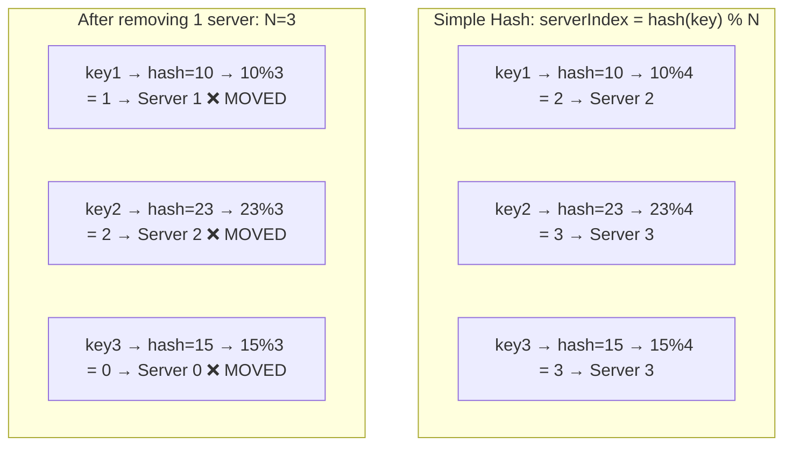
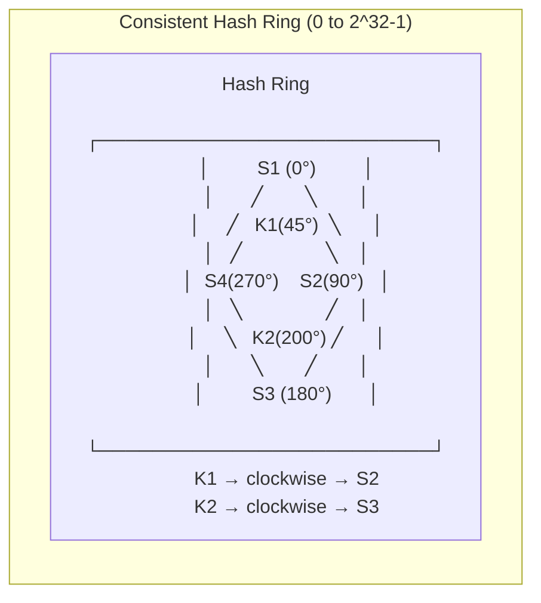
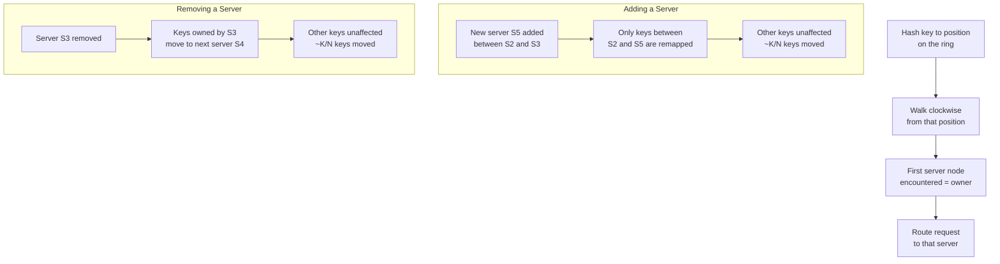
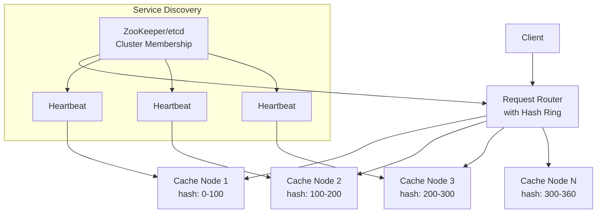
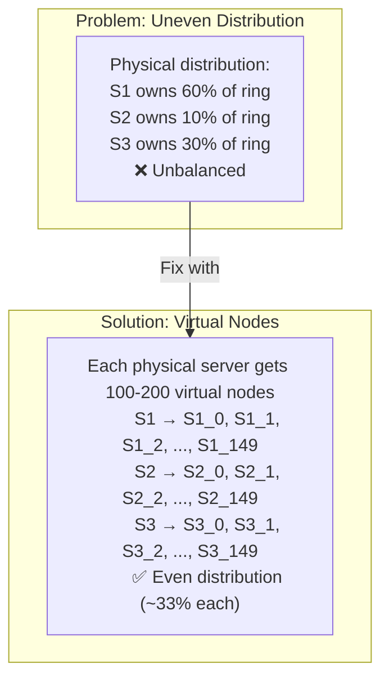
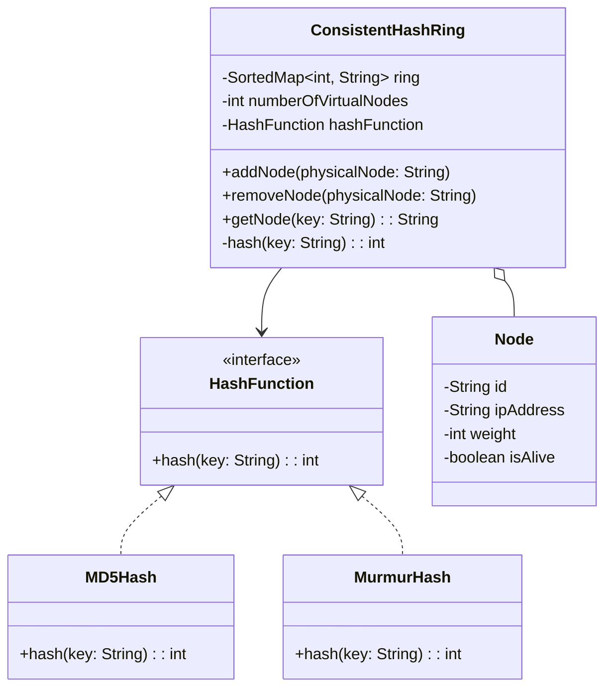
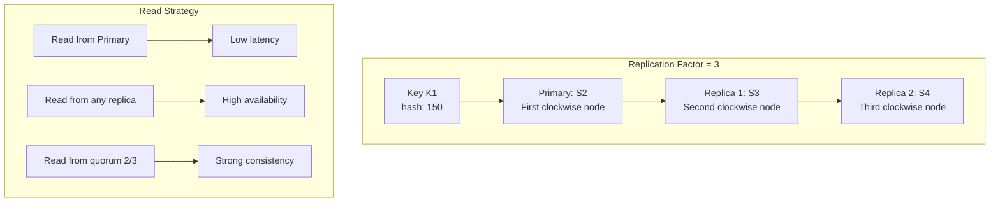

# 3. Consistent Hashing

> **Difficulty**: Hard | **Asked by**: Google, Amazon, Meta, Netflix, Twitter

## Table of Contents
- [Requirements](#requirements)
- [The Problem](#the-problem)
- [High-Level Design](#high-level-design)
- [Low-Level Design](#low-level-design)
- [Implementation](#implementation)
- [Limitations & Improvements](#limitations--improvements)

---

## Requirements

### Functional Requirements
1. Distribute data/requests evenly across N server nodes
2. When servers are added/removed, minimize data redistribution
3. Support weighted distribution (heterogeneous nodes)
4. Handle node failures gracefully

### Non-Functional Requirements
1. **O(log N)** lookup time for key → server mapping
2. **Minimal data movement** when topology changes (only K/N keys remapped)
3. **Even distribution** across nodes
4. **Scalable** to thousands of nodes

---

## The Problem

### Why Not Simple Hashing?



**Problem**: When N changes, almost ALL keys get remapped → cache avalanche

---

## High-Level Design

### Hash Ring Concept



### How It Works



### Architecture with Consistent Hashing



---

## Low-Level Design

### Virtual Nodes



### Hash Ring Data Structure



### Replication with Consistent Hashing



### Ring Operations Complexity

```
Operation         | Time Complexity | Space Complexity
------------------|----------------|------------------
Add Node          | O(V log(NV))   | O(V) new entries
Remove Node       | O(V log(NV))   | -O(V) entries
Lookup Key        | O(log(NV))     | O(1)
Rebalance         | O(K/N)         | Keys moved: K/N

Where: N = physical nodes, V = virtual nodes per physical, K = total keys
```

---

## Implementation

### Core Consistent Hashing (Python)

```python
import hashlib
from bisect import bisect_right
from collections import defaultdict
from typing import Optional, List

class ConsistentHashRing:
    """Consistent hashing with virtual nodes."""
    
    def __init__(self, num_virtual_nodes: int = 150):
        self.num_virtual_nodes = num_virtual_nodes
        self.ring = {}           # hash_value -> physical_node
        self.sorted_keys = []    # sorted hash values for binary search
        self.nodes = set()       # set of physical nodes
        self.node_weights = {}   # weight per node
    
    def _hash(self, key: str) -> int:
        """Generate hash using MD5 (uniform distribution)."""
        md5 = hashlib.md5(key.encode()).hexdigest()
        return int(md5, 16) % (2**32)
    
    def add_node(self, node: str, weight: int = 1) -> List[str]:
        """Add a physical node with virtual nodes.
        Returns list of keys that need to be migrated to this node.
        """
        if node in self.nodes:
            return []
        
        self.nodes.add(node)
        self.node_weights[node] = weight
        virtual_count = self.num_virtual_nodes * weight
        
        for i in range(virtual_count):
            virtual_key = f"{node}#VN{i}"
            hash_val = self._hash(virtual_key)
            self.ring[hash_val] = node
            self.sorted_keys.append(hash_val)
        
        self.sorted_keys.sort()
        return []  # In practice, return affected key ranges
    
    def remove_node(self, node: str) -> List[str]:
        """Remove a physical node and all its virtual nodes."""
        if node not in self.nodes:
            return []
        
        self.nodes.discard(node)
        weight = self.node_weights.pop(node, 1)
        virtual_count = self.num_virtual_nodes * weight
        
        for i in range(virtual_count):
            virtual_key = f"{node}#VN{i}"
            hash_val = self._hash(virtual_key)
            del self.ring[hash_val]
            self.sorted_keys.remove(hash_val)
        
        return []  # In practice, return keys to redistribute
    
    def get_node(self, key: str) -> Optional[str]:
        """Find the server responsible for the given key."""
        if not self.ring:
            return None
        
        hash_val = self._hash(key)
        # Binary search for the first node clockwise from hash_val
        idx = bisect_right(self.sorted_keys, hash_val)
        
        # Wrap around to the first node
        if idx == len(self.sorted_keys):
            idx = 0
        
        return self.ring[self.sorted_keys[idx]]
    
    def get_nodes_for_replication(self, key: str, replicas: int = 3) -> List[str]:
        """Get multiple distinct physical nodes for replication."""
        if not self.ring or replicas > len(self.nodes):
            return list(self.nodes)
        
        hash_val = self._hash(key)
        idx = bisect_right(self.sorted_keys, hash_val)
        
        result = []
        seen = set()
        
        for i in range(len(self.sorted_keys)):
            actual_idx = (idx + i) % len(self.sorted_keys)
            node = self.ring[self.sorted_keys[actual_idx]]
            
            if node not in seen:
                result.append(node)
                seen.add(node)
                if len(result) == replicas:
                    break
        
        return result
    
    def get_distribution(self) -> dict:
        """Get the distribution of hash space per physical node."""
        distribution = defaultdict(int)
        total = len(self.sorted_keys)
        
        for hash_val in self.sorted_keys:
            node = self.ring[hash_val]
            distribution[node] += 1
        
        return {
            node: f"{(count/total)*100:.1f}%"
            for node, count in distribution.items()
        }


# Usage Example
ring = ConsistentHashRing(num_virtual_nodes=150)

# Add servers
ring.add_node("server-1", weight=1)
ring.add_node("server-2", weight=1)
ring.add_node("server-3", weight=2)  # Double capacity server

# Route keys
for key in ["user:1001", "user:1002", "user:1003", "session:xyz"]:
    node = ring.get_node(key)
    replicas = ring.get_nodes_for_replication(key)
    print(f"{key} → Primary: {node}, Replicas: {replicas}")

# Check distribution
print(ring.get_distribution())
# → {'server-1': '25.0%', 'server-2': '25.0%', 'server-3': '50.0%'}
```

### Java Implementation (Interview-Ready)

```java
import java.util.*;
import java.security.MessageDigest;

public class ConsistentHash<T> {
    private final TreeMap<Long, T> ring = new TreeMap<>();
    private final int virtualNodes;
    
    public ConsistentHash(int virtualNodes, Collection<T> nodes) {
        this.virtualNodes = virtualNodes;
        for (T node : nodes) {
            addNode(node);
        }
    }
    
    public void addNode(T node) {
        for (int i = 0; i < virtualNodes; i++) {
            long hash = hash(node.toString() + "#VN" + i);
            ring.put(hash, node);
        }
    }
    
    public void removeNode(T node) {
        for (int i = 0; i < virtualNodes; i++) {
            long hash = hash(node.toString() + "#VN" + i);
            ring.remove(hash);
        }
    }
    
    public T getNode(String key) {
        if (ring.isEmpty()) return null;
        long hash = hash(key);
        Map.Entry<Long, T> entry = ring.ceilingEntry(hash);
        return (entry != null) ? entry.getValue() : ring.firstEntry().getValue();
    }
    
    private long hash(String key) {
        try {
            MessageDigest md = MessageDigest.getInstance("MD5");
            byte[] digest = md.digest(key.getBytes());
            return ((long)(digest[0] & 0xFF) << 24) |
                   ((long)(digest[1] & 0xFF) << 16) |
                   ((long)(digest[2] & 0xFF) << 8)  |
                   ((long)(digest[3] & 0xFF));
        } catch (Exception e) {
            throw new RuntimeException(e);
        }
    }
}
```

---

## Real-World Usage

| System | How Consistent Hashing is Used |
|--------|-------------------------------|
| Amazon DynamoDB | Partition data across storage nodes |
| Apache Cassandra | Token ring for data distribution |
| Discord | Route messages to correct server |
| Akamai CDN | Map content to edge servers |
| Memcached | Distribute cache keys across cluster |
| Netflix | Shard data in EVCache |

---

## Limitations & Improvements

### Current Limitations

| Limitation | Impact | Severity |
|-----------|--------|----------|
| Hot spots with popular keys | Uneven load despite balanced distribution | High |
| Virtual node overhead | Memory for mapping table | Low |
| Hash function quality affects distribution | Poor hash = uneven distribution | Medium |
| No automatic rebalancing on failure | Manual intervention needed | High |
| Does not consider server load | Busy server still gets same share | Medium |

### Improvement Areas

1. **Bounded Load Consistent Hashing** (Google)
   - Cap each server to `(1 + ε) × average_load`
   - Overflow keys go to next server clockwise
   - Ensures maximum 1+ε imbalance ratio

2. **Jump Consistent Hashing**
   - O(1) memory (no ring structure)
   - Only works for sequential server IDs
   - Google's improvement for specific use cases

3. **Multi-Probe Consistent Hashing**
   - Hash key multiple times, pick least-loaded server
   - Better load distribution under heterogeneous workloads

4. **Automatic Rebalancing**
   - Monitor per-node load metrics
   - Dynamically adjust virtual node count
   - Trigger data migration when imbalance exceeds threshold

5. **Gossip Protocol Integration**
   - Nodes discover each other via gossip
   - Failure detection through heartbeats
   - Automatic ring membership updates

---

## Key Interview Discussion Points

1. **Why not just use mod hashing?** Adding/removing servers remaps almost all keys — causes cache stampede
2. **How many virtual nodes?** 100-200 per physical node gives < 10% standard deviation
3. **What hash function?** MD5 or MurmurHash3 for uniform distribution; SHA not needed (not for security)
4. **How to handle hot keys?** Add a random suffix to spread across nodes, or use dedicated cache
5. **How does this relate to CAP theorem?** Consistent hashing enables partition tolerance; consistency vs availability is a separate choice
