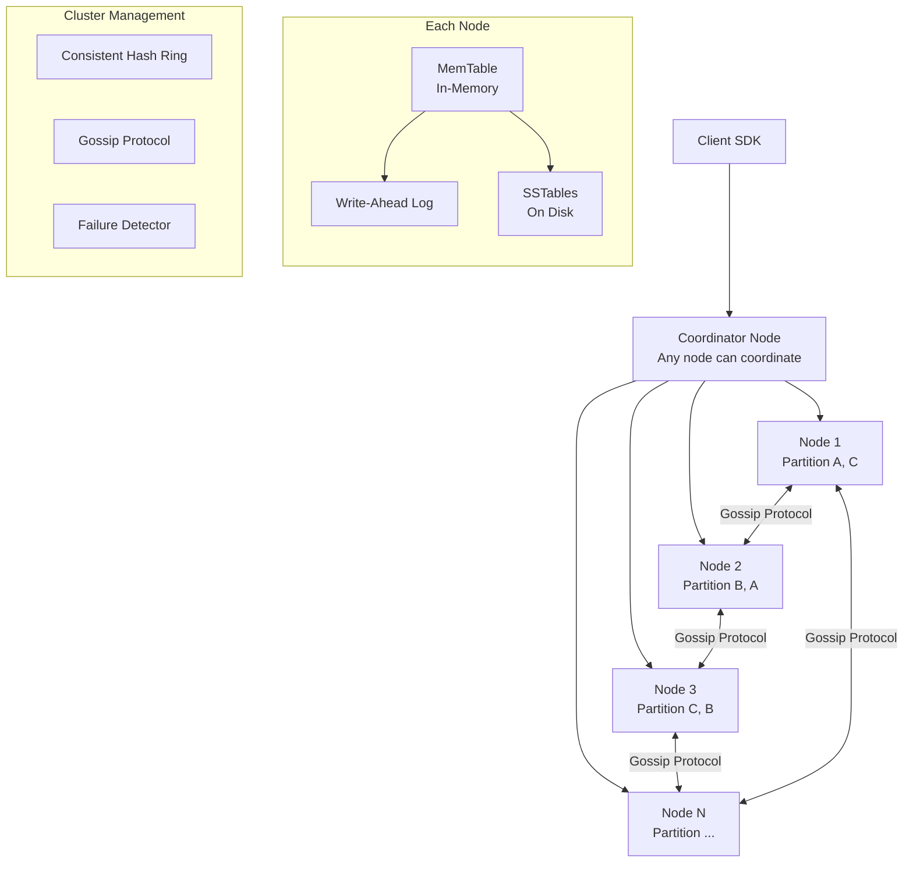
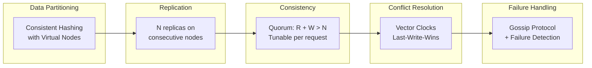
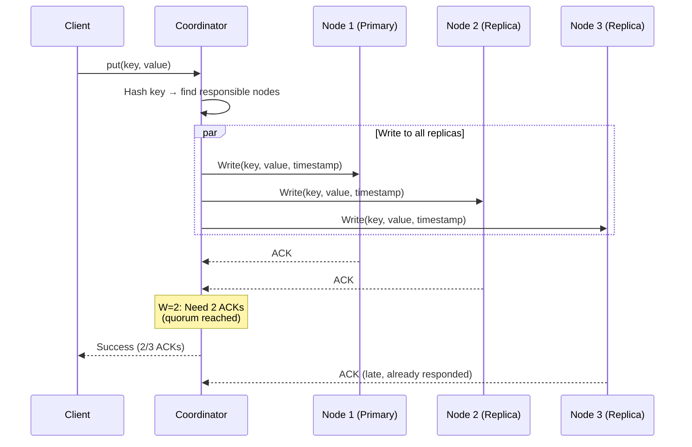
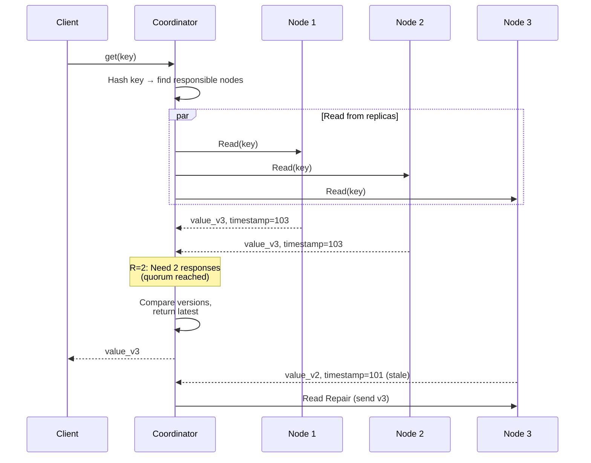
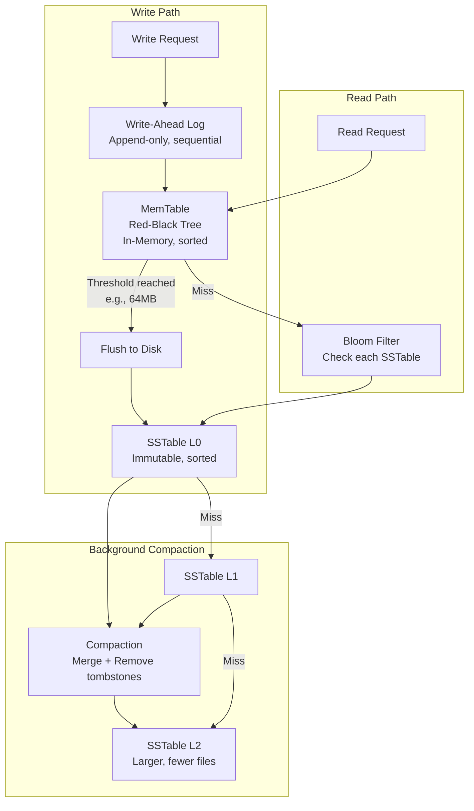
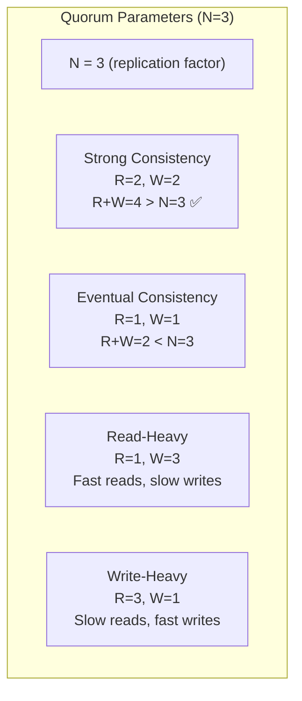
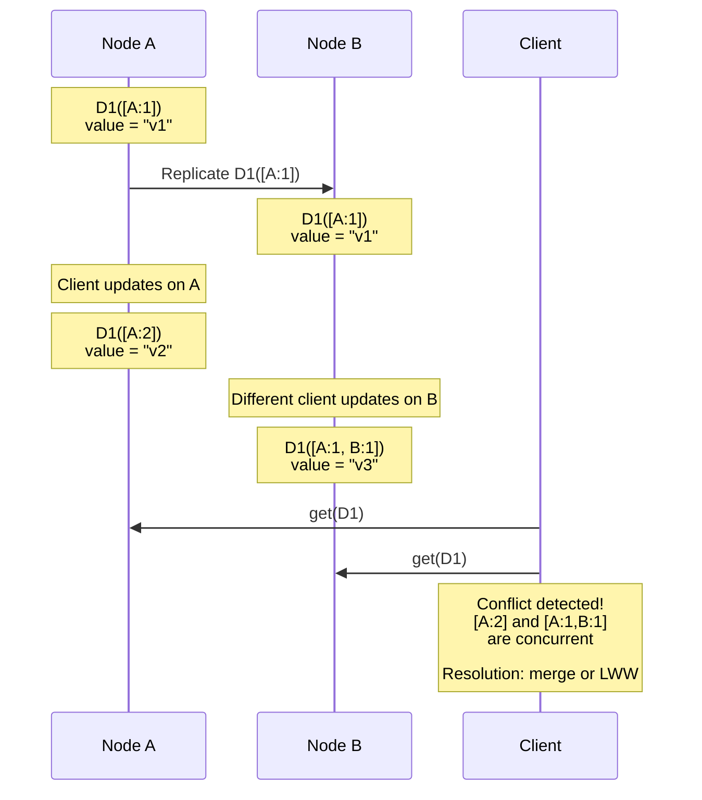
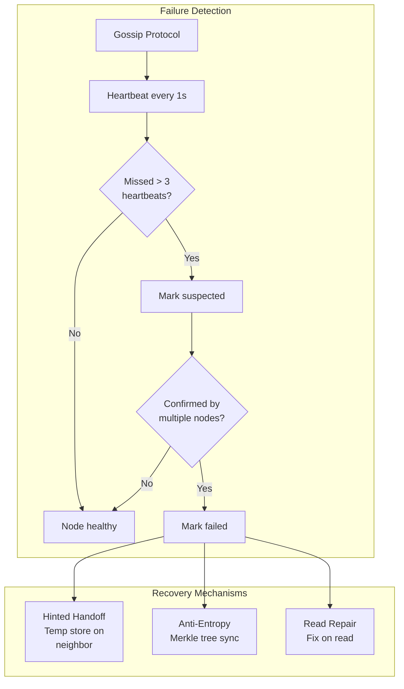

# 4. Distributed Key-Value Store

> **Difficulty**: Hard | **Asked by**: Amazon, Google, Meta, Netflix, Apple

## Table of Contents
- [Requirements](#requirements)
- [Capacity Estimation](#capacity-estimation)
- [High-Level Design](#high-level-design)
- [Low-Level Design](#low-level-design)
- [Implementation](#implementation)
- [Limitations & Improvements](#limitations--improvements)

---

## Requirements

### Functional Requirements
1. `put(key, value)` — Store a key-value pair
2. `get(key)` — Retrieve value by key
3. `delete(key)` — Remove a key-value pair
4. Support configurable consistency levels (eventual, strong)
5. Automatic data partitioning and replication

### Non-Functional Requirements
1. **High Availability**: 99.99% uptime (AP system)
2. **Scalability**: Handle petabytes of data, millions of ops/sec
3. **Low Latency**: Single-digit millisecond reads/writes
4. **Tunable Consistency**: Support both strong and eventual consistency
5. **Fault Tolerance**: No single point of failure

---

## Capacity Estimation

```
Data: 10 TB total, growing 1 TB/month
Operations: 1M reads/sec, 100K writes/sec
Key size: 256 bytes max
Value size: 10 KB average, 1 MB max
Replication factor: 3
Storage needed: 10 TB × 3 = 30 TB (with replication)
Nodes: 30 TB / 1 TB per node = 30 nodes minimum
```

---

## High-Level Design

### Architecture Overview



### Core Components



### Write Path



### Read Path



---

## Low-Level Design

### Storage Engine: LSM Tree



### SSTable Format

```
┌──────────────────────────────────────────────┐
│                  SSTable File                 │
├──────────────────────────────────────────────┤
│ Data Block 1 (sorted key-value pairs)        │
│   key1 -> value1                             │
│   key2 -> value2                             │
│   key3 -> value3                             │
├──────────────────────────────────────────────┤
│ Data Block 2                                 │
│   key4 -> value4                             │
│   ...                                        │
├──────────────────────────────────────────────┤
│ Index Block (key -> block offset)            │
│   key1 -> offset 0                           │
│   key4 -> offset 4096                        │
├──────────────────────────────────────────────┤
│ Bloom Filter (probabilistic membership test) │
├──────────────────────────────────────────────┤
│ Footer (metadata, offsets)                   │
└──────────────────────────────────────────────┘
```

### Consistency Model: Quorum



### Vector Clocks for Conflict Resolution



### Failure Handling



### Merkle Tree for Anti-Entropy

```mermaid
graph TD
    Root[Root Hash<br/>H(H12 + H34)] --> H12[H12<br/>H(H1+H2)]
    Root --> H34[H34<br/>H(H3+H4)]
    H12 --> H1[H1<br/>hash of keys 0-25%]
    H12 --> H2[H2<br/>hash of keys 25-50%]
    H34 --> H3[H3<br/>hash of keys 50-75%]
    H34 --> H4[H4<br/>hash of keys 75-100%]
    
    H1 --> KV1["key1:v1, key2:v2"]
    H2 --> KV2["key3:v3, key4:v4"]
    H3 --> KV3["key5:v5, key6:v6"]
    H4 --> KV4["key7:v7, key8:v8"]
```

Compare root hashes between replicas → if different, drill down to find divergent ranges → sync only those keys.

---

## Implementation

### Core Key-Value Store

```python
import time
import threading
from collections import OrderedDict
from sortedcontainers import SortedDict
from typing import Optional, Tuple

class MemTable:
    """In-memory sorted key-value store (Red-Black Tree via SortedDict)."""
    
    def __init__(self, max_size_bytes=64 * 1024 * 1024):  # 64MB
        self.data = SortedDict()
        self.size = 0
        self.max_size = max_size_bytes
        self.lock = threading.RLock()
    
    def put(self, key: str, value: bytes, timestamp: int) -> bool:
        with self.lock:
            entry = (timestamp, value)  # (timestamp, value)
            old = self.data.get(key)
            self.data[key] = entry
            self.size += len(key) + len(value) + 8
            if old:
                self.size -= len(old[1]) + 8
            return self.size >= self.max_size  # True = needs flush
    
    def get(self, key: str) -> Optional[Tuple[int, bytes]]:
        with self.lock:
            return self.data.get(key)
    
    def flush_to_sstable(self, filepath: str):
        """Write sorted data to SSTable file on disk."""
        with self.lock:
            snapshot = list(self.data.items())
        
        # Write SSTable with bloom filter and index
        with open(filepath, 'wb') as f:
            index = {}
            for key, (ts, value) in snapshot:
                offset = f.tell()
                index[key] = offset
                # Write: key_len | key | ts | value_len | value
                key_bytes = key.encode()
                f.write(len(key_bytes).to_bytes(4, 'big'))
                f.write(key_bytes)
                f.write(ts.to_bytes(8, 'big'))
                f.write(len(value).to_bytes(4, 'big'))
                f.write(value)
        
        return index


class BloomFilter:
    """Simple Bloom Filter for SSTable membership testing."""
    
    def __init__(self, size=1000000, num_hashes=7):
        self.size = size
        self.num_hashes = num_hashes
        self.bit_array = [False] * size
    
    def _hashes(self, key: str):
        import hashlib
        for i in range(self.num_hashes):
            h = hashlib.md5(f"{key}{i}".encode()).hexdigest()
            yield int(h, 16) % self.size
    
    def add(self, key: str):
        for pos in self._hashes(key):
            self.bit_array[pos] = True
    
    def might_contain(self, key: str) -> bool:
        return all(self.bit_array[pos] for pos in self._hashes(key))


class KVStore:
    """Simple LSM-based Key-Value Store."""
    
    def __init__(self):
        self.memtable = MemTable()
        self.immutable_memtables = []
        self.sstables = []  # List of (filepath, index, bloom_filter)
        self.wal = None  # Write-ahead log
    
    def put(self, key: str, value: bytes):
        timestamp = int(time.time() * 1000000)
        
        # 1. Write to WAL (not shown for brevity)
        # 2. Write to MemTable
        needs_flush = self.memtable.put(key, value, timestamp)
        
        if needs_flush:
            self._flush_memtable()
    
    def get(self, key: str) -> Optional[bytes]:
        # 1. Check current MemTable
        result = self.memtable.get(key)
        if result:
            return result[1]  # Return value
        
        # 2. Check immutable MemTables (newest first)
        for mt in reversed(self.immutable_memtables):
            result = mt.get(key)
            if result:
                return result[1]
        
        # 3. Check SSTables (newest first, use Bloom filter)
        for filepath, index, bloom in reversed(self.sstables):
            if bloom.might_contain(key):
                value = self._read_from_sstable(filepath, index, key)
                if value is not None:
                    return value
        
        return None
    
    def delete(self, key: str):
        # Write a tombstone marker
        self.put(key, b"__TOMBSTONE__")
    
    def _flush_memtable(self):
        """Move current MemTable to immutable, create new one."""
        old = self.memtable
        self.memtable = MemTable()
        self.immutable_memtables.append(old)
        # In production: async flush to SSTable + compaction
    
    def _read_from_sstable(self, filepath, index, key):
        if key not in index:
            return None
        # Read from file at index[key] offset
        # Implementation omitted for brevity
        return None
```

---

## Limitations & Improvements

### Current Limitations

| Limitation | Impact | Severity |
|-----------|--------|----------|
| Write amplification from compaction | High disk I/O, reduced SSD lifespan | High |
| Bloom filter false positives | Unnecessary disk reads | Low |
| Vector clocks grow with # of nodes | Memory overhead per key | Medium |
| Read amplification (check multiple SSTables) | Slower reads for cold data | Medium |
| Gossip protocol convergence delay | Temporary inconsistency on failures | Medium |

### Improvement Areas

1. **Write Optimization**
   - Grouped commits / batch writes
   - Tiered compaction strategy (RocksDB style)
   - Separate WAL per partition for parallelism

2. **Read Optimization**
   - Block cache for hot SSTables
   - Prefix Bloom filters for range queries
   - Adaptive read repair (only when divergence detected)

3. **Consistency Improvements**
   - Lightweight transactions (Paxos per partition — Cassandra style)
   - Conflict-free Replicated Data Types (CRDTs)
   - Causal consistency with hybrid logical clocks

4. **Operational**
   - Auto-repair and rebalancing
   - Online schema evolution
   - Cross-datacenter replication with conflict resolution
   - Rack-aware replica placement

---

## Key Interview Discussion Points

1. **Why LSM tree over B-Tree?** LSM optimizes writes (sequential I/O); B-Tree optimizes reads (in-place updates)
2. **How does compaction work?** Merge overlapping SSTables, remove tombstones, reduce read amplification
3. **Strong vs eventual consistency trade-off?** Quorum (R+W>N) for strong; single replica for speed
4. **How to handle network partitions?** Hinted handoff + anti-entropy repair after partition heals
5. **DynamoDB vs Cassandra?** Both use this architecture; Dynamo focuses on availability, Cassandra adds CQL and lightweight transactions
