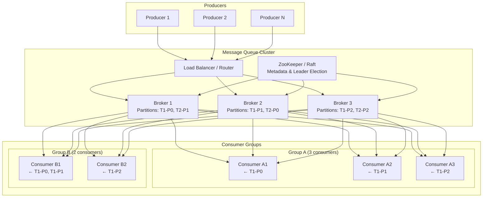
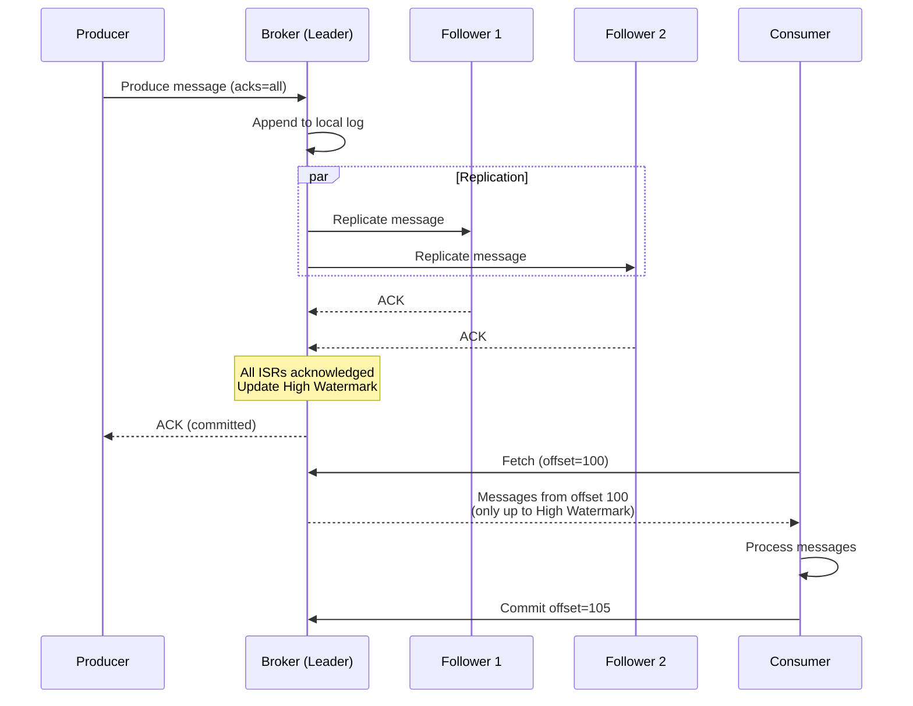
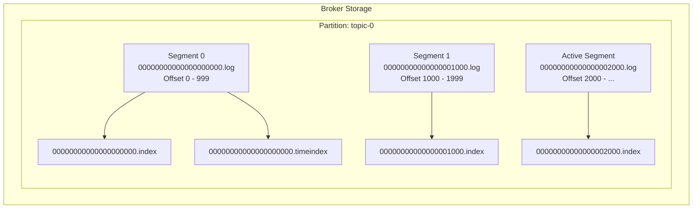
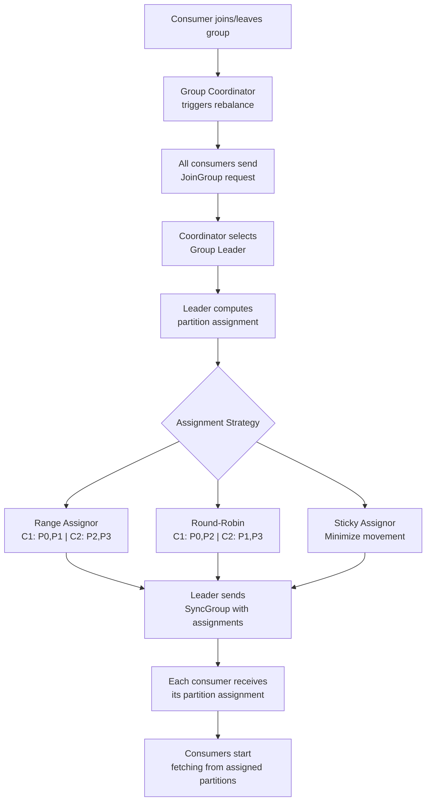
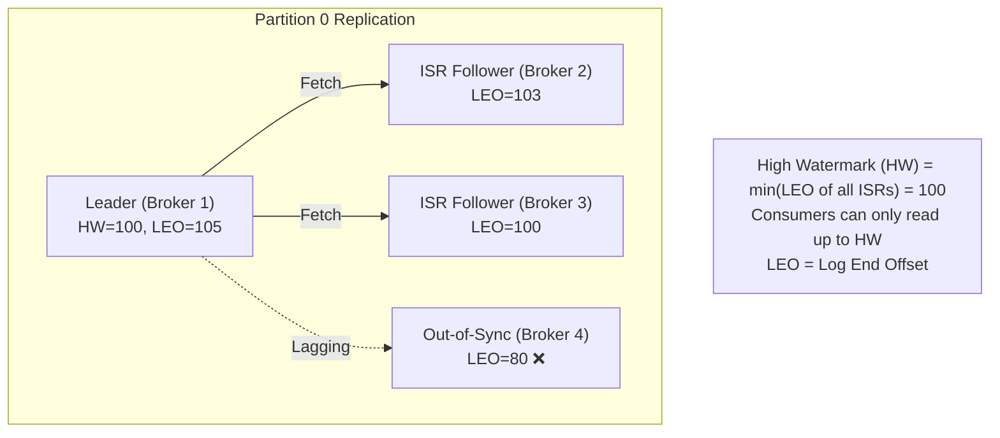
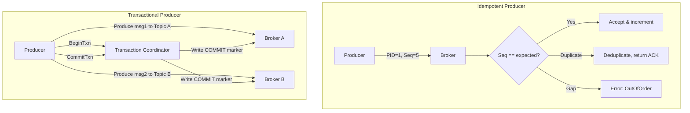

# 5. Distributed Message Queue (Kafka-like)

> **Difficulty**: Hard | **Asked by**: LinkedIn, Uber, Netflix, Amazon, Confluent

## Table of Contents
- [Requirements](#requirements)
- [Capacity Estimation](#capacity-estimation)
- [High-Level Design](#high-level-design)
- [Low-Level Design](#low-level-design)
- [Implementation](#implementation)
- [Limitations & Improvements](#limitations--improvements)

---

## Requirements

### Functional Requirements
1. Producers publish messages to named topics
2. Consumers subscribe to topics and receive messages
3. Messages ordered within a partition
4. Support consumer groups (each message delivered to one consumer per group)
5. Message retention for configurable duration (replay support)
6. At-least-once, at-most-once, and exactly-once delivery semantics

### Non-Functional Requirements
1. **High Throughput**: Millions of messages/sec
2. **Low Latency**: < 10ms end-to-end (producer to consumer)
3. **Durability**: No message loss once acknowledged
4. **Scalability**: Horizontal scaling by adding partitions/brokers
5. **Availability**: 99.99%, tolerate broker failures

---

## Capacity Estimation

```
Messages: 1 Billion messages/day
Average message size: 1 KB
Daily data: 1B × 1 KB = 1 TB/day
Retention: 7 days → 7 TB storage
Replication factor: 3 → 21 TB total
Peak throughput: ~30K messages/sec
With 3x replication writes: 90K writes/sec
```

---

## High-Level Design

### Architecture Overview



### Topic and Partition Model

```mermaid
graph LR
    subgraph "Topic: user-events (3 partitions)"
        P0["Partition 0<br/>[msg0, msg3, msg6, msg9...]<br/>Leader: Broker 1"]
        P1["Partition 1<br/>[msg1, msg4, msg7, msg10...]<br/>Leader: Broker 2"]
        P2["Partition 2<br/>[msg2, msg5, msg8, msg11...]<br/>Leader: Broker 3"]
    end
    
    Producer[Producer] -->|key: user_123<br/>hash(key) % 3 = 0| P0
    Producer -->|key: user_456<br/>hash(key) % 3 = 1| P1
    Producer -->|key: user_789<br/>hash(key) % 3 = 2| P2
```

### Message Lifecycle



---

## Low-Level Design

### Broker Storage Architecture



### Message Format

```
┌────────────────────────────────────────────────┐
│                  Message Batch                  │
├────────────────────────────────────────────────┤
│ Base Offset (8 bytes)                          │
│ Batch Length (4 bytes)                          │
│ Partition Leader Epoch (4 bytes)               │
│ Magic Byte (1 byte) - version                  │
│ CRC32 (4 bytes)                                │
│ Attributes (2 bytes) - compression, timestamp  │
│ Last Offset Delta (4 bytes)                    │
│ First Timestamp (8 bytes)                      │
│ Max Timestamp (8 bytes)                        │
│ Producer ID (8 bytes) - for idempotency        │
│ Producer Epoch (2 bytes)                       │
│ Sequence Number (4 bytes) - dedup              │
├────────────────────────────────────────────────┤
│ Record 1: [length, attrs, ts_delta, offset_    │
│            delta, key_len, key, val_len, value, │
│            headers]                             │
│ Record 2: ...                                  │
│ Record N: ...                                  │
└────────────────────────────────────────────────┘
```

### Consumer Group Rebalancing



### Replication & ISR (In-Sync Replicas)



### Exactly-Once Semantics



---

## Implementation

### Producer (Simplified)

```python
import hashlib
import time
from dataclasses import dataclass
from typing import Optional, List
from collections import defaultdict

@dataclass
class Message:
    key: Optional[bytes]
    value: bytes
    timestamp: int
    headers: dict = None

@dataclass  
class ProducerRecord:
    topic: str
    partition: Optional[int]
    key: Optional[bytes]
    value: bytes

class Producer:
    """Simplified message queue producer with batching."""
    
    def __init__(self, broker_list: List[str], acks='all',
                 batch_size=16384, linger_ms=5):
        self.brokers = broker_list
        self.acks = acks  # 0, 1, or 'all'
        self.batch_size = batch_size  # bytes
        self.linger_ms = linger_ms
        self.batches = defaultdict(list)  # partition -> messages
        self.metadata = {}  # topic -> partition metadata
    
    def send(self, record: ProducerRecord):
        """Send a message to a topic."""
        partition = self._select_partition(record)
        
        message = Message(
            key=record.key,
            value=record.value,
            timestamp=int(time.time() * 1000)
        )
        
        # Add to batch
        batch_key = (record.topic, partition)
        self.batches[batch_key].append(message)
        
        # Flush if batch is full
        if self._batch_size(batch_key) >= self.batch_size:
            self._flush_batch(batch_key)
    
    def _select_partition(self, record: ProducerRecord) -> int:
        """Select partition: by key hash or round-robin."""
        num_partitions = self._get_partition_count(record.topic)
        
        if record.partition is not None:
            return record.partition
        
        if record.key is not None:
            # Murmur2 hash for consistent partitioning
            key_hash = int(hashlib.md5(record.key).hexdigest(), 16)
            return key_hash % num_partitions
        
        # Round-robin for keyless messages
        return int(time.time() * 1000) % num_partitions
    
    def _flush_batch(self, batch_key):
        """Send accumulated batch to broker."""
        topic, partition = batch_key
        messages = self.batches.pop(batch_key, [])
        if messages:
            leader = self._get_partition_leader(topic, partition)
            # Network call to send batch
            self._send_to_broker(leader, topic, partition, messages)
    
    def _batch_size(self, key):
        return sum(len(m.value) for m in self.batches[key])
    
    def _get_partition_count(self, topic): return 3  # Simplified
    def _get_partition_leader(self, topic, partition): return self.brokers[0]
    def _send_to_broker(self, broker, topic, partition, messages): pass


class Consumer:
    """Simplified message queue consumer."""
    
    def __init__(self, broker_list, group_id, auto_commit=True):
        self.brokers = broker_list
        self.group_id = group_id
        self.auto_commit = auto_commit
        self.offsets = {}  # (topic, partition) -> offset
        self.assignments = []  # List of (topic, partition)
    
    def subscribe(self, topics: List[str]):
        """Subscribe to topics and trigger rebalance."""
        self._join_group(topics)
    
    def poll(self, timeout_ms=1000) -> List[Message]:
        """Fetch messages from assigned partitions."""
        messages = []
        for topic, partition in self.assignments:
            offset = self.offsets.get((topic, partition), 0)
            batch = self._fetch(topic, partition, offset, timeout_ms)
            messages.extend(batch)
            
            if batch:
                # Update local offset
                self.offsets[(topic, partition)] = offset + len(batch)
        
        if self.auto_commit and messages:
            self.commit()
        
        return messages
    
    def commit(self):
        """Commit current offsets to broker."""
        for (topic, partition), offset in self.offsets.items():
            self._commit_offset(topic, partition, offset)
    
    def _join_group(self, topics): pass
    def _fetch(self, topic, partition, offset, timeout): return []
    def _commit_offset(self, topic, partition, offset): pass
```

---

## Limitations & Improvements

### Current Limitations

| Limitation | Impact | Severity |
|-----------|--------|----------|
| Partition count fixed at creation | Cannot dynamically scale topics | High |
| Ordering only within a partition | No global ordering guarantee | Medium |
| Consumer rebalance causes pause | Brief unavailability during rebalance | Medium |
| Head-of-line blocking | Slow consumer blocks partition | Medium |
| Large messages reduce throughput | Not designed for large payloads | Low |

### Improvement Areas

1. **Tiered Storage** — Move old segments to S3/cloud storage for cost efficiency
2. **Serverless Consumers** — Auto-scale consumer count based on lag
3. **Dead Letter Queues** — Route failed messages for separate processing
4. **Schema Registry** — Enforce message schemas (Avro, Protobuf)
5. **Multi-region replication** — Async cross-datacenter replication with conflict resolution

---

## Key Interview Discussion Points

1. **How to guarantee ordering?** Same key → same partition → ordered within partition
2. **Pull vs Push model?** Pull (Kafka-style) gives consumer control; Push for lower latency
3. **How to handle slow consumers?** Consumer lag monitoring, auto-scaling, backpressure
4. **Exactly-once delivery?** Idempotent producer + transactional writes + read-committed consumers
5. **Kafka vs RabbitMQ vs SQS?** Kafka for high-throughput streaming; RabbitMQ for task queues; SQS for serverless
