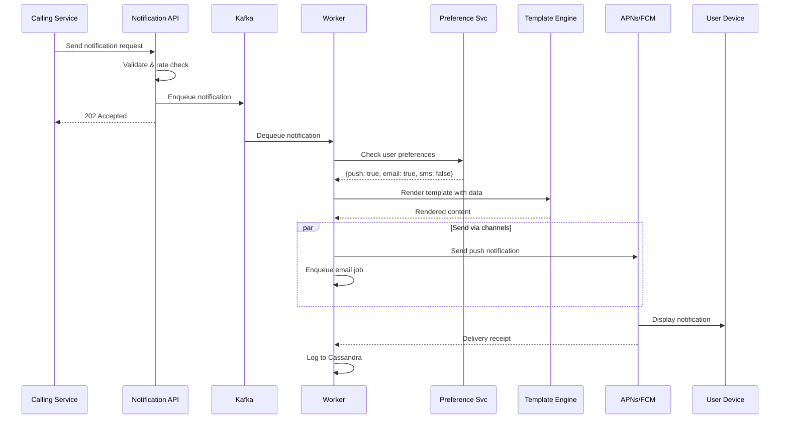
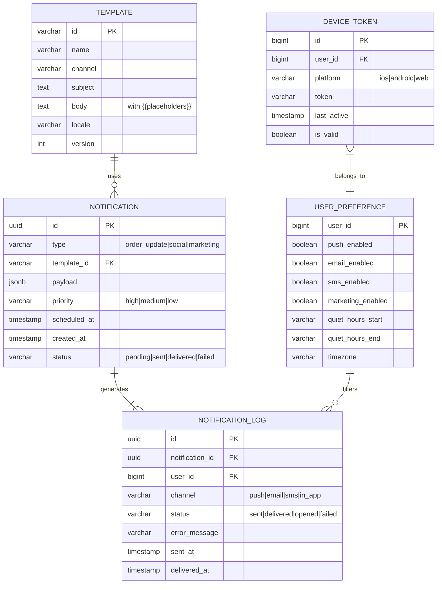
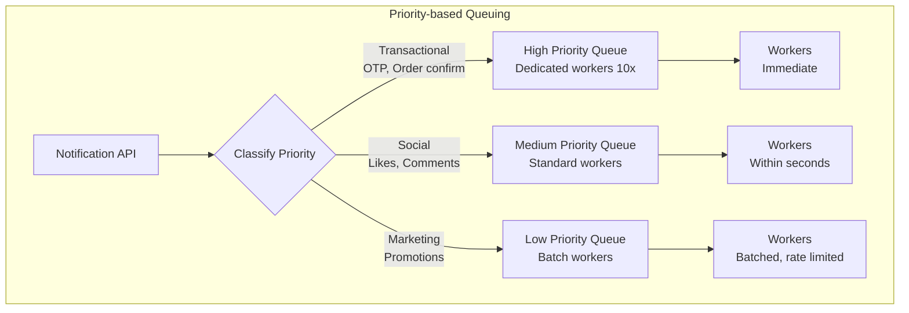
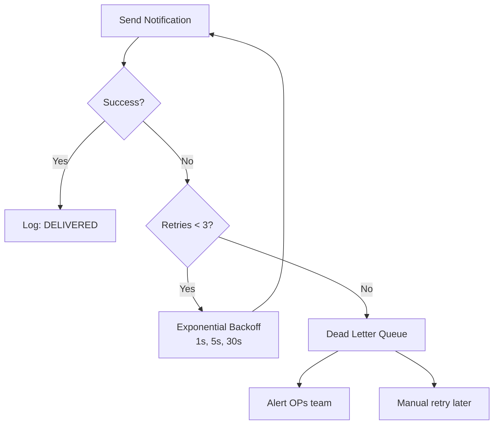
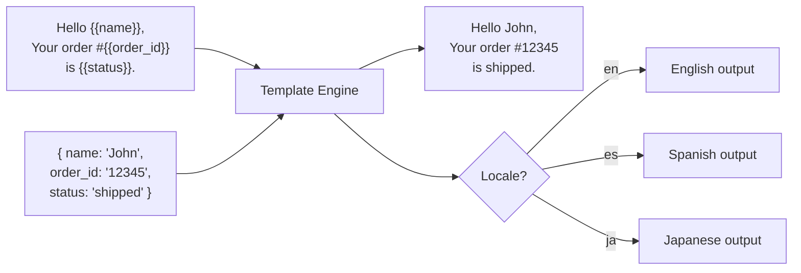

# 6. Notification System

> **Difficulty**: Medium | **Asked by**: Meta, Amazon, Google, Uber, Airbnb

## Table of Contents
- [Requirements](#requirements)
- [Capacity Estimation](#capacity-estimation)
- [High-Level Design](#high-level-design)
- [Low-Level Design](#low-level-design)
- [Implementation](#implementation)
- [Limitations & Improvements](#limitations--improvements)

---

## Requirements

### Functional Requirements
1. Support multiple channels: Push (iOS/Android), SMS, Email, In-App
2. Soft real-time: notifications delivered within seconds
3. Support for scheduled/delayed notifications
4. User notification preferences (opt-in/out per channel)
5. Template-based notifications with personalization
6. Rate limiting per user to prevent spam

### Non-Functional Requirements
1. **High Availability**: 99.99% uptime
2. **Scalability**: 10 Billion notifications/day
3. **Soft Real-Time**: < 5 second delivery for push notifications
4. **At-Least-Once Delivery**: No notification lost
5. **Deduplication**: No duplicate notifications

---

## Capacity Estimation

```
Notifications/day: 10 Billion
Peak QPS: ~500K notifications/sec (assuming 2x peak)
Push: 60%, Email: 30%, SMS: 8%, In-App: 2%

Storage (notification log, 30 days):
  10B × 30 × 500 bytes = 150 TB

Templates: ~10K templates × 5 KB = 50 MB (negligible)
```

---

## High-Level Design

### Architecture Overview

```mermaid
graph TB
    subgraph "Event Sources"
        S1[Service 1<br/>Order Service]
        S2[Service 2<br/>Social Service]
        S3[Service 3<br/>Marketing]
        S4[Scheduled Jobs<br/>Cron]
    end
    
    S1 & S2 & S3 & S4 --> API[Notification API Service]
    
    API --> Valid[Validation &<br/>Rate Limiting]
    Valid --> Queue[(Message Queue<br/>Kafka)]
    
    Queue --> Workers[Notification Workers<br/>Pool]
    
    Workers --> Pref[Preference Service<br/>+ Template Engine]
    Workers --> Dedup[Dedup Service<br/>Redis]
    
    Workers --> Router{Channel Router}
    
    Router --> Push[Push Service<br/>APNs / FCM]
    Router --> Email[Email Service<br/>SES / SendGrid]
    Router --> SMS[SMS Service<br/>Twilio / SNS]
    Router --> InApp[In-App Service<br/>WebSocket]
    
    Push & Email & SMS & InApp --> Log[(Notification Log<br/>Cassandra)]
    
    subgraph "Analytics"
        Log --> Analytics[Analytics Pipeline]
        Analytics --> Dash[Dashboard]
    end
```

### Notification Flow



---

## Low-Level Design

### Data Models



### Notification Priority & Queuing



### Retry & Failure Handling



### Template Engine Flow



---

## Implementation

### Notification Service Core

```python
import uuid
import json
from enum import Enum
from dataclasses import dataclass, field
from typing import List, Optional, Dict
from datetime import datetime

class Channel(Enum):
    PUSH = "push"
    EMAIL = "email"
    SMS = "sms"
    IN_APP = "in_app"

class Priority(Enum):
    HIGH = "high"       # OTP, security alerts
    MEDIUM = "medium"   # Social, transactional
    LOW = "low"         # Marketing, digest

@dataclass
class NotificationRequest:
    user_ids: List[int]
    template_id: str
    payload: Dict
    channels: List[Channel] = field(default_factory=lambda: [Channel.PUSH])
    priority: Priority = Priority.MEDIUM
    scheduled_at: Optional[datetime] = None
    idempotency_key: Optional[str] = None

class NotificationService:
    """Core notification orchestration service."""
    
    def __init__(self, queue, preference_svc, template_engine, 
                 dedup_cache, rate_limiter):
        self.queue = queue
        self.preferences = preference_svc
        self.templates = template_engine
        self.dedup = dedup_cache
        self.rate_limiter = rate_limiter
    
    def send(self, request: NotificationRequest) -> str:
        """Validate and enqueue notification."""
        notification_id = str(uuid.uuid4())
        
        # 1. Deduplication check
        dedup_key = request.idempotency_key or notification_id
        if self.dedup.exists(dedup_key):
            return dedup_key  # Already processed
        self.dedup.set(dedup_key, ttl=86400)
        
        # 2. Rate limiting
        for user_id in request.user_ids:
            if not self.rate_limiter.is_allowed(user_id, request.priority):
                continue  # Skip rate-limited users
        
        # 3. Enqueue to appropriate priority queue
        topic = f"notifications.{request.priority.value}"
        self.queue.send(topic, {
            "id": notification_id,
            "user_ids": request.user_ids,
            "template_id": request.template_id,
            "payload": request.payload,
            "channels": [c.value for c in request.channels],
            "scheduled_at": request.scheduled_at.isoformat() if request.scheduled_at else None
        })
        
        return notification_id


class NotificationWorker:
    """Worker that processes notification messages from queue."""
    
    def __init__(self, preference_svc, template_engine,
                 push_provider, email_provider, sms_provider):
        self.preferences = preference_svc
        self.templates = template_engine
        self.providers = {
            Channel.PUSH: push_provider,
            Channel.EMAIL: email_provider,
            Channel.SMS: sms_provider,
        }
    
    def process(self, message: dict):
        """Process a single notification message."""
        for user_id in message["user_ids"]:
            # 1. Check user preferences
            prefs = self.preferences.get(user_id)
            
            for channel_str in message["channels"]:
                channel = Channel(channel_str)
                
                # Skip if user opted out
                if not prefs.is_channel_enabled(channel):
                    continue
                
                # Check quiet hours
                if prefs.is_quiet_hours():
                    self._schedule_after_quiet_hours(message, user_id, channel)
                    continue
                
                # 2. Render template
                content = self.templates.render(
                    message["template_id"],
                    message["payload"],
                    channel=channel,
                    locale=prefs.locale
                )
                
                # 3. Send via provider
                try:
                    provider = self.providers[channel]
                    provider.send(user_id, content)
                    self._log_success(message["id"], user_id, channel)
                except Exception as e:
                    self._handle_failure(message, user_id, channel, e)
    
    def _handle_failure(self, message, user_id, channel, error):
        """Retry with exponential backoff."""
        retry_count = message.get("retry_count", 0)
        if retry_count < 3:
            message["retry_count"] = retry_count + 1
            delay = [1, 5, 30][retry_count]  # seconds
            self._retry_after(message, delay)
        else:
            self._send_to_dlq(message, str(error))
```

---

## Limitations & Improvements

### Current Limitations

| Limitation | Impact | Severity |
|-----------|--------|----------|
| Third-party provider outages (APNs, FCM) | Push notifications fail | High |
| No delivery guarantee for push | Device offline = lost | Medium |
| SMS costs at scale | Expensive for global reach | Medium |
| Template changes require deployment | Slow iteration | Low |
| No A/B testing built-in | Cannot optimize engagement | Medium |

### Improvement Areas

1. **Intelligent Delivery** — ML model to predict best channel/time per user
2. **Batching & Digest** — Combine multiple low-priority notifications into digest
3. **A/B Testing** — Test notification copy, timing, channel for engagement
4. **Analytics Pipeline** — Track open rates, click-through, conversion per template
5. **Multi-region** — Deploy notification workers close to push provider endpoints

---

## Key Interview Discussion Points

1. **How to prevent notification fatigue?** Rate limiting per user + frequency capping + quiet hours
2. **How to ensure exactly-once delivery?** Idempotency key + deduplication cache
3. **Push vs Pull for in-app?** WebSocket for real-time; long polling as fallback
4. **How to handle 10B notifications/day?** Kafka partitioning + horizontal worker scaling
5. **How to handle invalid device tokens?** Feedback service from APNs/FCM → mark tokens invalid
