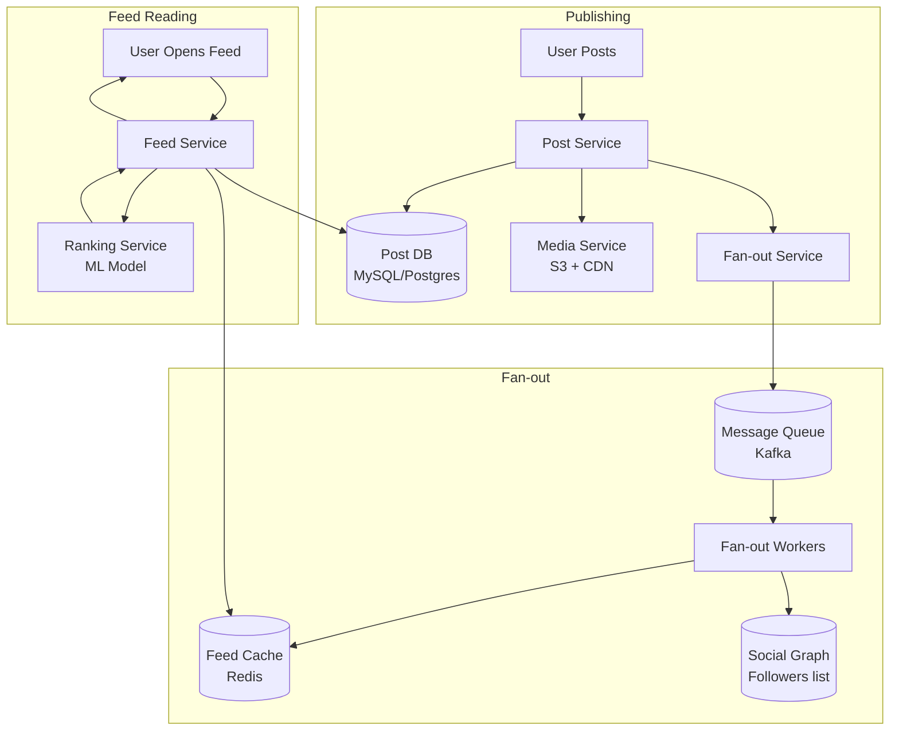
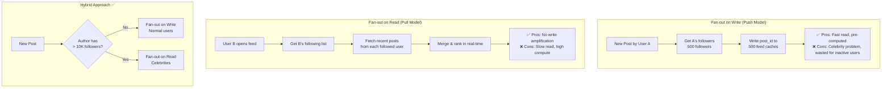
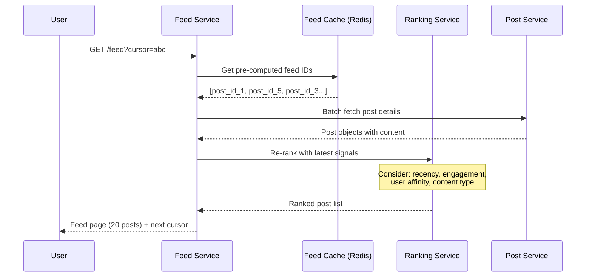
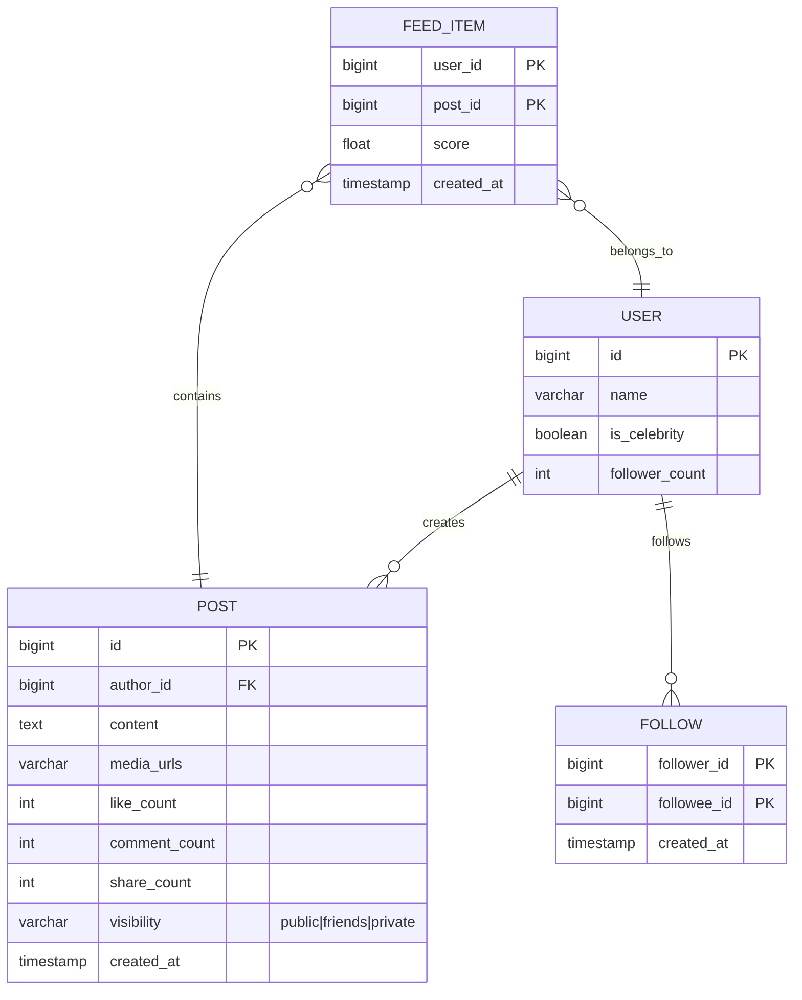
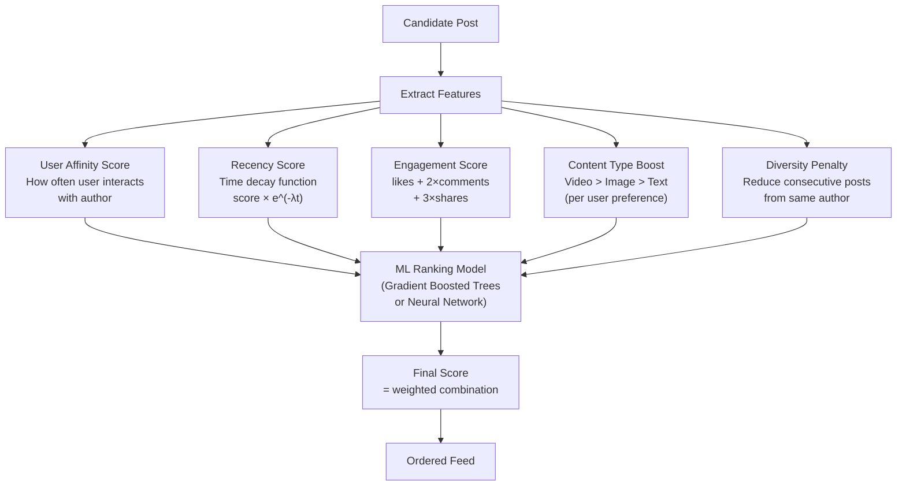
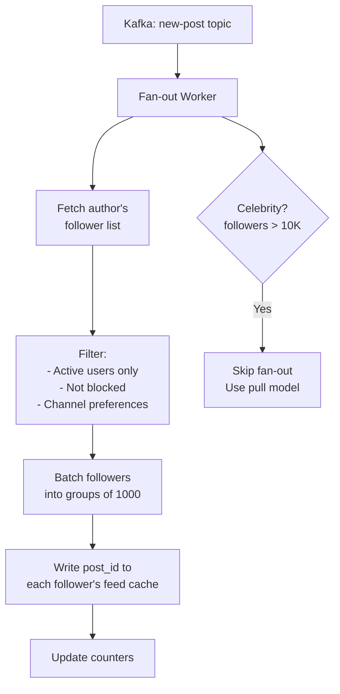

# 7. News Feed System (Facebook Feed)

> **Difficulty**: Hard | **Asked by**: Meta, Twitter, LinkedIn, Pinterest, TikTok

## Table of Contents
- [Requirements](#requirements)
- [Capacity Estimation](#capacity-estimation)
- [High-Level Design](#high-level-design)
- [Low-Level Design](#low-level-design)
- [Implementation](#implementation)
- [Limitations & Improvements](#limitations--improvements)

---

## Requirements

### Functional Requirements
1. User can create posts (text, images, videos)
2. User sees a personalized feed from friends/followed accounts
3. Feed is sorted by relevance (not just chronological)
4. Support likes, comments, shares
5. Infinite scroll with pagination

### Non-Functional Requirements
1. **Low Latency**: Feed loads in < 200ms
2. **High Availability**: 99.99% uptime
3. **Scalability**: 1B+ daily active users
4. **Eventual Consistency**: OK if feed is slightly stale (seconds)

---

## Capacity Estimation

```
DAU: 1 Billion users
Posts/day: 500M new posts
Feed refreshes: 10B/day (each user refreshes ~10 times)
Feed QPS: ~115K reads/sec, ~5.8K writes/sec

Storage per post: 1 KB metadata + media URLs
Daily post storage: 500M × 1KB = 500 GB/day
Feed cache per user: top 500 posts × 8 bytes (post IDs) = 4 KB
Total feed cache: 1B × 4 KB = 4 TB (fits in distributed cache)
```

---

## High-Level Design

### Architecture Overview



### Fan-out Strategies



### Feed Generation Flow



---

## Low-Level Design

### Data Models



### Feed Cache Structure (Redis)

```
# Pre-computed feed per user (Sorted Set)
Key: feed:{user_id}
Score: timestamp or ranking score
Value: post_id

Example:
  ZADD feed:12345 1690000100 "post:99001"
  ZADD feed:12345 1690000090 "post:99002"
  ZADD feed:12345 1690000080 "post:98500"
  
  # Fetch feed page: get top 20 by score
  ZREVRANGE feed:12345 0 19 WITHSCORES
  
  # Trim old entries (keep latest 1000)
  ZREMRANGEBYRANK feed:12345 0 -1001
```

### Ranking Algorithm



### Fan-out Worker Design



---

## Implementation

### Feed Service

```python
from typing import List, Optional
from dataclasses import dataclass
import redis
import json

@dataclass
class FeedItem:
    post_id: int
    author_id: int
    content: str
    score: float
    created_at: str

class FeedService:
    """Generates and serves user feeds."""
    
    def __init__(self, cache: redis.Redis, post_service, 
                 ranking_service, graph_service):
        self.cache = cache
        self.posts = post_service
        self.ranker = ranking_service
        self.graph = graph_service
    
    def get_feed(self, user_id: int, cursor: Optional[str] = None,
                 page_size: int = 20) -> dict:
        """Get paginated, ranked feed for a user."""
        
        # 1. Get pre-computed feed IDs from cache
        start = int(cursor) if cursor else 0
        end = start + page_size + 10  # Fetch extra for re-ranking
        
        feed_key = f"feed:{user_id}"
        post_ids_with_scores = self.cache.zrevrange(
            feed_key, start, end, withscores=True
        )
        
        if not post_ids_with_scores:
            # Cache miss: generate feed on-the-fly
            post_ids_with_scores = self._generate_feed(user_id)
        
        # 2. Fetch full post objects
        post_ids = [pid.decode() for pid, _ in post_ids_with_scores]
        posts = self.posts.batch_get(post_ids)
        
        # 3. Re-rank with freshest signals
        ranked_posts = self.ranker.rank(user_id, posts)
        
        # 4. Paginate
        result = ranked_posts[:page_size]
        next_cursor = str(start + page_size) if len(ranked_posts) > page_size else None
        
        return {
            "items": result,
            "next_cursor": next_cursor
        }
    
    def _generate_feed(self, user_id: int) -> list:
        """Pull-based feed generation (fallback or celebrity posts)."""
        following = self.graph.get_following(user_id)
        
        all_posts = []
        for author_id in following:
            posts = self.posts.get_recent(author_id, limit=10)
            all_posts.extend(posts)
        
        # Sort by score and cache
        all_posts.sort(key=lambda p: p.score, reverse=True)
        
        feed_key = f"feed:{user_id}"
        pipe = self.cache.pipeline()
        for post in all_posts[:500]:
            pipe.zadd(feed_key, {str(post.post_id): post.score})
        pipe.expire(feed_key, 86400)  # 24h TTL
        pipe.execute()
        
        return [(str(p.post_id).encode(), p.score) for p in all_posts]


class FanoutService:
    """Distributes new posts to followers' feeds."""
    
    CELEBRITY_THRESHOLD = 10000
    
    def __init__(self, cache: redis.Redis, graph_service, queue):
        self.cache = cache
        self.graph = graph_service
        self.queue = queue
    
    def fanout(self, post_id: int, author_id: int, score: float):
        """Fan-out new post to followers' feed caches."""
        follower_count = self.graph.get_follower_count(author_id)
        
        if follower_count > self.CELEBRITY_THRESHOLD:
            # Celebrity: skip fan-out, use pull model
            return
        
        followers = self.graph.get_followers(author_id)
        
        # Batch write to Redis pipeline
        pipe = self.cache.pipeline()
        for follower_id in followers:
            feed_key = f"feed:{follower_id}"
            pipe.zadd(feed_key, {str(post_id): score})
            # Trim to keep only latest 1000 items
            pipe.zremrangebyrank(feed_key, 0, -1001)
        pipe.execute()
```

---

## Limitations & Improvements

### Current Limitations

| Limitation | Impact | Severity |
|-----------|--------|----------|
| Celebrity problem (million+ followers) | Massive write amplification | High |
| Feed staleness (eventual consistency) | User sees slightly old content | Low |
| Cold start for new users | Empty feed, poor experience | Medium |
| Ranking model bias | Echo chamber effect | Medium |
| Storage cost of pre-computed feeds | 4TB+ Redis cache | Medium |

### Improvement Areas

1. **Real-time Feature Store** — Stream engagement signals for live re-ranking
2. **Content Understanding** — NLP/CV to understand post quality and relevance
3. **Exploration vs Exploitation** — Balance familiar content with discovery
4. **Edge Caching** — Cache popular feeds at CDN edge for viral moments
5. **Privacy Controls** — Fine-grained visibility and audience targeting

---

## Key Interview Discussion Points

1. **Fan-out on write vs read?** Hybrid: push for normal users, pull for celebrities
2. **How to handle a celebrity post?** Don't fan-out; merge celebrity posts at read time
3. **Ranking signals?** Affinity, recency, engagement, content type, diversity
4. **How to paginate?** Cursor-based using sorted set scores, not offset
5. **What about real-time updates?** WebSocket/SSE for new post notifications; lazy feed refresh
