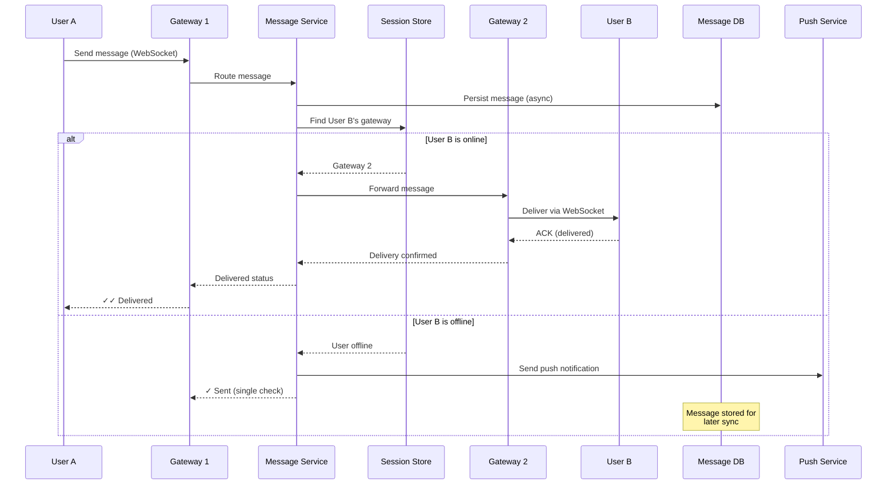
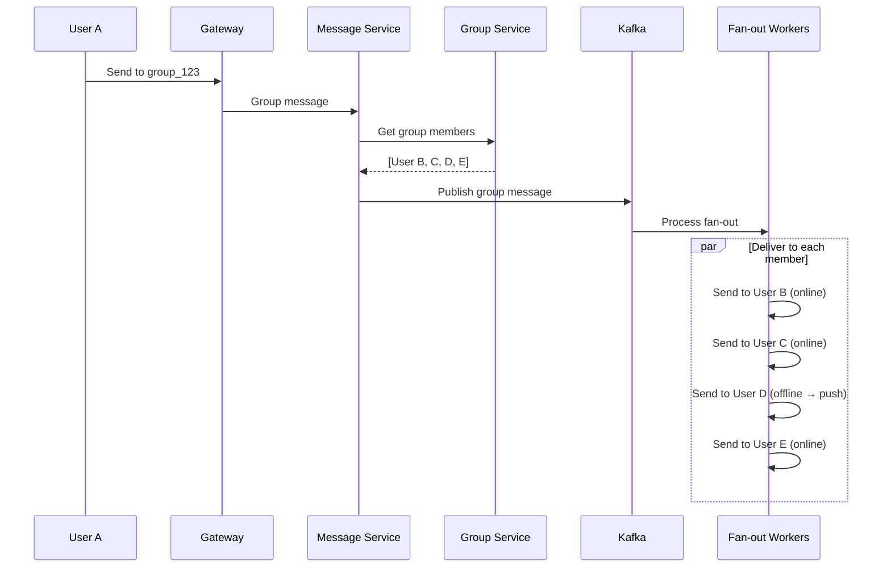
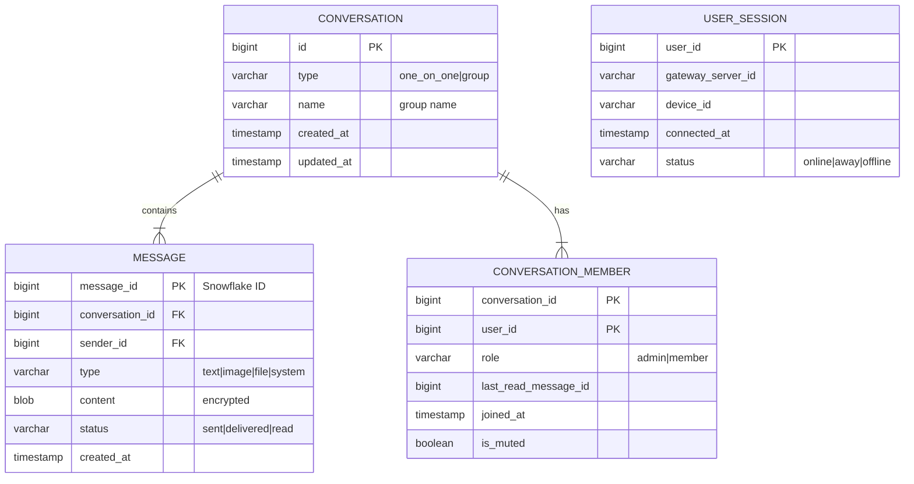
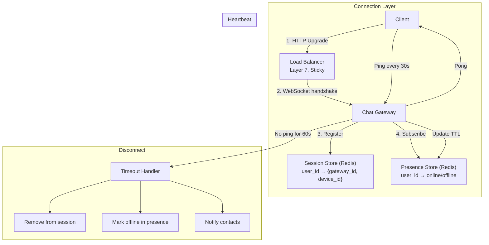
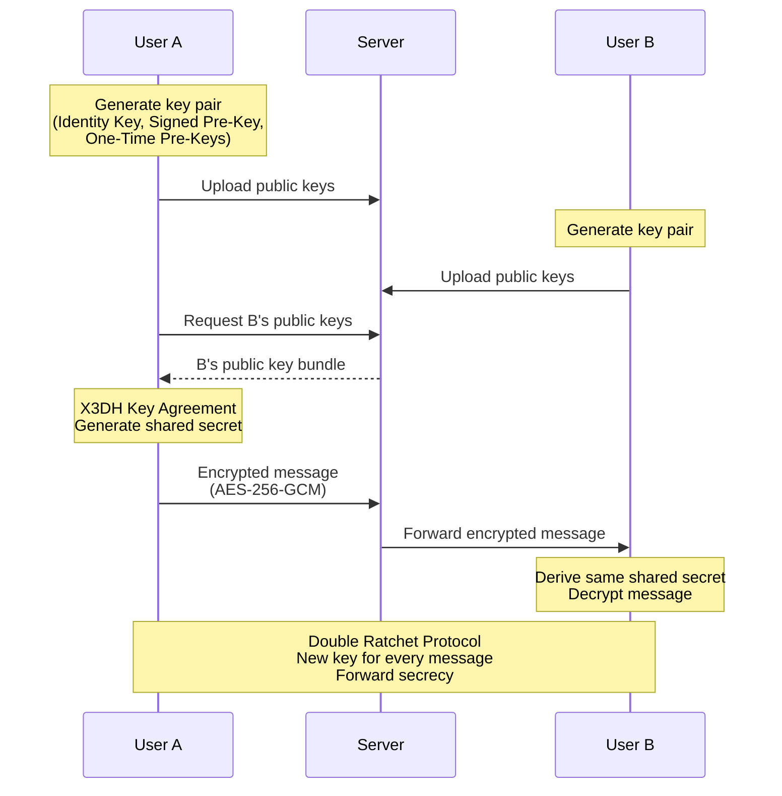
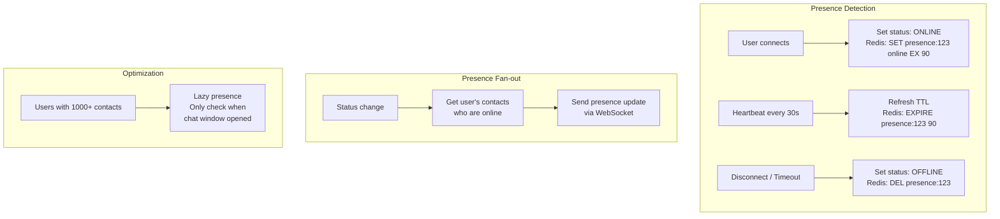

# 8. Chat System (WhatsApp / Messenger)

> **Difficulty**: Hard | **Asked by**: Meta, Microsoft, Google, Amazon, Slack

## Table of Contents
- [Requirements](#requirements)
- [Capacity Estimation](#capacity-estimation)
- [High-Level Design](#high-level-design)
- [Low-Level Design](#low-level-design)
- [Implementation](#implementation)
- [Limitations & Improvements](#limitations--improvements)

---

## Requirements

### Functional Requirements
1. One-on-one messaging (text, images, files)
2. Group messaging (up to 500 members)
3. Online/offline presence indicators
4. Read receipts and typing indicators
5. Message history and search
6. Push notifications for offline users

### Non-Functional Requirements
1. **Real-time**: Message delivery < 100ms (same region)
2. **Reliability**: No message loss, at-least-once delivery
3. **Ordering**: Messages ordered per conversation
4. **Scale**: 50M concurrent connections, 100B messages/day
5. **E2E Encryption**: Messages encrypted client-to-client

---

## Capacity Estimation

```
DAU: 500M users
Concurrent connections: 50M (10% online at any time)
Messages/day: 100B (avg 200 msgs/user/day)
QPS: ~1.2M messages/sec
Average message size: 200 bytes
Daily storage: 100B × 200 bytes = 20 TB/day
Media messages: 10% × 100B × 100KB avg = 1 PB/day (stored on CDN)
```

---

## High-Level Design

### Architecture Overview

```mermaid
graph TB
    subgraph "Clients"
        C1[User A<br/>Mobile/Web]
        C2[User B<br/>Mobile/Web]
    end
    
    C1 <-->|WebSocket| GW1[Chat Gateway<br/>Server 1]
    C2 <-->|WebSocket| GW2[Chat Gateway<br/>Server 2]
    
    GW1 & GW2 <--> MsgSvc[Message Service]
    MsgSvc --> MQ[(Message Queue<br/>Kafka)]
    MQ --> MsgStore[(Message Store<br/>Cassandra)]
    
    GW1 & GW2 <--> Presence[Presence Service<br/>Redis]
    GW1 & GW2 <--> Session[Session Service<br/>Redis<br/>user → gateway mapping]
    
    MsgSvc --> Push[Push Notification<br/>Service]
    
    subgraph "Media"
        Media[Media Service] --> S3[(S3/Blob Storage)]
        S3 --> CDN[CDN]
    end
    
    subgraph "Support Services"
        Group[Group Service]
        Search[Search Service<br/>Elasticsearch]
        Sync[Sync Service<br/>Message history]
    end
```

### Message Flow (1:1)



### Group Message Flow



---

## Low-Level Design

### Data Models



### Message Storage (Cassandra)

```
# Partition by conversation_id for locality
# Cluster by message_id (time-ordered) for efficient range queries

CREATE TABLE messages (
    conversation_id BIGINT,
    message_id      BIGINT,      -- Snowflake: time-sortable
    sender_id       BIGINT,
    content         BLOB,        -- Encrypted content
    type            TEXT,
    created_at      TIMESTAMP,
    PRIMARY KEY (conversation_id, message_id)
) WITH CLUSTERING ORDER BY (message_id DESC);

# Hot conversations are on same partition → fast reads
# Pagination: SELECT * FROM messages 
#   WHERE conversation_id = ? AND message_id < ? LIMIT 50
```

### WebSocket Connection Management



### End-to-End Encryption (Signal Protocol)



### Presence System



---

## Implementation

### Chat Gateway (WebSocket Server)

```python
import asyncio
import json
import websockets
from typing import Dict, Set

class ChatGateway:
    """WebSocket gateway for chat connections."""
    
    def __init__(self, session_store, message_service, presence_service):
        self.connections: Dict[int, websockets.WebSocketServerProtocol] = {}
        self.session_store = session_store
        self.message_svc = message_service
        self.presence_svc = presence_service
        self.gateway_id = "gateway-1"  # Unique per instance
    
    async def handle_connection(self, websocket, path):
        user_id = await self._authenticate(websocket)
        if not user_id:
            return
        
        # Register connection
        self.connections[user_id] = websocket
        await self.session_store.register(user_id, self.gateway_id)
        await self.presence_svc.set_online(user_id)
        
        try:
            # Deliver pending messages
            await self._sync_pending_messages(user_id, websocket)
            
            # Listen for messages
            async for raw_message in websocket:
                await self._handle_message(user_id, json.loads(raw_message))
        finally:
            # Cleanup on disconnect
            del self.connections[user_id]
            await self.session_store.unregister(user_id)
            await self.presence_svc.set_offline(user_id)
    
    async def _handle_message(self, sender_id: int, message: dict):
        msg_type = message.get("type")
        
        if msg_type == "text":
            await self.message_svc.send_message(
                sender_id=sender_id,
                conversation_id=message["conversation_id"],
                content=message["content"]
            )
        elif msg_type == "typing":
            await self._broadcast_typing(sender_id, message["conversation_id"])
        elif msg_type == "read_receipt":
            await self._handle_read_receipt(sender_id, message)
        elif msg_type == "heartbeat":
            await self.presence_svc.refresh(sender_id)
    
    async def deliver_to_user(self, user_id: int, message: dict):
        """Deliver message if user is connected to this gateway."""
        ws = self.connections.get(user_id)
        if ws:
            await ws.send(json.dumps(message))
            return True
        return False
    
    async def _sync_pending_messages(self, user_id, websocket):
        """Send messages received while user was offline."""
        pending = await self.message_svc.get_pending(user_id)
        for msg in pending:
            await websocket.send(json.dumps(msg))


class MessageService:
    """Core message processing service."""
    
    def __init__(self, message_store, session_store, gateway_registry, 
                 push_service, group_service):
        self.store = message_store
        self.sessions = session_store
        self.gateways = gateway_registry
        self.push = push_service
        self.groups = group_service
    
    async def send_message(self, sender_id: int, conversation_id: int, 
                           content: str):
        # 1. Generate message ID (Snowflake for ordering)
        message_id = self._generate_id()
        
        # 2. Persist message
        message = {
            "id": message_id,
            "conversation_id": conversation_id,
            "sender_id": sender_id,
            "content": content,
            "status": "sent",
            "timestamp": self._now()
        }
        await self.store.save(message)
        
        # 3. Get conversation members
        members = await self.groups.get_members(conversation_id)
        
        # 4. Deliver to each member
        for member_id in members:
            if member_id == sender_id:
                continue
            
            session = await self.sessions.get(member_id)
            
            if session:
                # User online: route to their gateway
                gateway = self.gateways.get(session["gateway_id"])
                delivered = await gateway.deliver_to_user(member_id, message)
                if delivered:
                    message["status"] = "delivered"
                    continue
            
            # User offline: send push notification
            await self.push.notify(member_id, message)
```

---

## Limitations & Improvements

### Current Limitations

| Limitation | Impact | Severity |
|-----------|--------|----------|
| WebSocket reconnection during network switch | Message gap during reconnect | Medium |
| Group fan-out for large groups (500 members) | High latency for large groups | Medium |
| Presence fan-out for popular users | Unnecessary traffic for contacts | Medium |
| Single-device message sync | Multi-device consistency issues | High |
| Message search at scale | Encrypted messages hard to index | High |

### Improvement Areas

1. **Multi-device Sync** — Sync protocol with per-device last-read offsets
2. **Message Reactions & Threads** — Support rich interaction patterns
3. **Voice/Video Calling** — WebRTC integration with TURN/STUN servers
4. **Disappearing Messages** — TTL-based auto-deletion
5. **Media Optimization** — Progressive image loading, thumbnail generation, video compression

---

## Key Interview Discussion Points

1. **WebSocket vs Long Polling vs SSE?** WebSocket for bidirectional real-time; long polling as fallback
2. **How to guarantee message ordering?** Snowflake IDs (time-sorted) + single partition per conversation
3. **How to handle user on multiple devices?** Synced message ID; deliver to all active sessions
4. **Read receipts at scale?** Batch read receipts; aggregate for group chats
5. **E2E encryption impact?** Server cannot read/search/moderate content; trade-off with features
