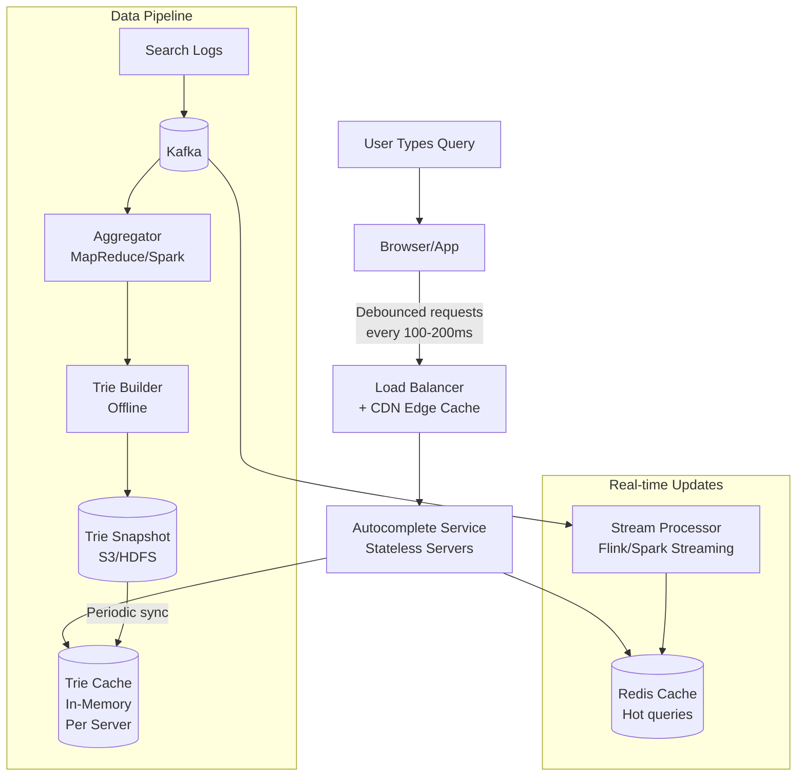
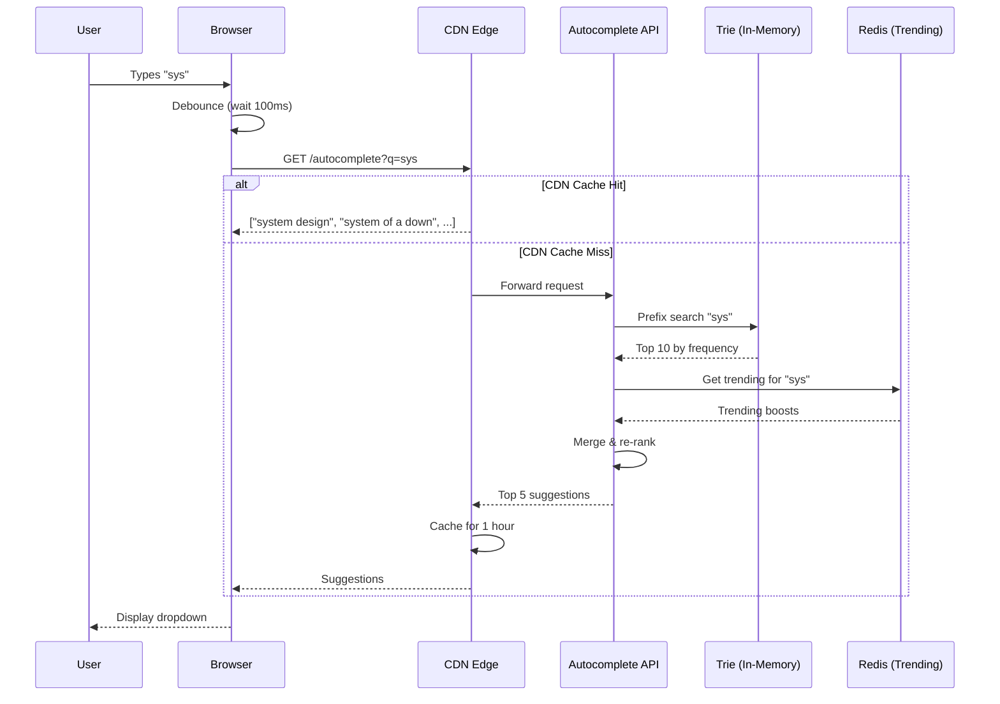
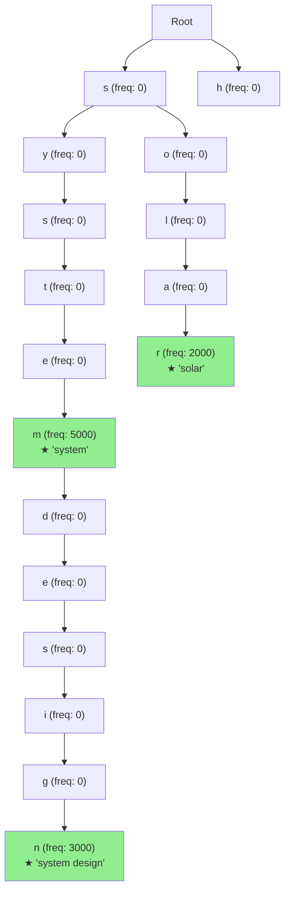
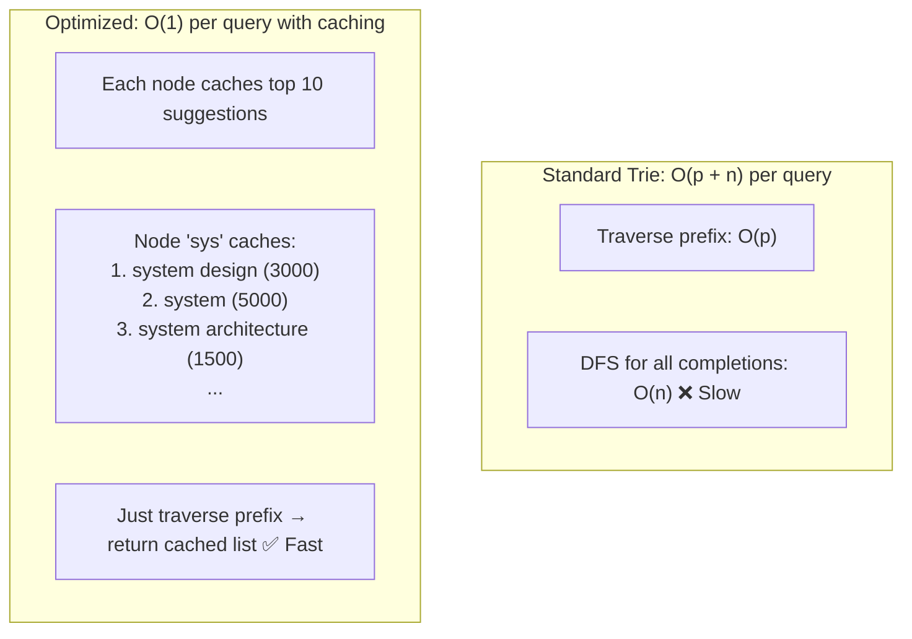
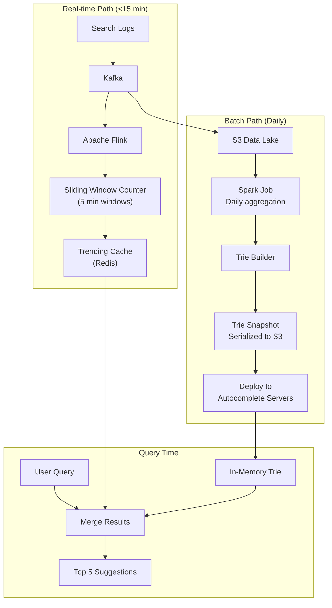

# 9. Search Autocomplete (Typeahead)

> **Difficulty**: Medium | **Asked by**: Google, Amazon, Microsoft, LinkedIn, Uber

## Table of Contents
- [Requirements](#requirements)
- [Capacity Estimation](#capacity-estimation)
- [High-Level Design](#high-level-design)
- [Low-Level Design](#low-level-design)
- [Implementation](#implementation)
- [Limitations & Improvements](#limitations--improvements)

---

## Requirements

### Functional Requirements
1. Return top 5-10 suggestions as user types each character
2. Suggestions ranked by popularity/relevance
3. Support multi-language queries
4. Personalized suggestions based on user history
5. Filter offensive/sensitive content

### Non-Functional Requirements
1. **Ultra-Low Latency**: < 50ms per keystroke response
2. **High Availability**: 99.99%
3. **Scalability**: 10B queries/day, 100K QPS
4. **Fresh Data**: New trending queries appear within 15 minutes

---

## Capacity Estimation

```
Daily queries: 10B (including partial keystrokes)
QPS: ~115K (peak: 300K)
Unique query terms: ~5 Billion (historical)
Active suggestions: ~100M top queries
Average query length: 20 characters
Trie node count: ~100M × 20 = 2B nodes
Memory per node: ~50 bytes → 100 GB (distributed across servers)
```

---

## High-Level Design

### Architecture Overview



### Request Flow



---

## Low-Level Design

### Trie Data Structure



### Optimized Trie with Top-K Cache



### Trie Node Structure

```
class TrieNode:
    children: Dict[char, TrieNode]    # Map of child nodes
    is_end: bool                       # Is this a complete word?
    frequency: int                     # Search frequency
    top_suggestions: List[(str, int)]  # Pre-computed top-K
    
Memory Layout (optimized):
┌───────────────────────────────────┐
│ TrieNode                          │
│ ├─ children: HashMap (26-char)    │  16-52 bytes
│ ├─ is_end: bool                   │  1 byte
│ ├─ frequency: u32                 │  4 bytes
│ └─ top_k: [(ptr, u32)] × 10      │  120 bytes
└───────────────────────────────────┘
~180 bytes per node
```

### Trie Sharding Strategy

```mermaid
graph TD
    subgraph "Shard by First Character"
        Q[Query: "system design"] --> Router[Shard Router]
        Router --> SA["Shard A: a-f"]
        Router --> SB["Shard B: g-m"]
        Router --> SC["Shard C: n-s ✅"]
        Router --> SD["Shard D: t-z"]
        Router --> SE["Shard E: 0-9, special"]
    end
    
    subgraph "Alternative: Shard by Hash"
        Q2[Query prefix hash] --> CH[Consistent Hashing]
        CH --> Node1[Node 1]
        CH --> Node2[Node 2]
        CH --> Node3[Node 3]
    end
```

### Data Pipeline for Trie Updates



---

## Implementation

### Trie Implementation

```python
from typing import List, Tuple, Optional, Dict
import heapq
from collections import defaultdict

class TrieNode:
    __slots__ = ['children', 'is_end', 'frequency', 'top_suggestions']
    
    def __init__(self):
        self.children: Dict[str, 'TrieNode'] = {}
        self.is_end: bool = False
        self.frequency: int = 0
        self.top_suggestions: List[Tuple[int, str]] = []  # [(freq, word)]

class AutocompleteTrie:
    """Trie with pre-computed top-K suggestions per node."""
    
    TOP_K = 10
    
    def __init__(self):
        self.root = TrieNode()
    
    def insert(self, word: str, frequency: int):
        """Insert a word with its frequency."""
        node = self.root
        for char in word:
            if char not in node.children:
                node.children[char] = TrieNode()
            node = node.children[char]
        node.is_end = True
        node.frequency = frequency
    
    def build_top_k_cache(self):
        """Pre-compute top-K suggestions for every node (DFS)."""
        self._dfs_build(self.root)
    
    def _dfs_build(self, node: TrieNode) -> List[Tuple[int, str]]:
        """DFS to collect all completions and cache top-K at each node."""
        results = []
        
        if node.is_end:
            results.append((-node.frequency, ""))  # Will build full word later
        
        for char, child in node.children.items():
            child_results = self._dfs_build(child)
            for freq, suffix in child_results:
                results.append((freq, char + suffix))
        
        # Keep only top K
        results.sort()
        node.top_suggestions = results[:self.TOP_K]
        return node.top_suggestions
    
    def search(self, prefix: str) -> List[Tuple[str, int]]:
        """Get top-K suggestions for a prefix. O(len(prefix))."""
        node = self.root
        
        for char in prefix:
            if char not in node.children:
                return []
            node = node.children[char]
        
        # Return pre-computed top-K
        return [
            (prefix + suffix, -freq)
            for freq, suffix in node.top_suggestions
        ]


class AutocompleteService:
    """Service combining trie with real-time trending data."""
    
    def __init__(self, trie: AutocompleteTrie, redis_client, 
                 filter_service):
        self.trie = trie
        self.redis = redis_client
        self.filter = filter_service
    
    def suggest(self, prefix: str, user_id: Optional[int] = None,
                limit: int = 5) -> List[dict]:
        """Get autocomplete suggestions."""
        if len(prefix) < 1:
            return []
        
        prefix = prefix.lower().strip()
        
        # 1. Get from pre-computed trie
        trie_results = self.trie.search(prefix)
        
        # 2. Get trending queries for this prefix
        trending = self._get_trending(prefix)
        
        # 3. Get personalized suggestions
        personal = self._get_personal(prefix, user_id) if user_id else []
        
        # 4. Merge and rank
        merged = self._merge_results(trie_results, trending, personal)
        
        # 5. Filter offensive content
        filtered = self.filter.apply(merged)
        
        return filtered[:limit]
    
    def _get_trending(self, prefix: str) -> List[Tuple[str, int]]:
        """Get trending queries from Redis."""
        key = f"trending:{prefix[:3]}"  # Bucket by first 3 chars
        results = self.redis.zrevrange(key, 0, 9, withscores=True)
        return [(q.decode(), int(s)) for q, s in results]
    
    def _get_personal(self, prefix: str, user_id: int):
        """Get user's recent queries matching prefix."""
        key = f"user_queries:{user_id}"
        all_queries = self.redis.lrange(key, 0, 99)
        return [
            (q.decode(), 1000)  # Boost personal results
            for q in all_queries
            if q.decode().startswith(prefix)
        ][:3]
    
    def _merge_results(self, trie, trending, personal):
        """Merge results with weighted scoring."""
        scores = defaultdict(float)
        
        for query, freq in personal:
            scores[query] += freq * 3.0  # 3x boost for personal
        for query, freq in trending:
            scores[query] += freq * 2.0  # 2x boost for trending
        for query, freq in trie:
            scores[query] += freq * 1.0
        
        return sorted(
            [{"query": q, "score": s} for q, s in scores.items()],
            key=lambda x: -x["score"]
        )
```

---

## Limitations & Improvements

### Current Limitations

| Limitation | Impact | Severity |
|-----------|--------|----------|
| Trie memory footprint (100GB+) | High infrastructure cost | Medium |
| Batch trie updates (daily) | Slow to reflect new trends | Medium |
| No typo tolerance | Missing suggestions for misspellings | High |
| Single-language per trie | Multilingual support complex | Medium |
| No context awareness | Same suggestions regardless of context | Medium |

### Improvement Areas

1. **Fuzzy Matching** — Edit distance (Levenshtein) for typo correction
2. **Context-Aware** — Use location, time of day, recent activity for personalization
3. **Compressed Trie (Patricia Trie)** — Merge single-child chains to reduce memory
4. **ML-Based Ranking** — BERT/transformer models for semantic understanding
5. **Multi-modal** — Suggest images, products, or entities alongside text

---

## Key Interview Discussion Points

1. **Why Trie over Elasticsearch?** Trie gives O(prefix_length) lookup; ES is slower for pure prefix matching
2. **How to handle multi-language?** Separate tries per language or Unicode-aware trie
3. **Browser optimization?** Debouncing (200ms delay), local caching, prefetch popular prefixes
4. **How fresh are suggestions?** Real-time via Redis for trending; daily batch for trie rebuild
5. **How to filter inappropriate content?** Blocklist + ML classifier on trie build; runtime checks
