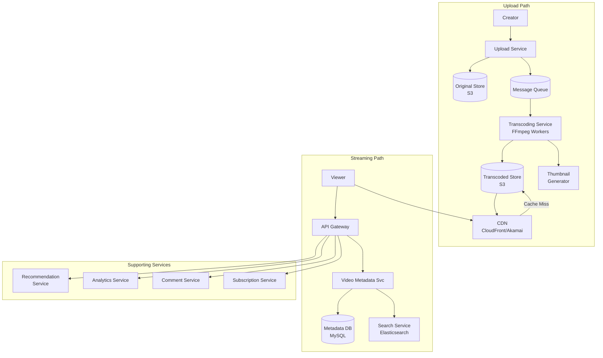
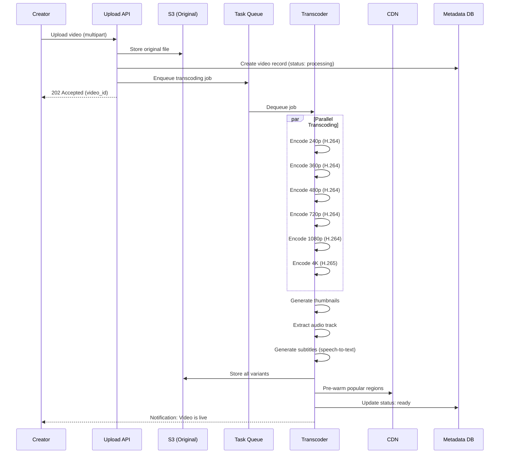
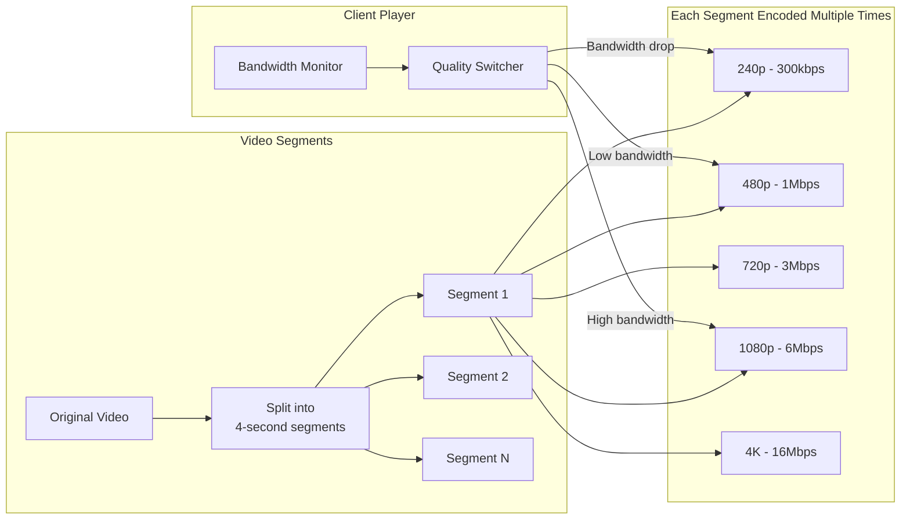
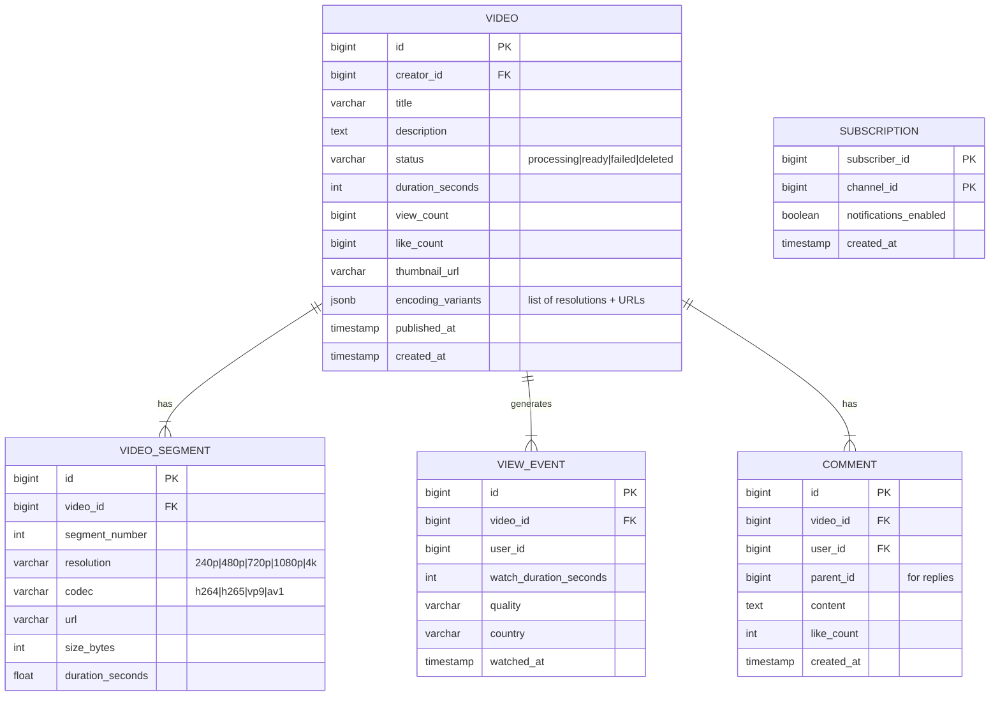
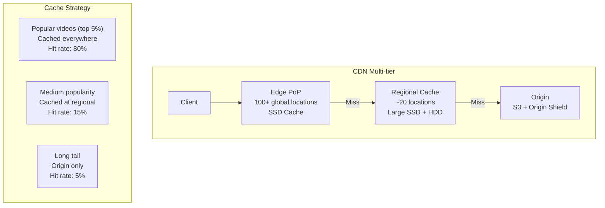
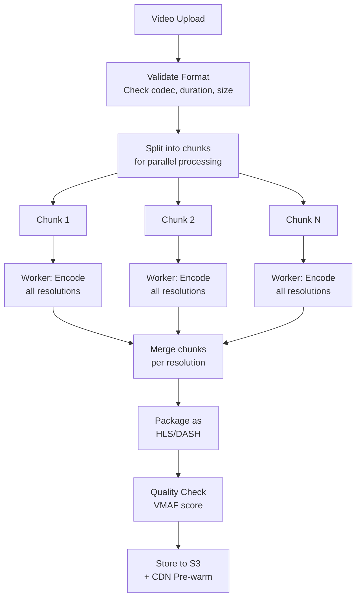
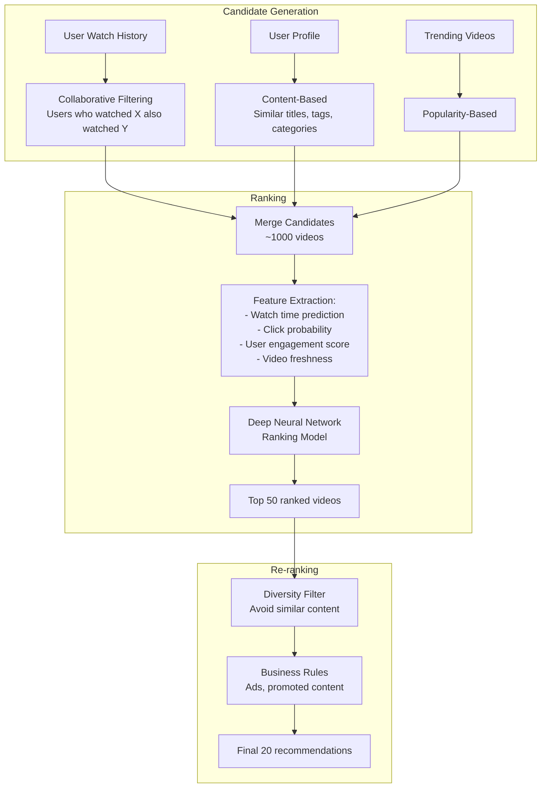

# 10. Video Streaming Platform (YouTube / Netflix)

> **Difficulty**: Hard | **Asked by**: Netflix, Google, Amazon, Meta, Disney+

## Table of Contents
- [Requirements](#requirements)
- [Capacity Estimation](#capacity-estimation)
- [High-Level Design](#high-level-design)
- [Low-Level Design](#low-level-design)
- [Implementation](#implementation)
- [Limitations & Improvements](#limitations--improvements)

---

## Requirements

### Functional Requirements
1. Upload videos (creators)
2. Stream/watch videos (viewers)
3. Search videos by title, description, tags
4. Video recommendations
5. Like, comment, subscribe
6. Video analytics (views, watch time)

### Non-Functional Requirements
1. **High Availability**: 99.99% uptime
2. **Low Latency Streaming**: < 200ms start time
3. **Scalability**: 1B DAU, 500M hours of video watched/day
4. **Global Reach**: Low latency worldwide via CDN
5. **Adaptive Bitrate**: Adjust quality based on bandwidth

---

## Capacity Estimation

```
DAU: 1 Billion users
Videos watched/day: 5B (avg 5 per user)
New videos uploaded/day: 500K
Average video length: 5 minutes
Average video size (raw): 600 MB (1080p, 5 min)
Storage per video (all encodings): ~2 GB
Daily upload storage: 500K × 2 GB = 1 PB/day
Total storage (5 years): ~1.8 Exabytes

Streaming bandwidth:
  5B videos × 10 MB average (adaptive) = 50 PB/day
  Peak bandwidth: ~5 Tbps

CDN: Cache 20% of videos (popular) = covers 80% of traffic
```

---

## High-Level Design

### Architecture Overview



### Video Upload & Processing Pipeline



### Adaptive Bitrate Streaming (ABR)



### HLS/DASH Manifest

```
#EXTM3U
#EXT-X-STREAM-INF:BANDWIDTH=300000,RESOLUTION=426x240
/video/abc123/240p/playlist.m3u8
#EXT-X-STREAM-INF:BANDWIDTH=1000000,RESOLUTION=854x480
/video/abc123/480p/playlist.m3u8
#EXT-X-STREAM-INF:BANDWIDTH=3000000,RESOLUTION=1280x720
/video/abc123/720p/playlist.m3u8
#EXT-X-STREAM-INF:BANDWIDTH=6000000,RESOLUTION=1920x1080
/video/abc123/1080p/playlist.m3u8

# Segment playlist (720p):
#EXTINF:4.0,
segment_001.ts
#EXTINF:4.0,
segment_002.ts
...
```

---

## Low-Level Design

### Data Models



### CDN Architecture



### Transcoding Pipeline Architecture



### Video Recommendation System



---

## Implementation

### Video Upload Service

```python
import uuid
from dataclasses import dataclass
from typing import List, Optional
from enum import Enum

class VideoStatus(Enum):
    UPLOADING = "uploading"
    PROCESSING = "processing"
    READY = "ready"
    FAILED = "failed"

@dataclass
class TranscodingJob:
    video_id: str
    source_url: str
    target_resolutions: List[str]
    codec: str = "h264"
    
class VideoUploadService:
    """Handles video upload and transcoding orchestration."""
    
    SUPPORTED_FORMATS = {"mp4", "mov", "avi", "mkv", "webm"}
    MAX_FILE_SIZE = 128 * 1024 * 1024 * 1024  # 128 GB
    RESOLUTIONS = ["240p", "360p", "480p", "720p", "1080p"]
    
    def __init__(self, storage, queue, metadata_db, cdn):
        self.storage = storage
        self.queue = queue
        self.db = metadata_db
        self.cdn = cdn
    
    async def upload(self, creator_id: int, file_stream, 
                     metadata: dict) -> str:
        video_id = str(uuid.uuid4())
        
        # 1. Validate
        self._validate(file_stream, metadata)
        
        # 2. Upload to S3 (multipart for large files)
        source_url = await self.storage.upload(
            bucket="raw-videos",
            key=f"{video_id}/original",
            stream=file_stream
        )
        
        # 3. Create metadata record
        await self.db.create_video({
            "id": video_id,
            "creator_id": creator_id,
            "title": metadata["title"],
            "description": metadata.get("description", ""),
            "status": VideoStatus.PROCESSING.value,
            "source_url": source_url
        })
        
        # 4. Enqueue transcoding job
        job = TranscodingJob(
            video_id=video_id,
            source_url=source_url,
            target_resolutions=self.RESOLUTIONS
        )
        await self.queue.enqueue("transcoding-jobs", job)
        
        return video_id
    
    def _validate(self, file_stream, metadata):
        if not metadata.get("title"):
            raise ValueError("Title required")
        # Additional validations...


class VideoStreamingService:
    """Serves video streaming requests."""
    
    def __init__(self, metadata_db, cdn_url_signer):
        self.db = metadata_db
        self.signer = cdn_url_signer
    
    async def get_manifest(self, video_id: str, 
                           user_id: Optional[int] = None) -> dict:
        """Return HLS/DASH manifest with signed CDN URLs."""
        video = await self.db.get_video(video_id)
        
        if video["status"] != "ready":
            raise ValueError("Video not available")
        
        # Generate signed URLs (expire in 6 hours)
        variants = []
        for variant in video["encoding_variants"]:
            signed_url = self.signer.sign(
                url=variant["url"],
                expires_in=21600  # 6 hours
            )
            variants.append({
                "resolution": variant["resolution"],
                "bitrate": variant["bitrate"],
                "codec": variant["codec"],
                "url": signed_url
            })
        
        # Log view event (async)
        await self._log_view(video_id, user_id)
        
        return {
            "video_id": video_id,
            "title": video["title"],
            "duration": video["duration_seconds"],
            "variants": variants
        }
```

---

## Limitations & Improvements

### Current Limitations

| Limitation | Impact | Severity |
|-----------|--------|----------|
| Transcoding cost & time | Hours for 4K videos, expensive GPU | High |
| CDN costs at petabyte scale | Major infrastructure expense | High |
| Cold start for new videos | Not cached at edge, slow first view | Medium |
| Copyright detection latency | Infringing content visible briefly | Medium |
| Live streaming not covered | Different architecture needed | Medium |

### Improvement Areas

1. **Codec Evolution** — AV1 codec for 30% better compression than H.265
2. **Edge Computing** — Transcode at edge for live streams
3. **AI-Powered CDN** — Predict popular videos and pre-warm cache
4. **Content Moderation** — Real-time AI moderation during upload
5. **Live Streaming** — WebRTC for ultra-low latency; HLS for scale

---

## Key Interview Discussion Points

1. **Why HLS/DASH over progressive download?** Adaptive bitrate, better seeking, CDN-friendly segments
2. **How does Netflix handle 200M users?** Open Connect CDN (custom hardware at ISPs)
3. **Horizontal scaling for transcoding?** Spot instances, GPU clusters, chunked parallel processing
4. **How to handle viral videos?** CDN auto-scales; origin shield prevents thundering herd
5. **Cost optimization?** Tiered storage (hot/cold), codec efficiency, regional transcoding
