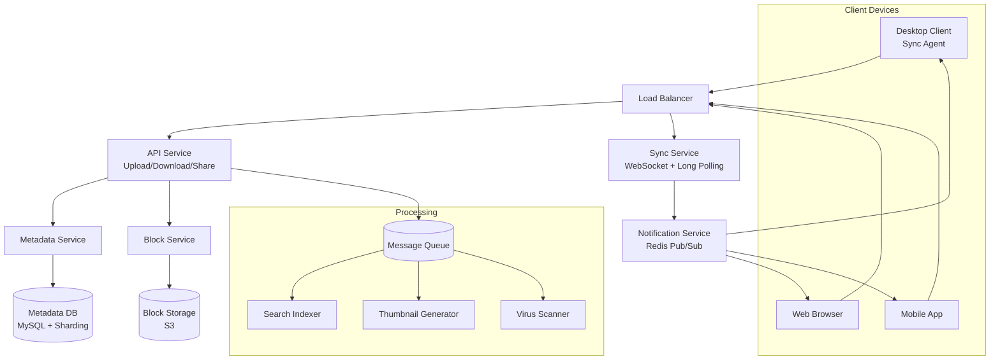
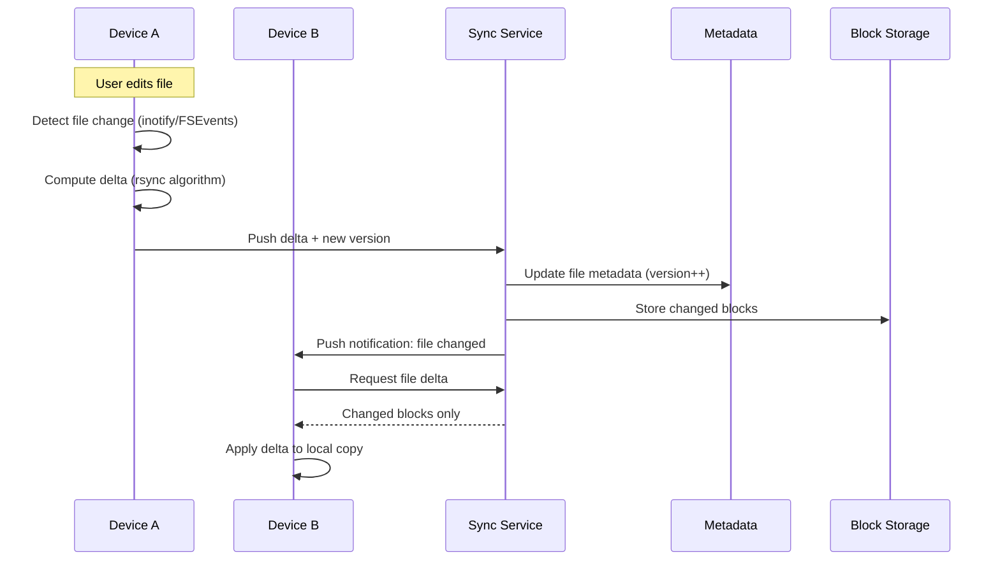
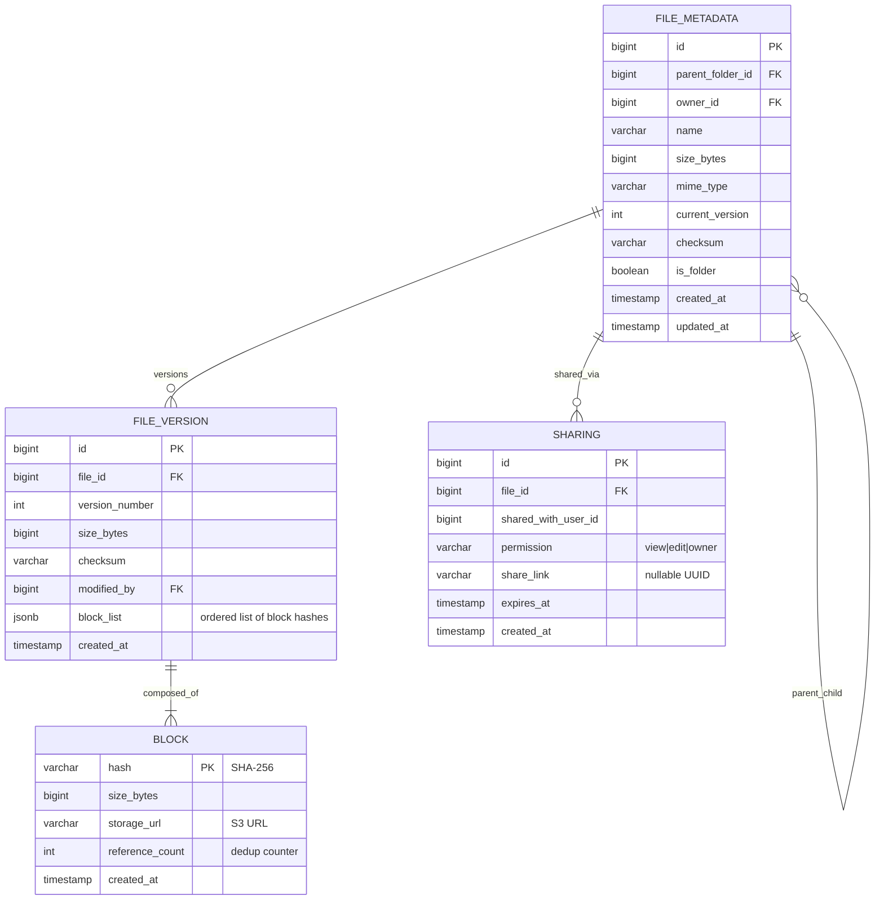
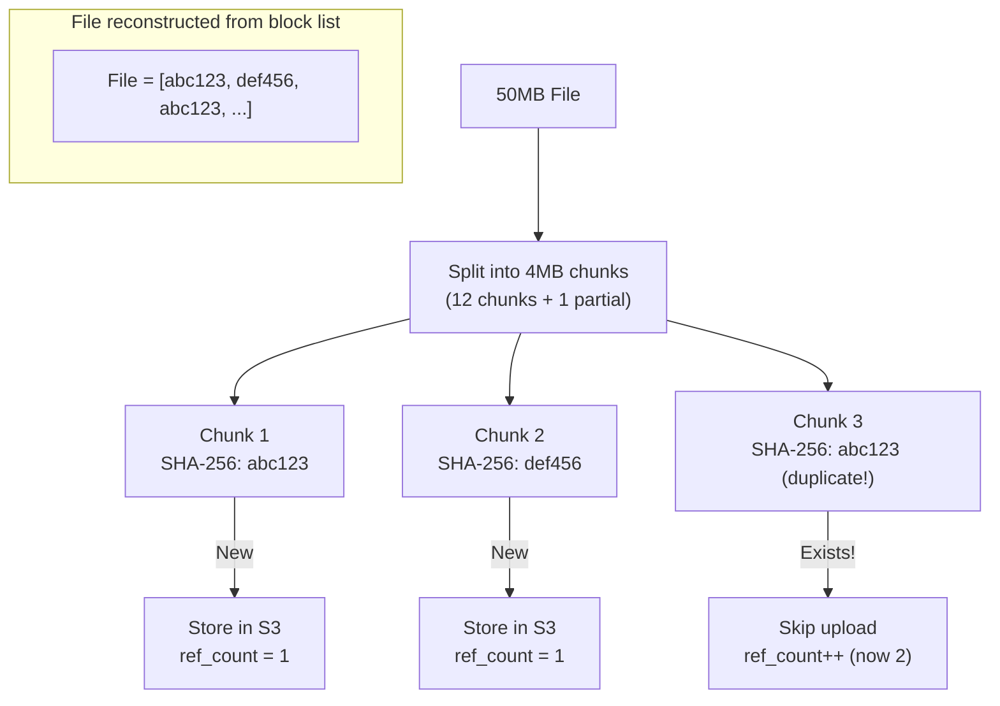
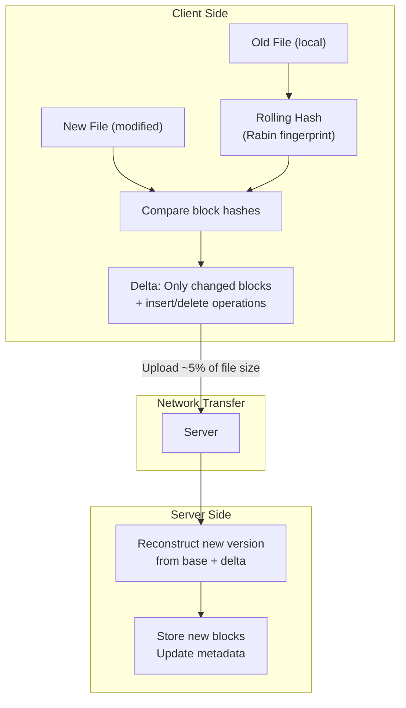
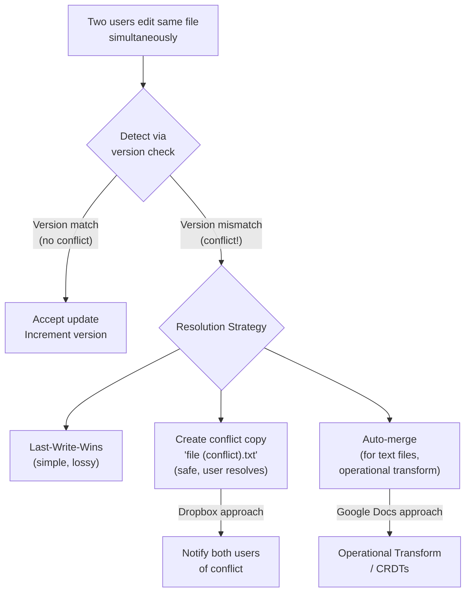

# 11. Google Drive / Dropbox (Cloud File Storage)

> **Difficulty**: Hard | **Asked by**: Google, Microsoft, Dropbox, Amazon, Apple

## Table of Contents
- [Requirements](#requirements)
- [Capacity Estimation](#capacity-estimation)
- [High-Level Design](#high-level-design)
- [Low-Level Design](#low-level-design)
- [Implementation](#implementation)
- [Limitations & Improvements](#limitations--improvements)

---

## Requirements

### Functional Requirements
1. Upload/download files
2. File sync across multiple devices
3. File/folder sharing with permissions
4. File versioning (revision history)
5. Offline editing with sync on reconnect
6. Real-time collaboration notifications

### Non-Functional Requirements
1. **Reliability**: No data loss (11 nines durability)
2. **Availability**: 99.9% uptime
3. **Scalability**: 500M users, 10B files
4. **Sync Efficiency**: Minimal bandwidth usage (delta sync)
5. **Consistency**: Eventual consistency OK; conflicts resolved gracefully

---

## Capacity Estimation

```
Users: 500M total, 100M DAU
Files per user: average 200
Total files: 100 Billion
Average file size: 500KB
Total storage: 100B × 500KB = 50 PB
Daily uploads: 2B files (file changes + new files)
Upload bandwidth: 2B × 500KB = 1 PB/day
Metadata per file: ~500 bytes
Metadata storage: 100B × 500B = 50 TB
```

---

## High-Level Design

### Architecture Overview



### File Upload Flow (Chunked + Dedup)

```mermaid
sequenceDiagram
    participant C as Client
    participant API as API Server
    participant Meta as Metadata Service
    participant Block as Block Service
    participant S3 as S3 Storage
    participant Notify as Notification Service
    
    C->>C: Split file into 4MB chunks
    C->>C: Compute hash for each chunk
    
    C->>API: Upload request (file metadata + chunk hashes)
    API->>Block: Check which chunks already exist
    Block-->>API: Chunks 1,3 exist; need 2,4
    API-->>C: Upload only chunks 2,4
    
    par Upload missing chunks
        C->>Block: Upload chunk 2
        C->>Block: Upload chunk 4
    end
    
    Block->>S3: Store new chunks
    Block-->>API: Chunks stored
    
    API->>Meta: Create/update file metadata
    Meta-->>API: File version created
    
    API->>Notify: File changed event
    Notify->>C: Sync update to other devices
    
    API-->>C: Upload complete (version 3)
```

### File Sync Flow



---

## Low-Level Design

### Data Models



### Block-Level Deduplication



### Delta Sync Algorithm (Rsync-like)



### Conflict Resolution



---

## Implementation

### Block Storage Service

```python
import hashlib
from typing import List, Optional
from dataclasses import dataclass

CHUNK_SIZE = 4 * 1024 * 1024  # 4 MB

@dataclass
class Block:
    hash: str
    data: bytes
    size: int

class BlockService:
    """Manages file blocks with deduplication."""
    
    def __init__(self, storage_backend, block_db):
        self.storage = storage_backend  # S3
        self.db = block_db
    
    def split_into_blocks(self, file_data: bytes) -> List[Block]:
        """Split file into fixed-size blocks with hashes."""
        blocks = []
        for i in range(0, len(file_data), CHUNK_SIZE):
            chunk = file_data[i:i + CHUNK_SIZE]
            block_hash = hashlib.sha256(chunk).hexdigest()
            blocks.append(Block(hash=block_hash, data=chunk, size=len(chunk)))
        return blocks
    
    async def upload_blocks(self, blocks: List[Block]) -> List[str]:
        """Upload blocks with dedup. Returns list of block hashes."""
        hashes = [b.hash for b in blocks]
        
        # Check which blocks already exist
        existing = await self.db.get_existing_blocks(hashes)
        existing_set = set(existing)
        
        # Upload only new blocks
        for block in blocks:
            if block.hash not in existing_set:
                # Store in S3
                url = await self.storage.put(
                    bucket="file-blocks",
                    key=block.hash,
                    data=block.data
                )
                # Record in DB
                await self.db.create_block(block.hash, len(block.data), url)
            else:
                # Increment reference count
                await self.db.increment_ref_count(block.hash)
        
        return hashes
    
    async def download_file(self, block_hashes: List[str]) -> bytes:
        """Reconstruct file from block hashes."""
        file_data = bytearray()
        for block_hash in block_hashes:
            block_meta = await self.db.get_block(block_hash)
            data = await self.storage.get(block_meta["storage_url"])
            file_data.extend(data)
        return bytes(file_data)


class SyncService:
    """Handles file synchronization across devices."""
    
    def __init__(self, metadata_db, block_service, notification_service):
        self.meta = metadata_db
        self.blocks = block_service
        self.notify = notification_service
    
    async def sync_file_change(self, user_id: int, file_id: int,
                                new_blocks: List[Block],
                                expected_version: int) -> dict:
        """Process a file change from a client."""
        
        # 1. Optimistic concurrency check
        current = await self.meta.get_file(file_id)
        if current["current_version"] != expected_version:
            return {
                "status": "conflict",
                "server_version": current["current_version"],
                "action": "client_should_merge"
            }
        
        # 2. Upload blocks (with dedup)
        block_hashes = await self.blocks.upload_blocks(new_blocks)
        
        # 3. Create new version
        new_version = expected_version + 1
        checksum = hashlib.sha256(
            b''.join(b.data for b in new_blocks)
        ).hexdigest()
        
        await self.meta.create_version(
            file_id=file_id,
            version=new_version,
            block_list=block_hashes,
            checksum=checksum,
            modified_by=user_id
        )
        
        # 4. Update file metadata
        await self.meta.update_file(file_id, {
            "current_version": new_version,
            "checksum": checksum,
            "size_bytes": sum(b.size for b in new_blocks)
        })
        
        # 5. Notify other devices
        await self.notify.broadcast(
            user_id=user_id,
            event="file_changed",
            data={"file_id": file_id, "version": new_version}
        )
        
        return {"status": "success", "version": new_version}
```

---

## Limitations & Improvements

### Current Limitations

| Limitation | Impact | Severity |
|-----------|--------|----------|
| Fixed-size chunking inefficient for small edits | Re-upload unchanged chunks at boundaries | Medium |
| No real-time co-editing (like Google Docs) | Only offline/version-based collaboration | High |
| Conflict resolution requires user action | Bad UX for collaborative teams | Medium |
| Storage cost at petabyte scale | Expensive infrastructure | High |
| Slow initial sync for large folders | Poor first-time experience | Medium |

### Improvement Areas

1. **Content-Defined Chunking** — Rabin fingerprinting for variable-size chunks (better delta)
2. **Operational Transform / CRDTs** — Real-time co-editing like Google Docs
3. **Compression** — Compress blocks before storage (zstd)
4. **Tiered Storage** — Hot (SSD) → Cold (S3-IA) → Archive (Glacier)
5. **Smart Sync** — Only download file stubs; fetch content on demand

---

## Key Interview Discussion Points

1. **Fixed vs variable chunk size?** Variable (Rabin) handles insertions better; fixed is simpler
2. **How to handle large files (>10GB)?** Multipart upload, resumable, parallel chunk uploads
3. **How does dedup save storage?** Same blocks (e.g., common libraries) stored once across all users
4. **Conflict resolution strategy?** Depends on use case: LWW for simple, OT for real-time, fork for safety
5. **How to ensure durability?** 3-way replication in S3 + cross-region backup + checksums
