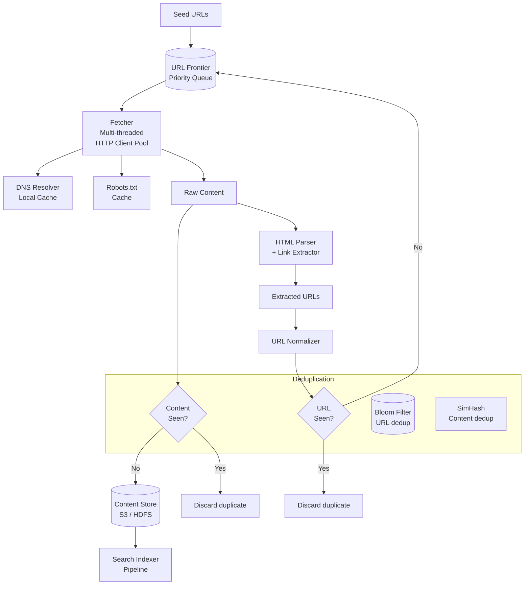
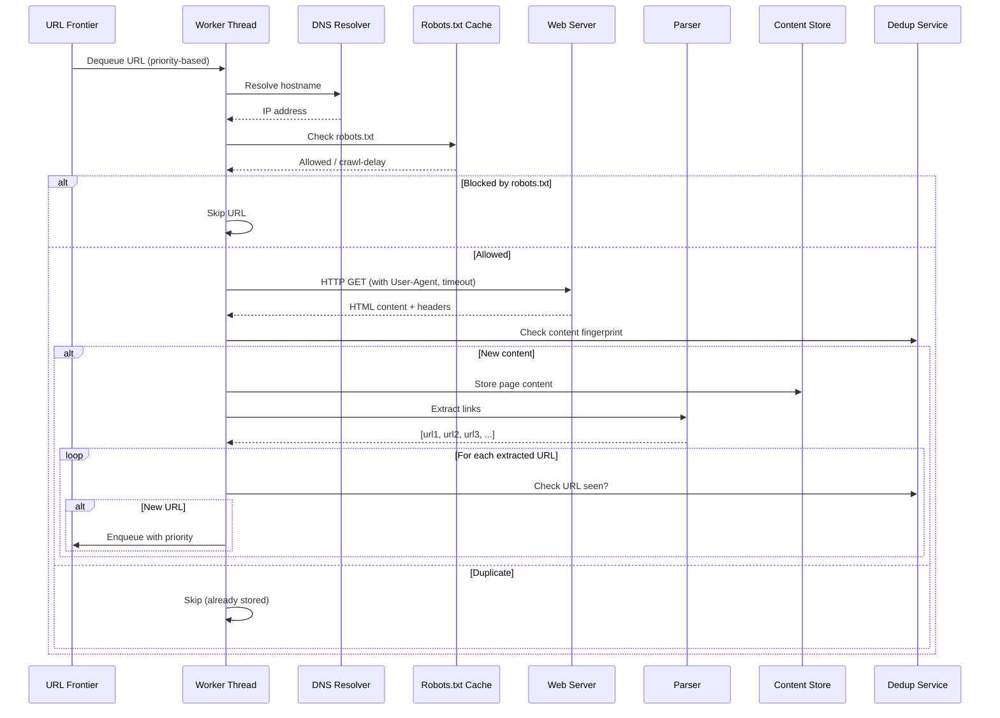
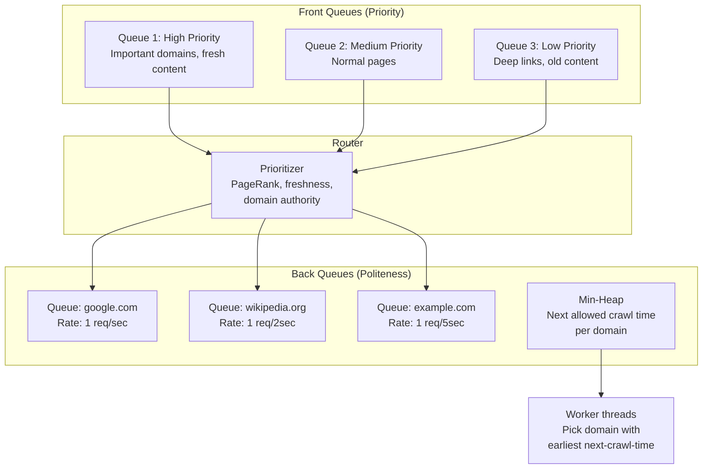
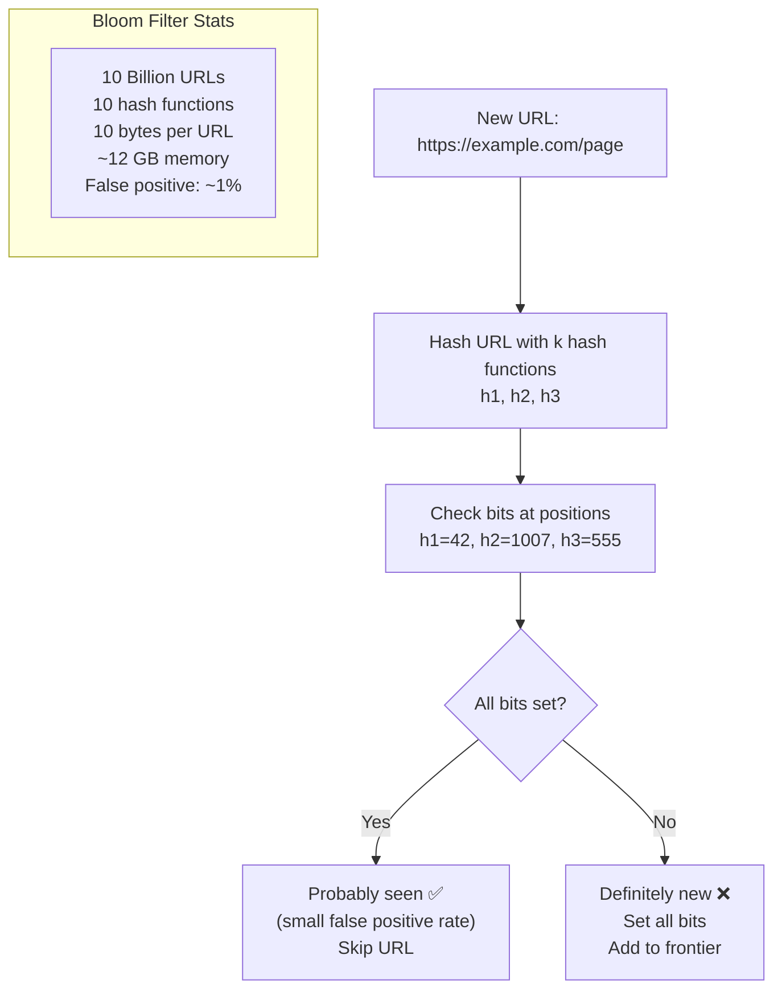
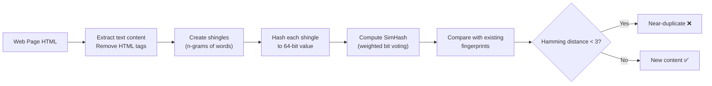
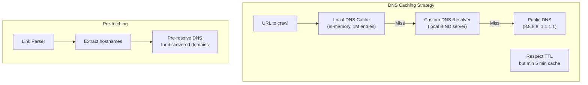
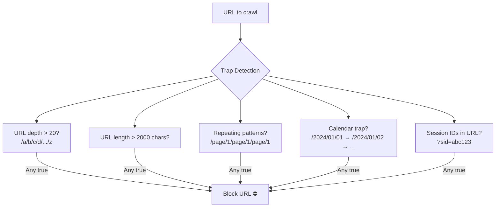

# 12. Web Crawler

> **Difficulty**: Medium | **Asked by**: Google, Microsoft (Bing), Amazon, Apple, ByteDance

## Table of Contents
- [Requirements](#requirements)
- [Capacity Estimation](#capacity-estimation)
- [High-Level Design](#high-level-design)
- [Low-Level Design](#low-level-design)
- [Implementation](#implementation)
- [Limitations & Improvements](#limitations--improvements)

---

## Requirements

### Functional Requirements
1. Crawl billions of web pages starting from seed URLs
2. Discover new pages by extracting links from crawled pages
3. Store page content for indexing
4. Respect robots.txt and crawl rate limits
5. Detect and avoid crawling duplicate content
6. Support incremental re-crawling (freshness)

### Non-Functional Requirements
1. **Scalability**: Crawl 1 Billion pages/day
2. **Politeness**: Honor robots.txt, limit requests per domain
3. **Robustness**: Handle malformed HTML, traps, infinite loops
4. **Extensibility**: Pluggable modules for different content types
5. **Priority**: Crawl important pages first

---

## Capacity Estimation

```
Pages to crawl: 1 Billion/day ≈ 11,574 pages/sec
Average page size: 500 KB (HTML + headers)
Daily storage: 1B × 500 KB = 500 TB/day
Bandwidth: ~46 Gbps sustained
URLs discovered/day: ~5B (many duplicates)
URL frontier size: ~100M unique URLs at any time
DNS queries: ~1B/day
```

---

## High-Level Design

### Architecture Overview



### Crawl Loop



---

## Low-Level Design

### URL Frontier (Priority + Politeness)



### URL Deduplication (Bloom Filter)



### Content Fingerprinting (SimHash)



### DNS Resolution Optimization



### Crawler Trap Detection



---

## Implementation

### Core Crawler

```python
import asyncio
import hashlib
import time
from dataclasses import dataclass, field
from typing import List, Set, Optional
from collections import defaultdict
import aiohttp
from urllib.parse import urljoin, urlparse
from html.parser import HTMLParser

@dataclass(order=True)
class CrawlTask:
    priority: int
    url: str = field(compare=False)
    depth: int = field(compare=False, default=0)
    discovered_at: float = field(compare=False, default_factory=time.time)

class URLFrontier:
    """Priority queue with politeness constraints."""
    
    def __init__(self, max_size=10_000_000):
        self.queues = defaultdict(asyncio.PriorityQueue)  # domain -> queue
        self.domain_next_crawl = {}  # domain -> next allowed timestamp
        self.default_delay = 1.0  # seconds between requests per domain
    
    async def put(self, task: CrawlTask):
        domain = urlparse(task.url).netloc
        await self.queues[domain].put(task)
    
    async def get(self) -> CrawlTask:
        """Get next URL respecting politeness."""
        now = time.time()
        
        for domain, queue in self.queues.items():
            if queue.empty():
                continue
            
            next_allowed = self.domain_next_crawl.get(domain, 0)
            if now >= next_allowed:
                task = await queue.get()
                delay = self.default_delay
                self.domain_next_crawl[domain] = now + delay
                return task
        
        await asyncio.sleep(0.1)
        return await self.get()  # Retry


class BloomFilter:
    """Space-efficient URL deduplication."""
    
    def __init__(self, expected_items=1_000_000_000, fp_rate=0.01):
        import math
        self.size = int(-expected_items * math.log(fp_rate) / (math.log(2)**2))
        self.num_hashes = int(self.size / expected_items * math.log(2))
        self.bits = bytearray(self.size // 8 + 1)
    
    def add(self, item: str):
        for i in range(self.num_hashes):
            pos = self._hash(item, i) % self.size
            self.bits[pos // 8] |= (1 << (pos % 8))
    
    def contains(self, item: str) -> bool:
        for i in range(self.num_hashes):
            pos = self._hash(item, i) % self.size
            if not (self.bits[pos // 8] & (1 << (pos % 8))):
                return False
        return True
    
    def _hash(self, item: str, seed: int) -> int:
        return int(hashlib.md5(f"{seed}:{item}".encode()).hexdigest(), 16)


class WebCrawler:
    """Distributed web crawler."""
    
    MAX_DEPTH = 15
    MAX_URL_LENGTH = 2000
    
    def __init__(self, seeds: List[str], num_workers: int = 100):
        self.frontier = URLFrontier()
        self.url_seen = BloomFilter()
        self.content_seen = set()  # SimHash fingerprints
        self.num_workers = num_workers
        self.robots_cache = {}
        self.seeds = seeds
    
    async def start(self):
        # Seed the frontier
        for url in self.seeds:
            await self.frontier.put(CrawlTask(priority=0, url=url, depth=0))
            self.url_seen.add(url)
        
        # Start worker pool
        workers = [
            asyncio.create_task(self._worker(i))
            for i in range(self.num_workers)
        ]
        await asyncio.gather(*workers)
    
    async def _worker(self, worker_id: int):
        async with aiohttp.ClientSession() as session:
            while True:
                task = await self.frontier.get()
                await self._process_url(session, task)
    
    async def _process_url(self, session, task: CrawlTask):
        url = task.url
        
        # Trap detection
        if task.depth > self.MAX_DEPTH or len(url) > self.MAX_URL_LENGTH:
            return
        
        # Check robots.txt
        if not await self._is_allowed(url):
            return
        
        try:
            async with session.get(url, timeout=aiohttp.ClientTimeout(total=30),
                                    headers={"User-Agent": "MyBot/1.0"}) as resp:
                if resp.status != 200:
                    return
                
                content_type = resp.headers.get("Content-Type", "")
                if "text/html" not in content_type:
                    return
                
                html = await resp.text()
        except Exception:
            return
        
        # Content dedup (SimHash)
        fingerprint = self._simhash(html)
        if fingerprint in self.content_seen:
            return
        self.content_seen.add(fingerprint)
        
        # Store content
        await self._store(url, html)
        
        # Extract and enqueue new URLs
        links = self._extract_links(html, url)
        for link in links:
            normalized = self._normalize_url(link)
            if normalized and not self.url_seen.contains(normalized):
                self.url_seen.add(normalized)
                priority = self._calculate_priority(normalized, task.depth + 1)
                await self.frontier.put(
                    CrawlTask(priority=priority, url=normalized, 
                              depth=task.depth + 1)
                )
    
    def _normalize_url(self, url: str) -> Optional[str]:
        """Normalize URL: lowercase host, remove fragment, sort params."""
        try:
            parsed = urlparse(url)
            if parsed.scheme not in ('http', 'https'):
                return None
            normalized = f"{parsed.scheme}://{parsed.netloc.lower()}{parsed.path}"
            if parsed.query:
                params = sorted(parsed.query.split('&'))
                normalized += '?' + '&'.join(params)
            return normalized.rstrip('/')
        except Exception:
            return None
    
    def _simhash(self, content: str) -> int:
        """Compute SimHash fingerprint for near-duplicate detection."""
        v = [0] * 64
        words = content.lower().split()
        for i in range(len(words) - 2):
            shingle = ' '.join(words[i:i+3])
            h = int(hashlib.md5(shingle.encode()).hexdigest(), 16)
            for j in range(64):
                if h & (1 << j):
                    v[j] += 1
                else:
                    v[j] -= 1
        
        fingerprint = 0
        for j in range(64):
            if v[j] > 0:
                fingerprint |= (1 << j)
        return fingerprint
    
    def _calculate_priority(self, url: str, depth: int) -> int:
        """Lower number = higher priority."""
        return depth  # Simple: prefer shallow pages
    
    def _extract_links(self, html: str, base_url: str) -> List[str]:
        """Extract absolute URLs from HTML."""
        links = []
        # Simplified: in production use lxml or BeautifulSoup
        import re
        for match in re.finditer(r'href=["\']([^"\']+)["\']', html):
            link = match.group(1)
            absolute = urljoin(base_url, link)
            links.append(absolute)
        return links
    
    async def _is_allowed(self, url: str) -> bool:
        """Check robots.txt."""
        return True  # Simplified
    
    async def _store(self, url: str, content: str):
        """Store crawled content."""
        pass  # Write to S3/HDFS
```

---

## Limitations & Improvements

### Current Limitations

| Limitation | Impact | Severity |
|-----------|--------|----------|
| JavaScript-rendered pages not crawled | Miss SPA content | High |
| Bloom filter false positives | Skip some valid URLs | Low |
| No link importance ranking (PageRank) | Crawl unimportant pages | Medium |
| Single-region crawling | High latency for distant sites | Medium |
| No adaptive crawl rate | Under/over-crawl some domains | Medium |

### Improvement Areas

1. **Headless Browser Rendering** — Chromium/Playwright for JavaScript content
2. **Distributed Crawling** — Partition URL space across global crawler nodes
3. **Adaptive Re-crawling** — Track page change frequency; re-crawl accordingly
4. **PageRank Integration** — Prioritize high-authority pages
5. **Compliance** — Respect robots.txt crawl-delay, noindex, nofollow directives

---

## Key Interview Discussion Points

1. **BFS vs DFS?** BFS preferred — finds important pages first; DFS risks getting stuck
2. **How to handle crawler traps?** URL depth limits, pattern detection, timeout budgets per domain
3. **Politeness?** Per-domain queues, respect robots.txt, honor crawl-delay, identify via User-Agent
4. **Scale to billions?** Distributed frontier, Bloom filter for dedup, partitioned workers
5. **How to keep content fresh?** Track change frequency per domain; re-crawl popular pages more often
