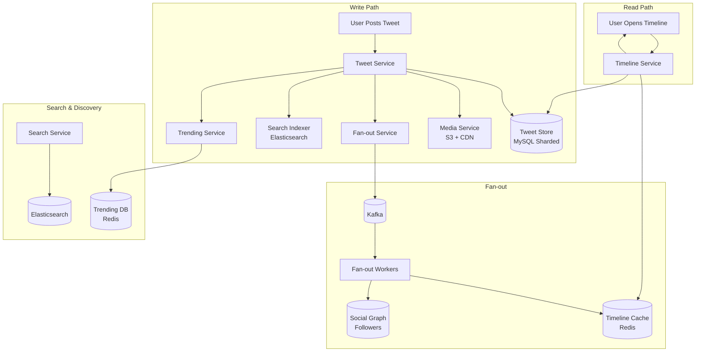
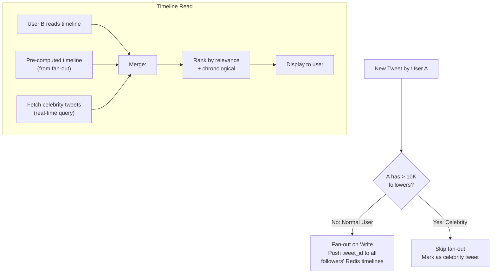
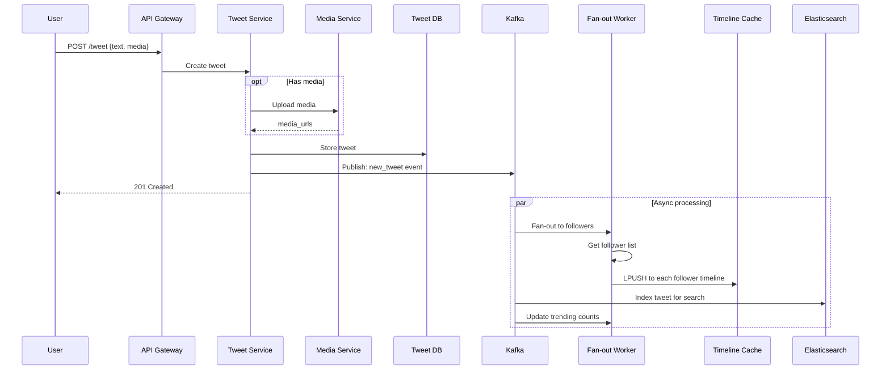
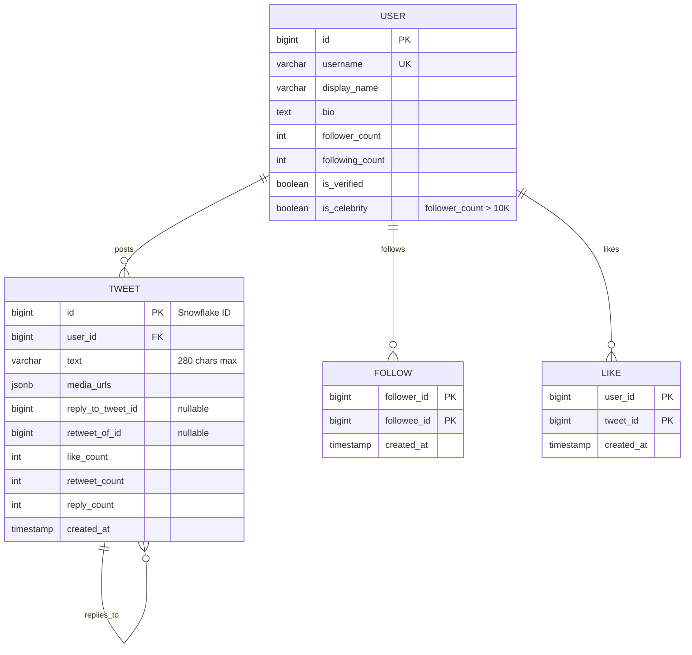
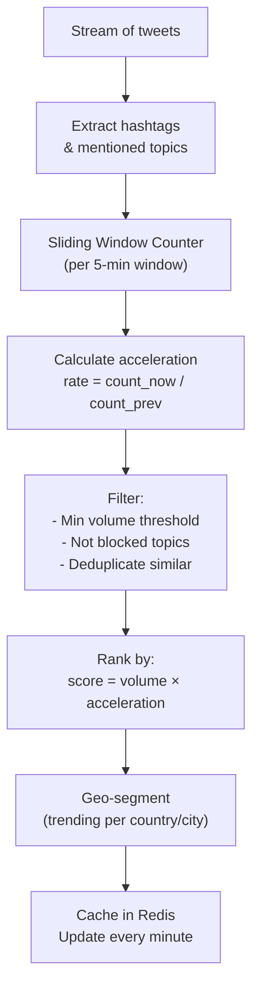
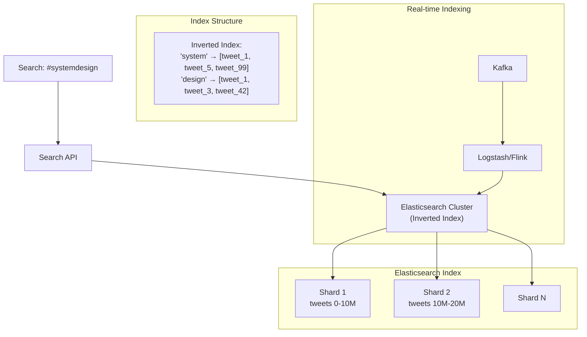

# 13. Twitter (Social Microblogging)

> **Difficulty**: Hard | **Asked by**: Twitter/X, Meta, Google, Amazon, LinkedIn

## Table of Contents
- [Requirements](#requirements)
- [Capacity Estimation](#capacity-estimation)
- [High-Level Design](#high-level-design)
- [Low-Level Design](#low-level-design)
- [Implementation](#implementation)
- [Limitations & Improvements](#limitations--improvements)

---

## Requirements

### Functional Requirements
1. Post tweets (280 chars + media)
2. Follow/unfollow users
3. Home timeline (feed of followed users' tweets)
4. User timeline (all tweets by a specific user)
5. Search tweets
6. Trending topics
7. Like, retweet, reply

### Non-Functional Requirements
1. **Read-Heavy**: 100:1 read/write ratio
2. **Low Latency**: Timeline loads < 300ms
3. **Availability**: 99.99% (prefer availability over consistency)
4. **Scale**: 500M DAU, 500M tweets/day

---

## Capacity Estimation

```
DAU: 500M users
Tweets/day: 500M
Timeline reads/day: 50B (100:1 ratio)
Average tweet size: 300 bytes (text) + metadata
Media attachments: 20% of tweets, avg 500KB

Tweet storage/day: 500M × 1KB = 500 GB
Media storage/day: 100M × 500KB = 50 TB
Timeline QPS: ~580K reads/sec (peak: 1.5M)
Tweet QPS: ~5,800 writes/sec

Fan-out:
  Average followers: 200
  Celebrity followers: up to 100M
  Fan-out writes for normal tweet: 200 cache writes
  Fan-out writes for celebrity tweet: 0 (pull model)
```

---

## High-Level Design

### Architecture Overview



### Timeline Generation (Hybrid Fan-out)



### Tweet Lifecycle



---

## Low-Level Design

### Data Models



### Timeline Cache (Redis)

```
# Each user has a sorted list of tweet IDs
Key: timeline:{user_id}
Type: Sorted Set (score = tweet creation timestamp)

# On fan-out write:
ZADD timeline:12345 1690000100 "tweet:99001"
ZADD timeline:12345 1690000200 "tweet:99002"

# Trim to latest 800 tweets
ZREMRANGEBYRANK timeline:12345 0 -801

# Read timeline (latest 20):
ZREVRANGE timeline:12345 0 19 WITHSCORES

# Cursor-based pagination:
ZREVRANGEBYSCORE timeline:12345 (last_score +inf LIMIT 0 20
```

### Trending Topics Algorithm



### Snowflake ID Generation

```
┌─────────────────────────────────────────────────────┐
│                 64-bit Snowflake ID                  │
├──────────┬──────────┬─────────────┬─────────────────┤
│ Sign (1) │ Time(41) │ Machine(10) │ Sequence(12)    │
│    0     │ ms since │  worker ID  │ per-ms counter  │
│          │ epoch    │  (0-1023)   │ (0-4095)        │
└──────────┴──────────┴─────────────┴─────────────────┘

- 41 bits timestamp: ~69 years from custom epoch
- 10 bits machine: 1024 workers
- 12 bits sequence: 4096 IDs per millisecond per worker
- Total: ~4M IDs/sec per worker
- Time-sortable: newer tweets have higher IDs
```

### Search Architecture



---

## Implementation

### Timeline Service

```python
from typing import List, Optional
from dataclasses import dataclass

@dataclass
class Tweet:
    id: int
    user_id: int
    text: str
    media_urls: list
    like_count: int
    retweet_count: int
    created_at: str

class TimelineService:
    """Manages user timelines with hybrid fan-out."""
    
    CELEBRITY_THRESHOLD = 10000
    TIMELINE_MAX_SIZE = 800
    PAGE_SIZE = 20
    
    def __init__(self, redis, tweet_store, graph_service):
        self.redis = redis
        self.tweets = tweet_store
        self.graph = graph_service
    
    async def get_home_timeline(self, user_id: int, 
                                 cursor: Optional[str] = None) -> dict:
        """Get user's home timeline (merged fan-out + celebrity tweets)."""
        
        # 1. Get pre-computed timeline from cache
        timeline_key = f"timeline:{user_id}"
        if cursor:
            score = float(cursor)
            cached_ids = self.redis.zrevrangebyscore(
                timeline_key, f"({score}", "-inf",
                start=0, num=self.PAGE_SIZE
            )
        else:
            cached_ids = self.redis.zrevrange(
                timeline_key, 0, self.PAGE_SIZE - 1, withscores=True
            )
        
        # 2. Fetch celebrity tweets (pull model)
        celebrity_followees = await self.graph.get_celebrity_followees(user_id)
        celebrity_tweets = []
        for celeb_id in celebrity_followees:
            recent = await self.tweets.get_recent_by_user(celeb_id, limit=5)
            celebrity_tweets.extend(recent)
        
        # 3. Merge and sort
        all_tweet_ids = set()
        for tid, score in cached_ids:
            all_tweet_ids.add(int(tid))
        for tweet in celebrity_tweets:
            all_tweet_ids.add(tweet.id)
        
        # 4. Fetch full tweet objects
        tweets = await self.tweets.batch_get(list(all_tweet_ids))
        tweets.sort(key=lambda t: t.created_at, reverse=True)
        
        page = tweets[:self.PAGE_SIZE]
        next_cursor = str(page[-1].created_at) if len(page) == self.PAGE_SIZE else None
        
        return {"tweets": page, "next_cursor": next_cursor}


class FanoutService:
    """Distributes tweets to followers' timeline caches."""
    
    CELEBRITY_THRESHOLD = 10000
    
    def __init__(self, redis, graph_service):
        self.redis = redis
        self.graph = graph_service
    
    async def fanout_tweet(self, tweet_id: int, author_id: int,
                            timestamp: float):
        """Fan-out tweet to followers' caches."""
        follower_count = await self.graph.get_follower_count(author_id)
        
        if follower_count > self.CELEBRITY_THRESHOLD:
            return  # Celebrity: skip fan-out, use pull model
        
        followers = await self.graph.get_followers(author_id)
        
        # Batch Redis writes
        pipe = self.redis.pipeline()
        for follower_id in followers:
            key = f"timeline:{follower_id}"
            pipe.zadd(key, {str(tweet_id): timestamp})
            pipe.zremrangebyrank(key, 0, -801)  # Keep latest 800
        pipe.execute()
```

---

## Limitations & Improvements

### Current Limitations

| Limitation | Impact | Severity |
|-----------|--------|----------|
| Celebrity fan-out problem | High write amplification for popular users | High |
| Timeline staleness | Cache may lag behind real-time | Low |
| Hot partition (viral tweets) | Uneven load on tweet DB shards | Medium |
| Trending manipulation | Bot-driven trending topics | High |
| Search relevance | Simple text matching insufficient | Medium |

### Improvement Areas

1. **ML-Ranked Timeline** — Engagement prediction model instead of chronological
2. **Real-time Event Processing** — Flink/Kafka Streams for instant trending
3. **GraphQL API** — Clients request exactly what they need, reducing over-fetching
4. **Spam/Bot Detection** — ML models for fake account and spam detection
5. **Spaces/Audio** — Real-time audio rooms using WebRTC

---

## Key Interview Discussion Points

1. **Fan-out on write vs read?** Hybrid approach: push for normal, pull for celebrities
2. **Why Snowflake IDs?** Time-sortable (chronological ordering), unique across distributed systems
3. **How to handle viral tweets?** Dedicated hot key cache, replicate across shards
4. **How does search work in real-time?** Kafka → Elasticsearch near-real-time indexing
5. **How to prevent trending manipulation?** Velocity-based scoring, bot detection, minimum unique users threshold
