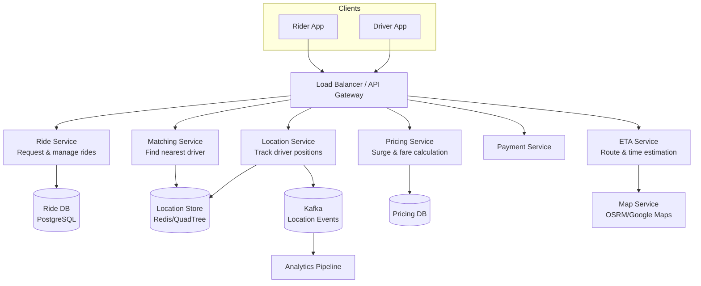
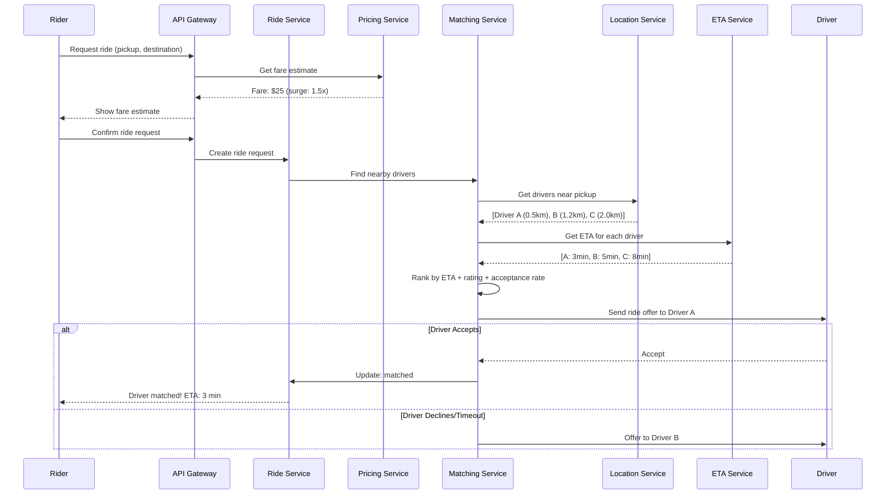
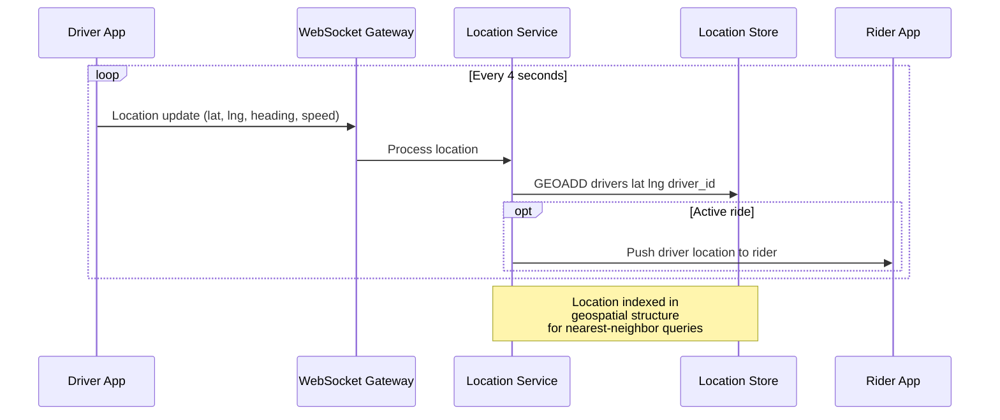
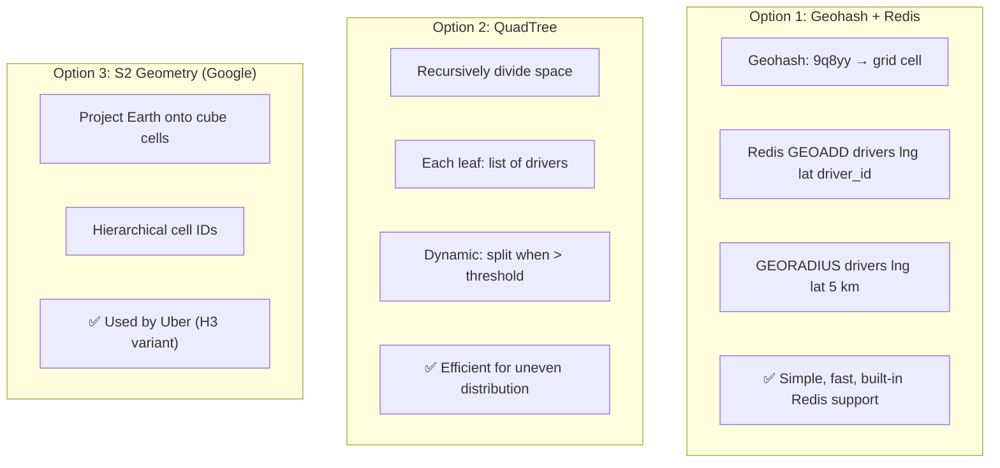
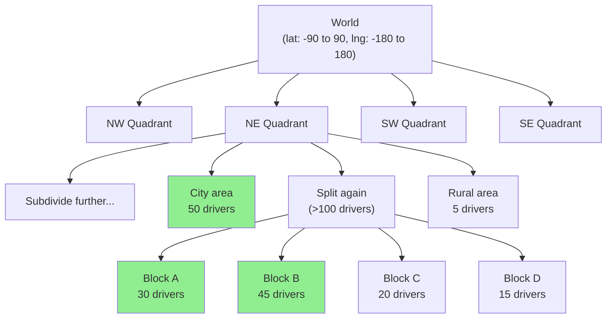
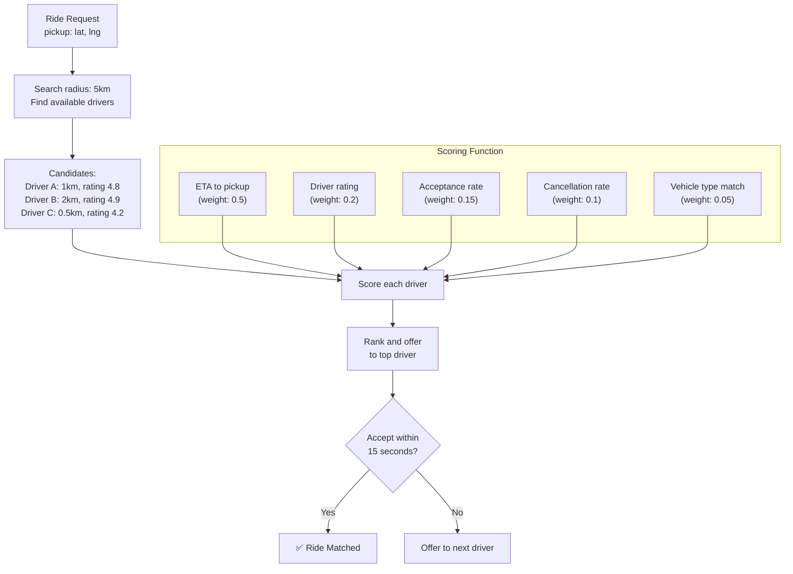
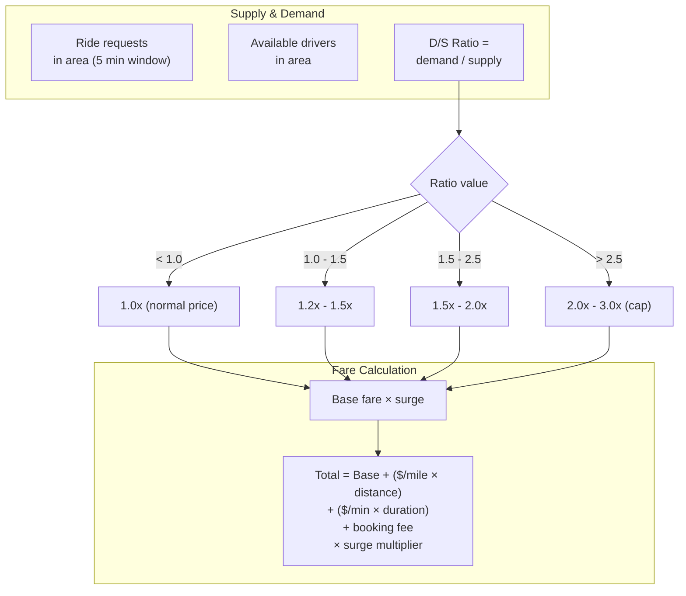
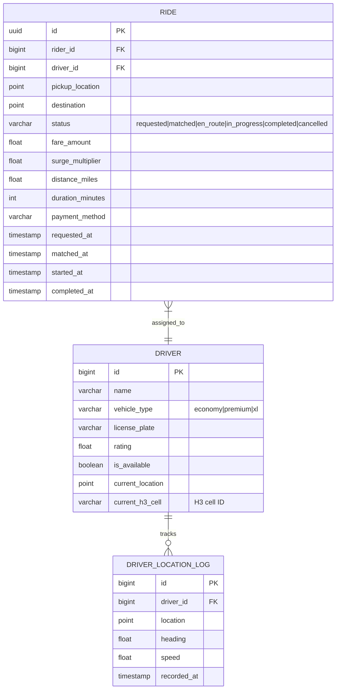

# 14. Uber / Ride Sharing Platform

> **Difficulty**: Hard | **Asked by**: Uber, Lyft, Google, Amazon, Grab, Didi

## Table of Contents
- [Requirements](#requirements)
- [Capacity Estimation](#capacity-estimation)
- [High-Level Design](#high-level-design)
- [Low-Level Design](#low-level-design)
- [Implementation](#implementation)
- [Limitations & Improvements](#limitations--improvements)

---

## Requirements

### Functional Requirements
1. Riders request a ride by specifying pickup and destination
2. Match riders with nearby available drivers
3. Real-time driver location tracking
4. ETA calculation
5. Dynamic pricing (surge pricing)
6. Trip tracking and payment processing
7. Ratings and reviews

### Non-Functional Requirements
1. **Low Latency Matching**: < 5 seconds to find a driver
2. **Real-time Location**: Location updates every 3-5 seconds
3. **High Availability**: 99.99% uptime
4. **Scalability**: 10M concurrent rides, 1M drivers online
5. **Geospatial Queries**: Efficient nearest-driver search

---

## Capacity Estimation

```
Active drivers: 1M concurrent
Active riders: 10M concurrent
Rides/day: 20M
Location updates: 1M drivers × 1 update/4 sec = 250K updates/sec
Matching requests: ~230/sec (20M/day)
Average trip duration: 15 minutes
GPS data per update: ~100 bytes
Location data/day: 250K × 100B × 86400 = 2.16 TB
```

---

## High-Level Design

### Architecture Overview



### Ride Request Flow



### Real-Time Location Tracking



---

## Low-Level Design

### Geospatial Indexing



### QuadTree Structure



### H3 Hexagonal Grid (Uber's Approach)

```
Resolution 7: ~5.16 km² hexagons (city level)
Resolution 9: ~0.11 km² hexagons (neighborhood)
Resolution 11: ~0.002 km² hexagons (block level)

Advantages:
- Uniform distance to all neighbors (unlike square grids)
- Natural for proximity search (k-ring neighbors)
- Hierarchical: zoom in/out for different scales
```

### Matching Algorithm



### Surge Pricing Model



### Data Models



---

## Implementation

### Location Service

```python
import redis
import time
from typing import List, Tuple
from dataclasses import dataclass

@dataclass
class DriverLocation:
    driver_id: int
    latitude: float
    longitude: float
    heading: float
    speed: float
    timestamp: float

class LocationService:
    """Manages real-time driver locations using Redis Geo."""
    
    def __init__(self, redis_client: redis.Redis):
        self.redis = redis_client
        self.geo_key = "driver_locations"
    
    def update_location(self, loc: DriverLocation):
        """Update driver's position in geospatial index."""
        # Store in Redis geo set
        self.redis.geoadd(
            self.geo_key,
            (loc.longitude, loc.latitude, str(loc.driver_id))
        )
        
        # Store additional metadata (heading, speed)
        self.redis.hset(
            f"driver:{loc.driver_id}:meta",
            mapping={
                "heading": loc.heading,
                "speed": loc.speed,
                "last_update": loc.timestamp,
                "available": "1"
            }
        )
        
        # Publish for real-time tracking
        self.redis.publish(
            f"driver_location:{loc.driver_id}",
            f"{loc.latitude},{loc.longitude}"
        )
    
    def find_nearby_drivers(self, lat: float, lng: float,
                            radius_km: float = 5.0,
                            limit: int = 20) -> List[dict]:
        """Find available drivers within radius."""
        results = self.redis.georadius(
            self.geo_key, lng, lat,
            radius=radius_km, unit='km',
            withcoord=True, withdist=True,
            count=limit, sort='ASC'
        )
        
        drivers = []
        for driver_id, dist, (d_lng, d_lat) in results:
            driver_id = driver_id.decode()
            meta = self.redis.hgetall(f"driver:{driver_id}:meta")
            
            if meta.get(b"available") == b"1":
                drivers.append({
                    "driver_id": int(driver_id),
                    "distance_km": dist,
                    "latitude": d_lat,
                    "longitude": d_lng,
                    "heading": float(meta.get(b"heading", 0)),
                })
        
        return drivers


class MatchingService:
    """Matches riders with optimal nearby drivers."""
    
    def __init__(self, location_service, eta_service, driver_service):
        self.location = location_service
        self.eta = eta_service
        self.drivers = driver_service
    
    async def find_driver(self, pickup_lat: float, pickup_lng: float,
                          vehicle_type: str = "economy") -> dict:
        """Find and assign the best available driver."""
        
        # 1. Find nearby drivers (expanding radius)
        for radius in [3, 5, 8, 12]:
            candidates = self.location.find_nearby_drivers(
                pickup_lat, pickup_lng, radius_km=radius
            )
            if candidates:
                break
        
        if not candidates:
            return {"status": "no_drivers_available"}
        
        # 2. Get ETA for each candidate
        for driver in candidates:
            driver["eta_minutes"] = await self.eta.calculate(
                driver["latitude"], driver["longitude"],
                pickup_lat, pickup_lng
            )
        
        # 3. Score and rank
        scored = []
        for driver in candidates:
            info = await self.drivers.get(driver["driver_id"])
            score = self._calculate_score(driver, info)
            scored.append((score, driver))
        
        scored.sort(key=lambda x: -x[0])
        
        # 4. Offer to best driver
        for score, driver in scored:
            accepted = await self._offer_ride(driver["driver_id"])
            if accepted:
                return {"status": "matched", "driver": driver}
        
        return {"status": "no_driver_accepted"}
    
    def _calculate_score(self, driver, info) -> float:
        """Score a driver based on multiple factors."""
        eta_score = max(0, 15 - driver["eta_minutes"]) / 15  # 0-1
        rating_score = (info.get("rating", 4.0) - 3.0) / 2.0  # 0-1
        accept_score = info.get("acceptance_rate", 0.8)
        
        return (
            eta_score * 0.5 +
            rating_score * 0.2 +
            accept_score * 0.2 +
            (1 - info.get("cancel_rate", 0.1)) * 0.1
        )
```

---

## Limitations & Improvements

### Current Limitations

| Limitation | Impact | Severity |
|-----------|--------|----------|
| GPS inaccuracy in cities (urban canyons) | Wrong pickup location | Medium |
| Matching timeout for low-supply areas | Long wait times | High |
| Surge pricing fairness | User frustration | Medium |
| Real-time location at scale | 250K updates/sec overhead | Medium |
| ETA accuracy in traffic | Unreliable time estimates | Medium |

### Improvement Areas

1. **ML-Based Demand Prediction** — Predict demand to pre-position drivers
2. **Carpooling Optimization** — Match multiple riders going similar direction
3. **Autonomous Vehicles** — Self-driving fleet integration
4. **Map Matching** — Snap GPS to road network for accurate positioning
5. **Multi-Modal** — Combine ride-sharing with bike/scooter/transit

---

## Key Interview Discussion Points

1. **Why H3/Geohash over QuadTree?** Hexagonal grids have uniform neighbor distance; QuadTree is dynamic
2. **How to handle supply-demand imbalance?** Surge pricing + driver incentives + demand prediction
3. **Why WebSocket for location?** Bidirectional real-time; also supports ride updates
4. **How to scale location updates?** Sharding by geohash region + Kafka for async processing
5. **Consistency requirements?** Ride state must be strongly consistent; location can be eventually consistent
