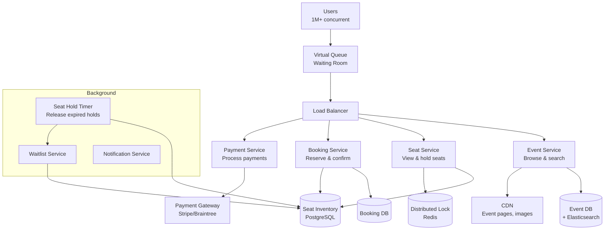
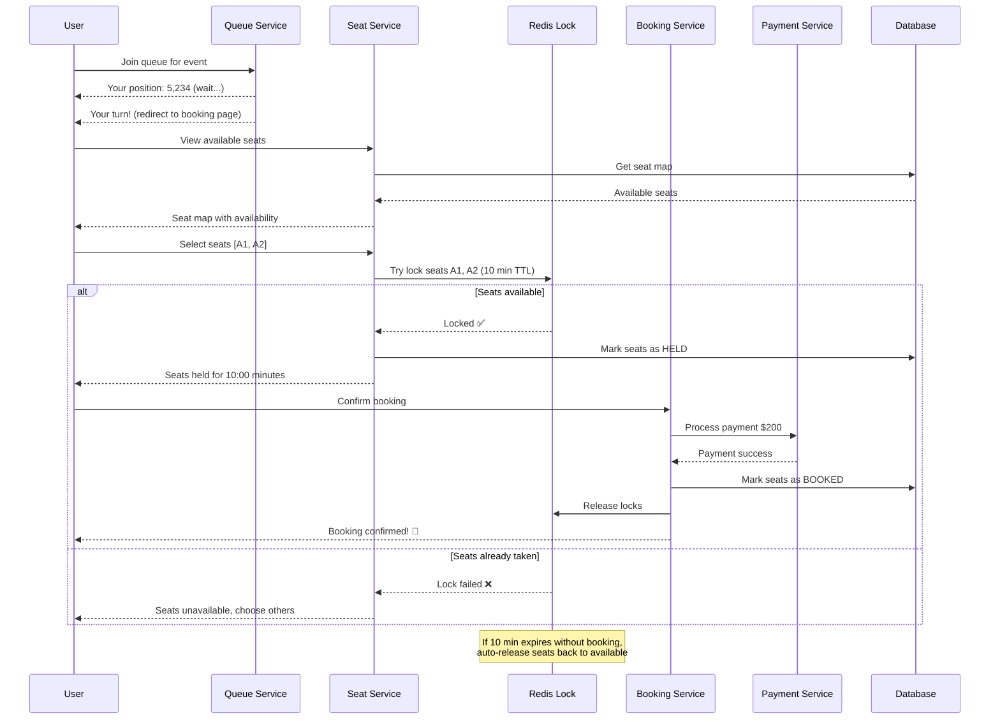
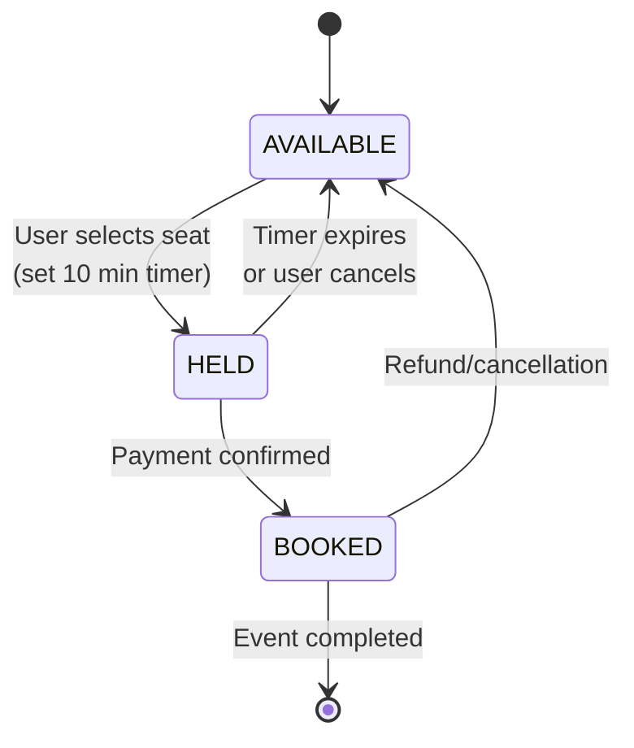
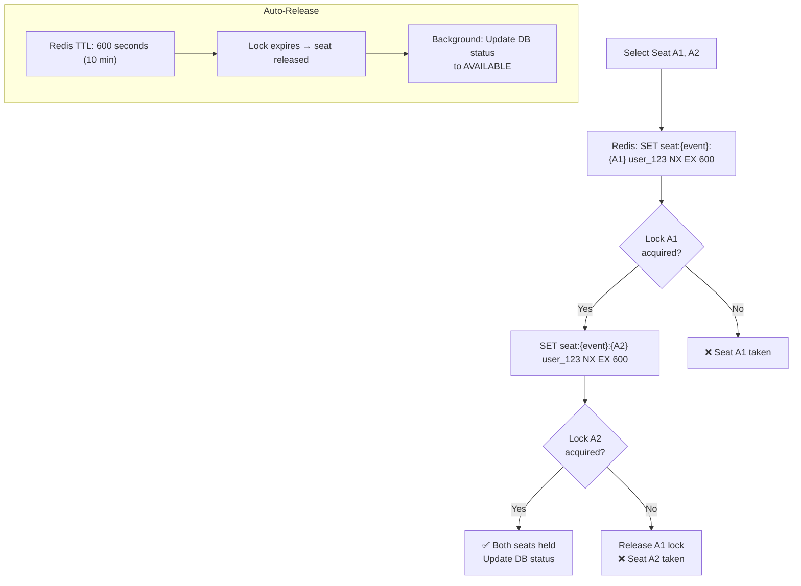
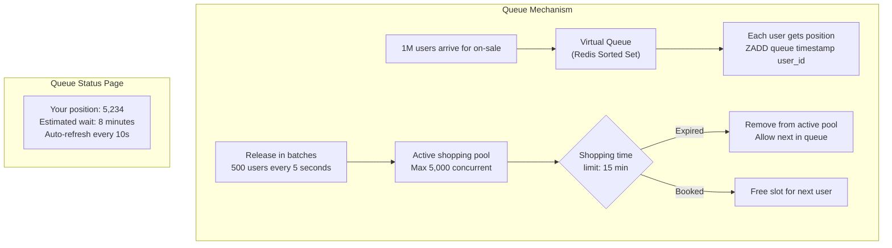
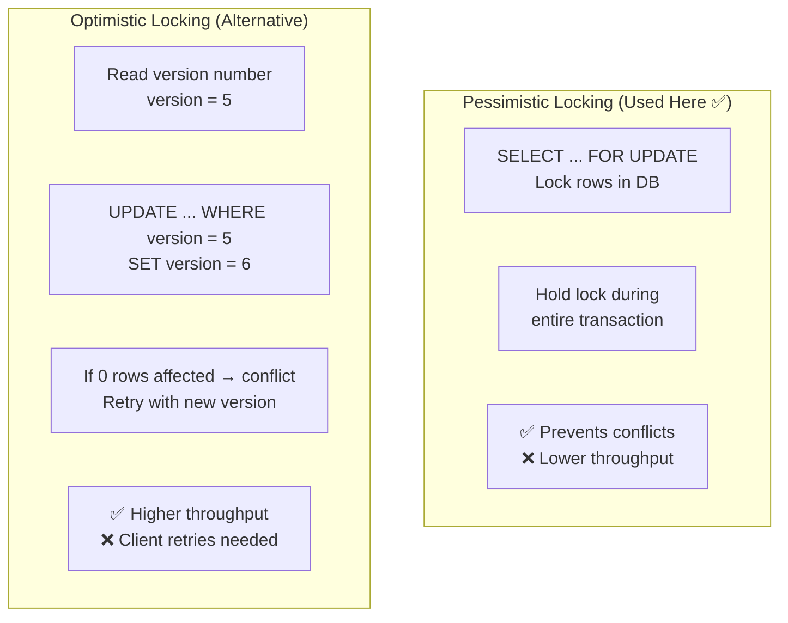

# 15. Ticketmaster (Event Booking System)

> **Difficulty**: Hard | **Asked by**: Amazon, Microsoft, Google, Booking, Ticketmaster

## Table of Contents
- [Requirements](#requirements)
- [Capacity Estimation](#capacity-estimation)
- [High-Level Design](#high-level-design)
- [Low-Level Design](#low-level-design)
- [Implementation](#implementation)
- [Limitations & Improvements](#limitations--improvements)

---

## Requirements

### Functional Requirements
1. View events and available seats
2. Select and temporarily hold seats
3. Complete booking within time limit (10 min)
4. Process payment and confirm booking
5. Support seat maps and different pricing tiers
6. Waitlist when sold out

### Non-Functional Requirements
1. **No Double-Booking**: Same seat never sold twice
2. **High Concurrency**: Handle 1M+ users for popular events
3. **Low Latency**: < 500ms for seat selection
4. **Fairness**: First-come-first-served for seat holds
5. **Availability**: 99.99% during on-sale events

---

## Capacity Estimation

```
Events/year: 100K
Seats per event: 50K average
Daily bookings: 500K
Peak: Major concert on-sale → 1M users in 60 seconds
Seat selection QPS: ~16,000 (peak)
Payment processing: ~8,000/min (peak)
Data per booking: ~1 KB
```

---

## High-Level Design

### Architecture Overview



### Booking Flow



---

## Low-Level Design

### Seat State Machine



### Data Models

```mermaid
erDiagram
    EVENT {
        bigint id PK
        varchar name
        varchar venue
        timestamp event_date
        varchar status "upcoming|on_sale|sold_out|completed"
        timestamp on_sale_date
        int total_seats
        int available_seats
    }
    
    SEAT {
        bigint id PK
        bigint event_id FK
        varchar section
        int row
        int number
        varchar tier "VIP|premium|standard"
        decimal price
        varchar status "available|held|booked"
        bigint held_by_user_id
        timestamp held_until
        bigint booking_id FK
    }
    
    BOOKING {
        bigint id PK
        bigint user_id FK
        bigint event_id FK
        varchar status "pending|confirmed|cancelled|refunded"
        decimal total_amount
        varchar payment_id
        timestamp created_at
        timestamp confirmed_at
    }
    
    BOOKING_SEAT {
        bigint booking_id PK
        bigint seat_id PK
    }
    
    EVENT ||--|{ SEAT : contains
    BOOKING ||--|{ BOOKING_SEAT : includes
    SEAT ||--o| BOOKING_SEAT : reserved_in
```



### Distributed Locking for Seat Reservation



### Virtual Queue Design



### Optimistic vs Pessimistic Locking



---

## Implementation

### Seat Reservation Service

```python
import time
import uuid
import redis
from typing import List, Optional
from contextlib import contextmanager

class SeatReservationService:
    """Handles seat hold, booking, and release with distributed locks."""
    
    HOLD_DURATION = 600  # 10 minutes
    
    def __init__(self, redis_client: redis.Redis, db):
        self.redis = redis_client
        self.db = db
    
    def hold_seats(self, event_id: int, seat_ids: List[int],
                   user_id: int) -> dict:
        """Atomically hold multiple seats with distributed locks."""
        hold_id = str(uuid.uuid4())
        locked_seats = []
        
        try:
            # Try to lock each seat atomically
            for seat_id in seat_ids:
                lock_key = f"seat_lock:{event_id}:{seat_id}"
                acquired = self.redis.set(
                    lock_key, 
                    f"{user_id}:{hold_id}",
                    nx=True,  # Only if not exists
                    ex=self.HOLD_DURATION
                )
                
                if not acquired:
                    # Rollback: release already-locked seats
                    for locked_id in locked_seats:
                        self._release_lock(event_id, locked_id, user_id)
                    return {
                        "status": "failed",
                        "message": f"Seat {seat_id} is not available"
                    }
                
                locked_seats.append(seat_id)
            
            # All seats locked - update DB
            self.db.execute("""
                UPDATE seats 
                SET status = 'held', held_by_user_id = %s, 
                    held_until = NOW() + INTERVAL '10 minutes'
                WHERE id = ANY(%s) AND event_id = %s AND status = 'available'
            """, (user_id, seat_ids, event_id))
            
            return {
                "status": "held",
                "hold_id": hold_id,
                "seats": seat_ids,
                "expires_at": time.time() + self.HOLD_DURATION
            }
        except Exception as e:
            # Rollback on any error
            for locked_id in locked_seats:
                self._release_lock(event_id, locked_id, user_id)
            raise
    
    def confirm_booking(self, event_id: int, user_id: int,
                        seat_ids: List[int], payment_info: dict) -> dict:
        """Confirm booking after payment."""
        
        # 1. Verify seats are still held by this user
        for seat_id in seat_ids:
            lock_key = f"seat_lock:{event_id}:{seat_id}"
            lock_value = self.redis.get(lock_key)
            if not lock_value or not lock_value.decode().startswith(f"{user_id}:"):
                return {"status": "expired", "message": "Hold expired"}
        
        # 2. Process payment
        payment_result = self._process_payment(payment_info)
        if not payment_result["success"]:
            return {"status": "payment_failed"}
        
        # 3. Update DB atomically
        booking_id = self.db.execute("""
            WITH booking AS (
                INSERT INTO bookings (user_id, event_id, status, total_amount, payment_id)
                VALUES (%s, %s, 'confirmed', %s, %s)
                RETURNING id
            )
            UPDATE seats SET status = 'booked', booking_id = (SELECT id FROM booking)
            WHERE id = ANY(%s) AND event_id = %s AND held_by_user_id = %s
        """, (user_id, event_id, payment_info["amount"], 
              payment_result["payment_id"], seat_ids, event_id, user_id))
        
        # 4. Release locks
        for seat_id in seat_ids:
            self._release_lock(event_id, seat_id, user_id)
        
        return {"status": "confirmed", "booking_id": booking_id}
    
    def _release_lock(self, event_id: int, seat_id: int, user_id: int):
        """Release lock only if owned by this user (Lua script for atomicity)."""
        lua_script = """
        if redis.call('get', KEYS[1]) == ARGV[1] then
            return redis.call('del', KEYS[1])
        end
        return 0
        """
        lock_key = f"seat_lock:{event_id}:{seat_id}"
        self.redis.eval(lua_script, 1, lock_key, f"{user_id}")
    
    def _process_payment(self, payment_info):
        """Process payment via payment gateway."""
        return {"success": True, "payment_id": str(uuid.uuid4())}


class SeatHoldExpirationWorker:
    """Background worker to release expired seat holds."""
    
    def __init__(self, db, redis_client, waitlist_service):
        self.db = db
        self.redis = redis_client
        self.waitlist = waitlist_service
    
    def run(self):
        """Run periodically (every 30 seconds)."""
        expired = self.db.execute("""
            UPDATE seats SET status = 'available', 
                held_by_user_id = NULL, held_until = NULL
            WHERE status = 'held' AND held_until < NOW()
            RETURNING id, event_id
        """)
        
        for seat_id, event_id in expired:
            # Notify waitlist
            self.waitlist.notify_availability(event_id, seat_id)
```

---

## Limitations & Improvements

### Current Limitations

| Limitation | Impact | Severity |
|-----------|--------|----------|
| Thundering herd at on-sale time | System overload | Critical |
| Seat hold squatting (hold & abandon) | Inventory unavailable to real buyers | High |
| Single-event bottleneck | One popular event impacts all | High |
| Bot/scalper abuse | Unfair for real fans | Critical |
| Payment failure after hold | Complex cleanup | Medium |

### Improvement Areas

1. **Queue-Based Flow Control** — Virtual waiting room to throttle concurrent users
2. **Anti-Bot** — CAPTCHA, device fingerprinting, behavioral analysis
3. **Dynamic Hold Duration** — Shorter holds during high demand
4. **Reserved Inventory** — Pre-allocate seats to fan clubs, credit card holders
5. **Fallback to General Admission** — When seat selection overwhelms, offer "best available"

---

## Key Interview Discussion Points

1. **How to prevent double-booking?** Distributed lock (Redis NX) + DB constraint (UNIQUE on seat+event booking)
2. **Pessimistic vs optimistic locking?** Pessimistic for high-contention (seats); optimistic for low-contention
3. **How to handle 1M concurrent users?** Virtual queue → rate-limit active shoppers → handle in batches
4. **What if payment fails after hold?** Release seats back to available; retry payment; offer to hold again
5. **How to fight scalpers?** Verified fan programs, CAPTCHA, purchase limits, non-transferable tickets
