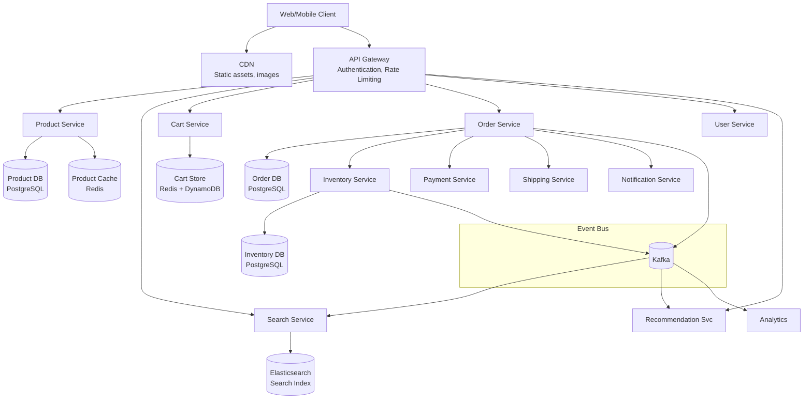
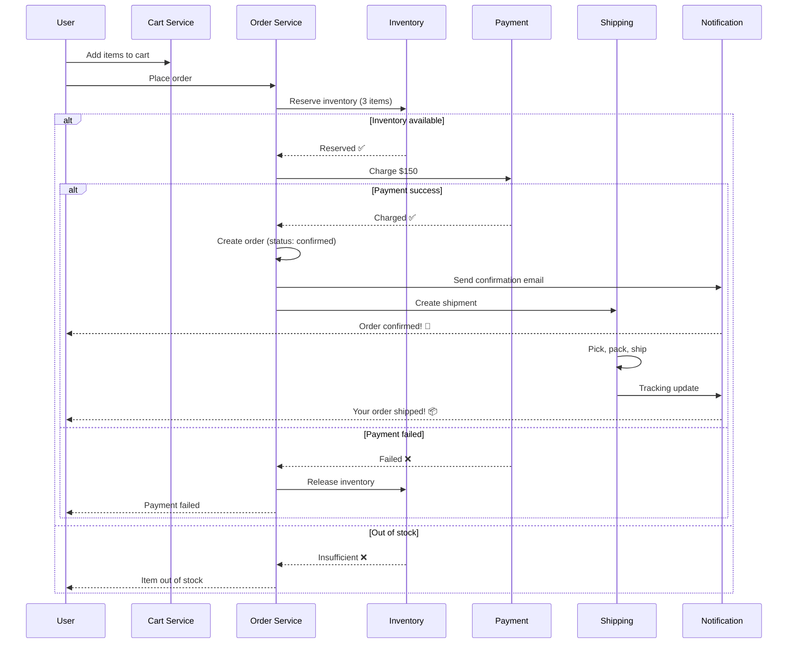
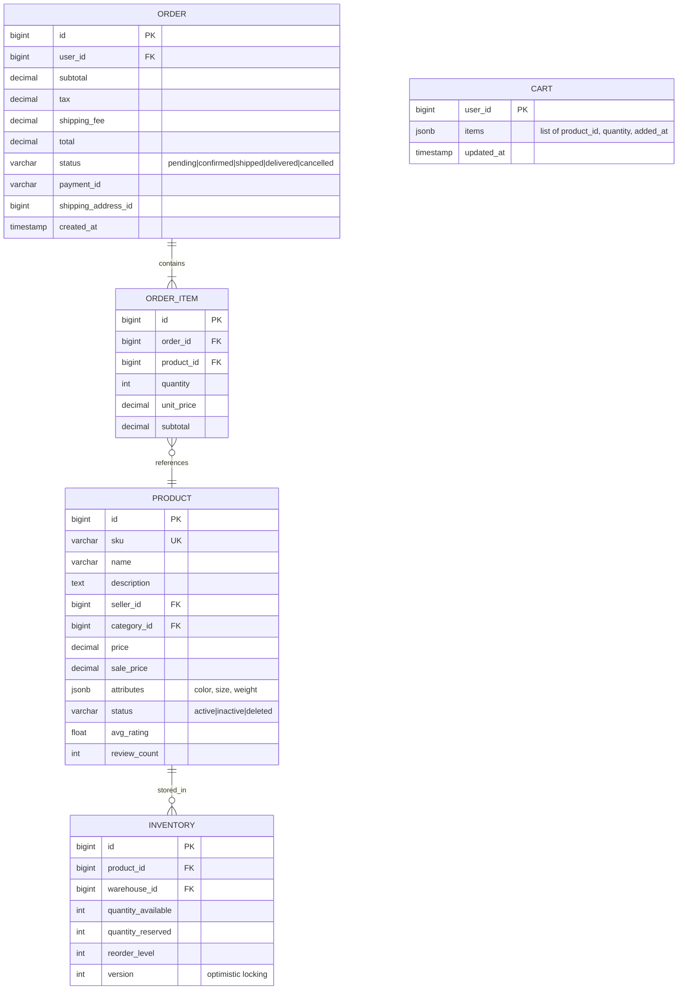
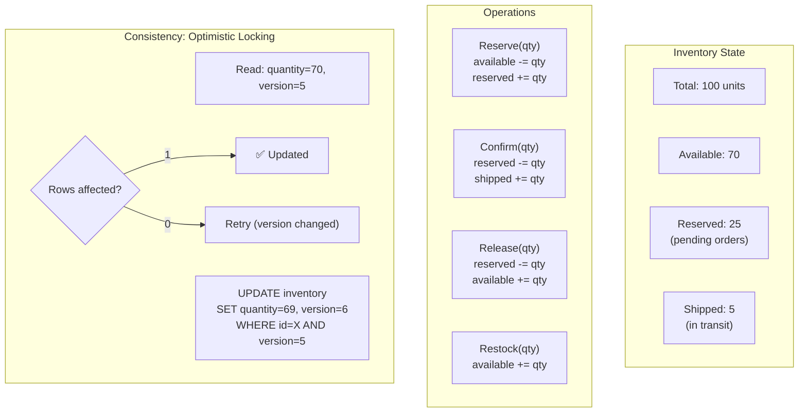
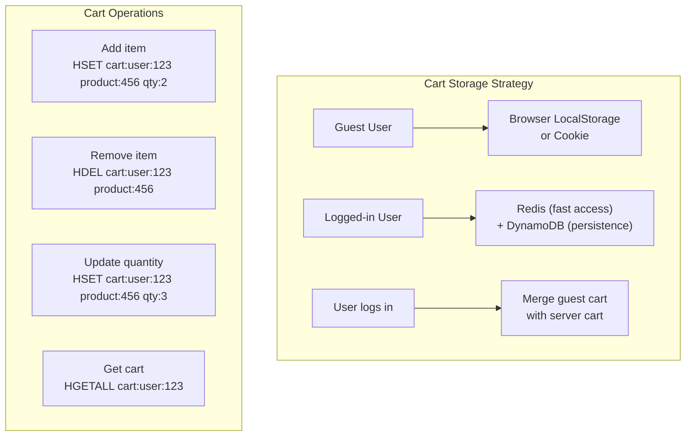
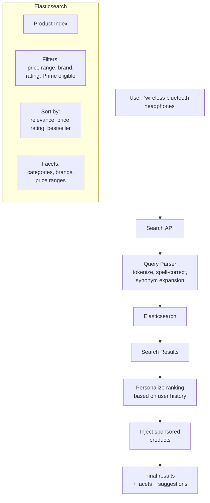
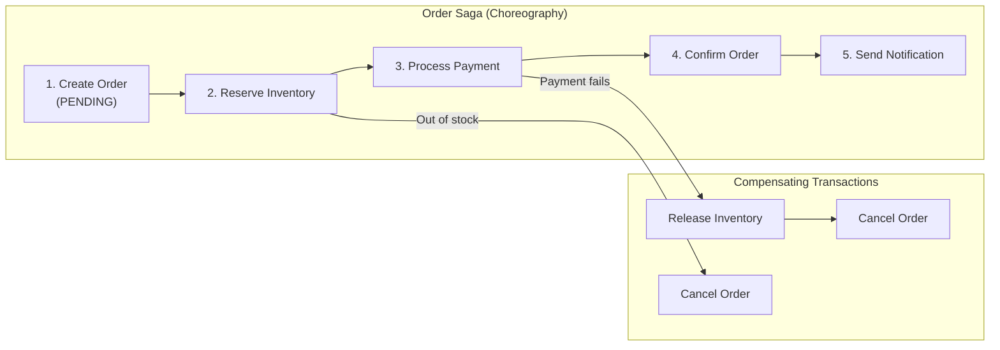

# 16. E-Commerce Platform (Amazon)

> **Difficulty**: Hard | **Asked by**: Amazon, Walmart, Shopify, Alibaba, Flipkart

## Table of Contents
- [Requirements](#requirements)
- [Capacity Estimation](#capacity-estimation)
- [High-Level Design](#high-level-design)
- [Low-Level Design](#low-level-design)
- [Implementation](#implementation)
- [Limitations & Improvements](#limitations--improvements)

---

## Requirements

### Functional Requirements
1. Product catalog (search, browse, filter)
2. Shopping cart management
3. Order placement and tracking
4. Inventory management
5. User reviews and ratings
6. Recommendation engine
7. Seller management (multi-vendor marketplace)

### Non-Functional Requirements
1. **High Availability**: 99.99% (downtime = lost revenue)
2. **Low Latency**: Product page < 200ms, search < 300ms
3. **Scalability**: 500M products, 100M DAU, 10M orders/day
4. **Consistency**: Inventory - strong; catalog - eventual
5. **Peak Handling**: 10x traffic during sales (Black Friday, Prime Day)

---

## Capacity Estimation

```
DAU: 100M users
Products: 500M SKUs
Orders/day: 10M (peak: 100M during Black Friday)
Product page views/day: 5B
Search queries/day: 1B
Cart operations/day: 500M
Average order: 3 items, $50
Payment transactions: 10M/day

Storage:
  Product data: 500M × 2 KB = 1 TB
  Images: 500M × 5 images × 500 KB = 1.25 PB
  Order history: 3.6B orders/year × 2 KB = 7.2 TB/year
```

---

## High-Level Design

### Architecture Overview (Microservices)



### Order Flow



---

## Low-Level Design

### Data Models



### Inventory Management



### Shopping Cart Design



### Search Architecture



### Saga Pattern for Order Processing



---

## Implementation

### Order Service with Saga

```python
from enum import Enum
from dataclasses import dataclass
from typing import List
import uuid

class OrderStatus(Enum):
    PENDING = "pending"
    INVENTORY_RESERVED = "inventory_reserved"
    PAYMENT_PROCESSING = "payment_processing" 
    CONFIRMED = "confirmed"
    SHIPPED = "shipped"
    DELIVERED = "delivered"
    CANCELLED = "cancelled"

@dataclass
class OrderItem:
    product_id: int
    quantity: int
    unit_price: float

class OrderService:
    """Orchestrates order creation with saga pattern."""
    
    def __init__(self, order_db, inventory_svc, payment_svc, 
                 notification_svc, event_bus):
        self.db = order_db
        self.inventory = inventory_svc
        self.payment = payment_svc
        self.notify = notification_svc
        self.events = event_bus
    
    async def place_order(self, user_id: int, items: List[OrderItem],
                          payment_info: dict, shipping_address: dict) -> dict:
        """Place order with saga-based transaction management."""
        order_id = str(uuid.uuid4())
        
        try:
            # Step 1: Create order record
            total = sum(i.unit_price * i.quantity for i in items)
            await self.db.create_order(order_id, user_id, items, total,
                                        OrderStatus.PENDING)
            
            # Step 2: Reserve inventory
            for item in items:
                reserved = await self.inventory.reserve(
                    item.product_id, item.quantity, order_id
                )
                if not reserved:
                    # Compensate: release already reserved items
                    await self._compensate_inventory(order_id, items)
                    await self.db.update_status(order_id, OrderStatus.CANCELLED)
                    return {"status": "failed", "reason": "out_of_stock",
                            "product_id": item.product_id}
            
            await self.db.update_status(order_id, OrderStatus.INVENTORY_RESERVED)
            
            # Step 3: Process payment
            payment = await self.payment.charge(
                user_id=user_id,
                amount=total,
                order_id=order_id,
                idempotency_key=f"order-{order_id}",
                **payment_info
            )
            
            if not payment["success"]:
                # Compensate: release inventory
                await self._compensate_inventory(order_id, items)
                await self.db.update_status(order_id, OrderStatus.CANCELLED)
                return {"status": "failed", "reason": "payment_failed"}
            
            # Step 4: Confirm order
            await self.db.update_status(order_id, OrderStatus.CONFIRMED)
            
            # Step 5: Publish events
            await self.events.publish("order.confirmed", {
                "order_id": order_id,
                "user_id": user_id,
                "items": [(i.product_id, i.quantity) for i in items]
            })
            
            # Step 6: Notify user
            await self.notify.send_order_confirmation(user_id, order_id)
            
            return {"status": "confirmed", "order_id": order_id}
        
        except Exception as e:
            # Full compensation
            await self._compensate_inventory(order_id, items)
            await self.db.update_status(order_id, OrderStatus.CANCELLED)
            raise
    
    async def _compensate_inventory(self, order_id: str, 
                                     items: List[OrderItem]):
        """Release reserved inventory."""
        for item in items:
            await self.inventory.release(item.product_id, item.quantity,
                                          order_id)
```

---

## Limitations & Improvements

### Current Limitations

| Limitation | Impact | Severity |
|-----------|--------|----------|
| Inventory oversell during flash sales | Negative customer experience | Critical |
| Saga compensation complexity | Partial failures hard to handle | High |
| Search relevance cold start | New products hard to rank | Medium |
| Payment gateway timeouts | Order stuck in pending | High |
| Cart abandonment (70%) | Lost revenue | Medium |

### Improvement Areas

1. **Event Sourcing** — Full audit trail for orders, undo/replay capability
2. **ML Demand Forecasting** — Predict inventory needs per warehouse
3. **Personalized Pricing** — Dynamic pricing based on user behavior
4. **Multi-Warehouse Routing** — Route order to nearest warehouse with stock
5. **Real-time Inventory** — Event-driven inventory updates with Kafka instead of polling

---

## Key Interview Discussion Points

1. **How to prevent overselling?** Optimistic locking + atomic decrement + compensating transactions
2. **Saga vs 2PC?** Saga for microservices (eventual consistency); 2PC for monolith (ACID)
3. **How to handle flash sales?** Pre-warm cache, rate limit, queue-based ordering, pre-deduct inventory
4. **Cart: Redis vs DB?** Redis for speed + DB for persistence; merge on login
5. **How does Amazon handle Prime Day?** Throttling, cell-based architecture, pre-provisioned capacity
