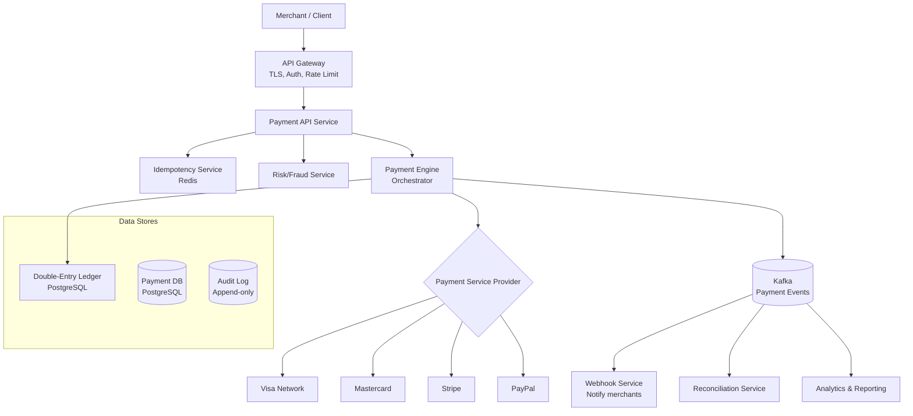
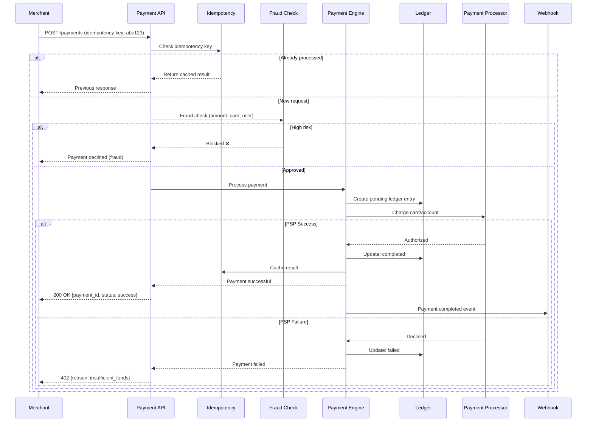
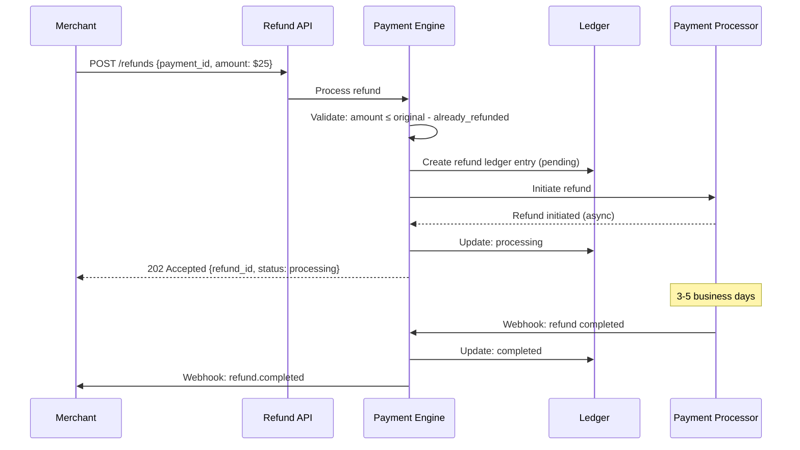
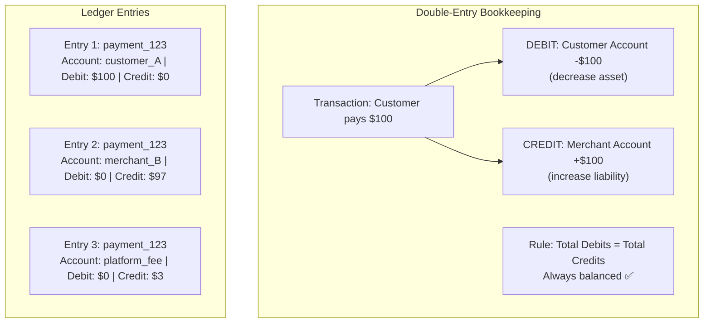
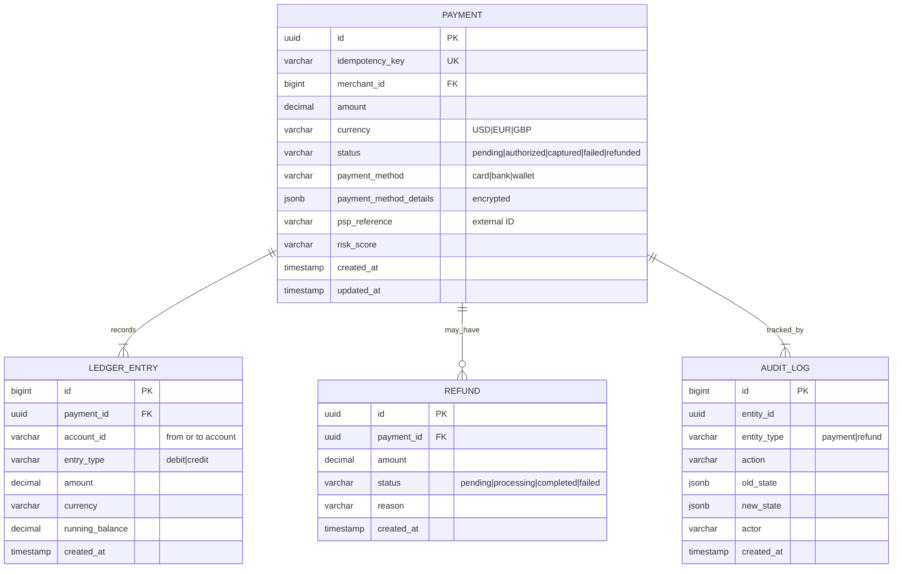
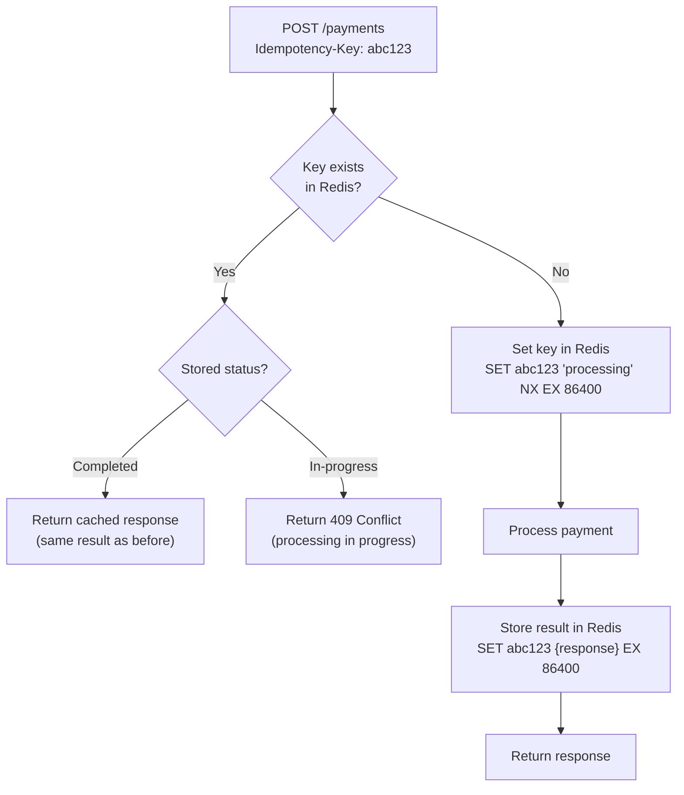
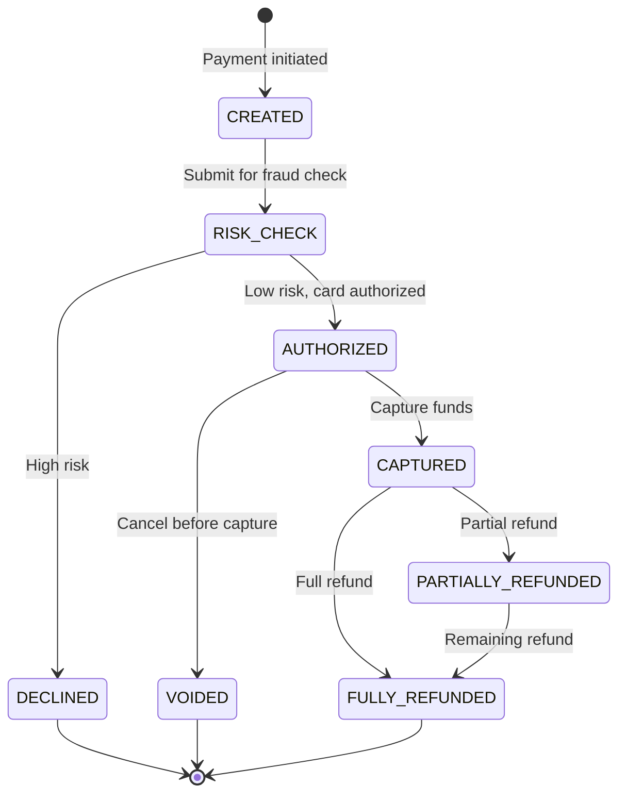
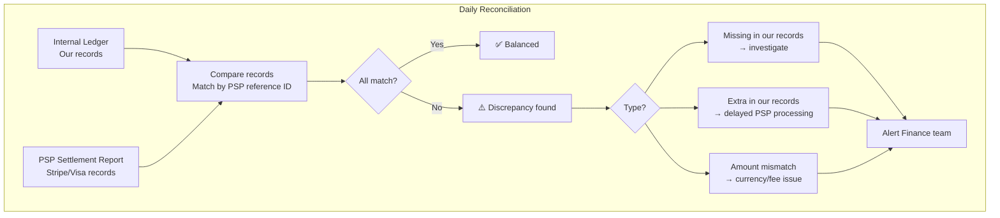

# 17. Payment System

> **Difficulty**: Hard | **Asked by**: Stripe, PayPal, Amazon, Google, Square, Visa

## Table of Contents
- [Requirements](#requirements)
- [Capacity Estimation](#capacity-estimation)
- [High-Level Design](#high-level-design)
- [Low-Level Design](#low-level-design)
- [Implementation](#implementation)
- [Limitations & Improvements](#limitations--improvements)

---

## Requirements

### Functional Requirements
1. Accept payments (credit card, debit, bank transfer, wallets)
2. Process refunds (full and partial)
3. Multi-currency support
4. Payment status tracking
5. Reconciliation with external processors
6. Webhook notifications for payment events

### Non-Functional Requirements
1. **Reliability**: 99.999% — zero payment loss
2. **Idempotency**: Same request processed exactly once
3. **Consistency**: Strong consistency (money can't be duplicated)
4. **Security**: PCI DSS compliant, encrypted at rest and in transit
5. **Audit Trail**: Complete, immutable transaction history
6. **Low Latency**: < 2 seconds for payment processing

---

## Capacity Estimation

```
Transactions/day: 10M (peak: 100M on Black Friday)
Average transaction: $50
Daily volume: $500M
TPS: ~115 (average), ~1,200 (peak)
Storage per transaction: 2 KB (metadata + audit)
Annual storage: 3.6B × 2 KB = 7.2 TB
Reconciliation records: same volume, separate store
```

---

## High-Level Design

### Architecture Overview



### Payment Flow



### Refund Flow



---

## Low-Level Design

### Double-Entry Ledger



### Data Models



### Idempotency Implementation



### Payment State Machine



### Reconciliation Process



---

## Implementation

### Payment Service Core

```python
import uuid
import json
from decimal import Decimal
from enum import Enum
from dataclasses import dataclass
from typing import Optional

class PaymentStatus(Enum):
    CREATED = "created"
    AUTHORIZED = "authorized"
    CAPTURED = "captured"
    FAILED = "failed"
    REFUNDED = "refunded"

@dataclass
class PaymentRequest:
    merchant_id: int
    amount: Decimal
    currency: str
    payment_method: dict  # {type: "card", card_token: "tok_xxx"}
    idempotency_key: str
    description: Optional[str] = None
    metadata: Optional[dict] = None

class PaymentService:
    """Core payment processing with idempotency and double-entry ledger."""
    
    def __init__(self, db, redis, psp_client, ledger, 
                 risk_service, event_bus):
        self.db = db
        self.redis = redis
        self.psp = psp_client
        self.ledger = ledger
        self.risk = risk_service
        self.events = event_bus
    
    async def process_payment(self, request: PaymentRequest) -> dict:
        """Process a payment with idempotency guarantee."""
        
        # 1. Idempotency check
        cached = await self._check_idempotency(request.idempotency_key)
        if cached:
            return cached
        
        payment_id = str(uuid.uuid4())
        
        try:
            # 2. Mark as processing
            await self._set_processing(request.idempotency_key, payment_id)
            
            # 3. Create payment record
            await self.db.create_payment({
                "id": payment_id,
                "merchant_id": request.merchant_id,
                "amount": request.amount,
                "currency": request.currency,
                "status": PaymentStatus.CREATED.value
            })
            
            # 4. Fraud/risk check
            risk_result = await self.risk.evaluate(request)
            if risk_result["action"] == "block":
                await self._fail_payment(payment_id, "fraud_detected")
                return {"payment_id": payment_id, "status": "declined",
                        "reason": "risk_check_failed"}
            
            # 5. Process with PSP
            psp_result = await self.psp.charge(
                amount=int(request.amount * 100),  # cents
                currency=request.currency,
                payment_method=request.payment_method,
                idempotency_key=request.idempotency_key
            )
            
            if psp_result["status"] == "succeeded":
                # 6. Update ledger (double-entry)
                await self.ledger.record_payment(
                    payment_id=payment_id,
                    customer_account=f"customer:{request.merchant_id}",
                    merchant_account=f"merchant:{request.merchant_id}",
                    amount=request.amount,
                    currency=request.currency
                )
                
                # 7. Update payment status
                await self.db.update_payment(payment_id, {
                    "status": PaymentStatus.CAPTURED.value,
                    "psp_reference": psp_result["id"]
                })
                
                result = {
                    "payment_id": payment_id,
                    "status": "succeeded",
                    "psp_reference": psp_result["id"]
                }
            else:
                await self._fail_payment(payment_id, psp_result.get("decline_reason"))
                result = {
                    "payment_id": payment_id,
                    "status": "failed",
                    "reason": psp_result.get("decline_reason")
                }
            
            # 8. Cache result for idempotency
            await self._cache_result(request.idempotency_key, result)
            
            # 9. Publish event
            await self.events.publish(f"payment.{result['status']}", result)
            
            return result
        
        except Exception as e:
            await self._fail_payment(payment_id, str(e))
            raise
    
    async def _check_idempotency(self, key: str) -> Optional[dict]:
        """Check if request was already processed."""
        result = self.redis.get(f"idem:{key}")
        if result:
            data = json.loads(result)
            if data.get("status") == "processing":
                raise Exception("Payment already in progress")
            return data
        return None
    
    async def _set_processing(self, key: str, payment_id: str):
        """Mark idempotency key as processing."""
        self.redis.set(
            f"idem:{key}",
            json.dumps({"status": "processing", "payment_id": payment_id}),
            nx=True, ex=86400  # 24h TTL
        )
    
    async def _cache_result(self, key: str, result: dict):
        self.redis.set(f"idem:{key}", json.dumps(result), ex=86400)
    
    async def _fail_payment(self, payment_id: str, reason: str):
        await self.db.update_payment(payment_id, {
            "status": PaymentStatus.FAILED.value,
            "failure_reason": reason
        })


class DoubleEntryLedger:
    """Immutable, balanced double-entry ledger."""
    
    def __init__(self, db):
        self.db = db
    
    async def record_payment(self, payment_id: str, customer_account: str,
                             merchant_account: str, amount: Decimal,
                             currency: str):
        """Record payment as balanced debit/credit entries."""
        # Single transaction ensures atomicity
        async with self.db.transaction() as tx:
            # Debit customer (money leaves)
            await tx.execute("""
                INSERT INTO ledger_entries 
                (payment_id, account_id, entry_type, amount, currency)
                VALUES (%s, %s, 'debit', %s, %s)
            """, (payment_id, customer_account, amount, currency))
            
            # Calculate fees
            platform_fee = amount * Decimal("0.029")  # 2.9%
            merchant_payout = amount - platform_fee
            
            # Credit merchant
            await tx.execute("""
                INSERT INTO ledger_entries 
                (payment_id, account_id, entry_type, amount, currency)
                VALUES (%s, %s, 'credit', %s, %s)
            """, (payment_id, merchant_account, merchant_payout, currency))
            
            # Credit platform fee account
            await tx.execute("""
                INSERT INTO ledger_entries 
                (payment_id, account_id, entry_type, amount, currency)
                VALUES (%s, %s, 'credit', %s, %s)
            """, (payment_id, "platform_fees", platform_fee, currency))
```

---

## Limitations & Improvements

### Current Limitations

| Limitation | Impact | Severity |
|-----------|--------|----------|
| PSP single point of failure | Payment processing down | Critical |
| Cross-border currency complexity | Exchange rate fluctuations | High |
| Reconciliation delay (T+1 or later) | Late discrepancy detection | Medium |
| PCI compliance overhead | Complex infrastructure requirements | High |
| Webhook delivery failures | Merchants miss events | Medium |

### Improvement Areas

1. **Multi-PSP Failover** — Route to backup PSP if primary is down
2. **Smart Routing** — Route to cheapest/fastest PSP per transaction type
3. **Real-time Fraud ML** — Neural network for fraud detection
4. **Ledger Sharding** — Partition by merchant for horizontal scaling
5. **Webhook Retry** — Exponential backoff with dead letter queue for failed webhooks

---

## Key Interview Discussion Points

1. **Why idempotency?** Network failures cause retries; without idempotency, customer charged twice
2. **Why double-entry ledger?** Self-verifying: sum of debits = sum of credits; catches bugs
3. **How to handle PSP timeout?** Polling + webhook; reconciliation catches mismatches
4. **PCI DSS compliance?** Tokenize card data; never store raw card numbers; use PSP tokens
5. **Exactly-once payment?** Idempotency key + PSP idempotency + DB unique constraints
