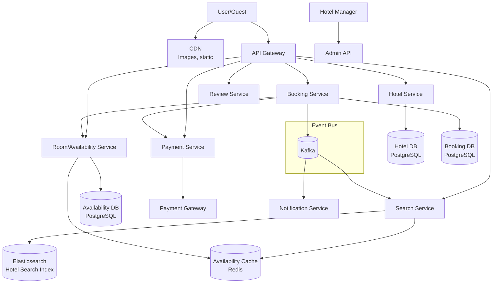
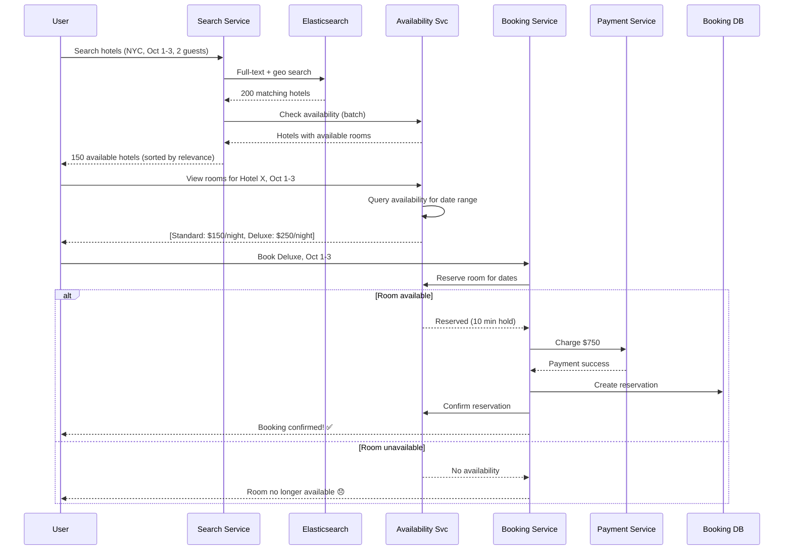
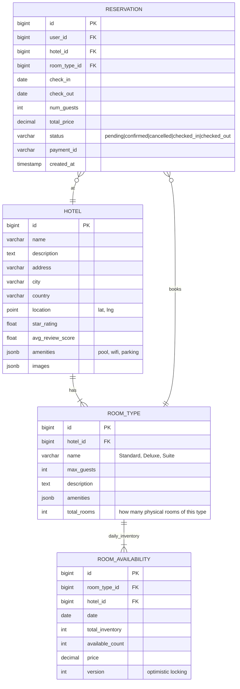
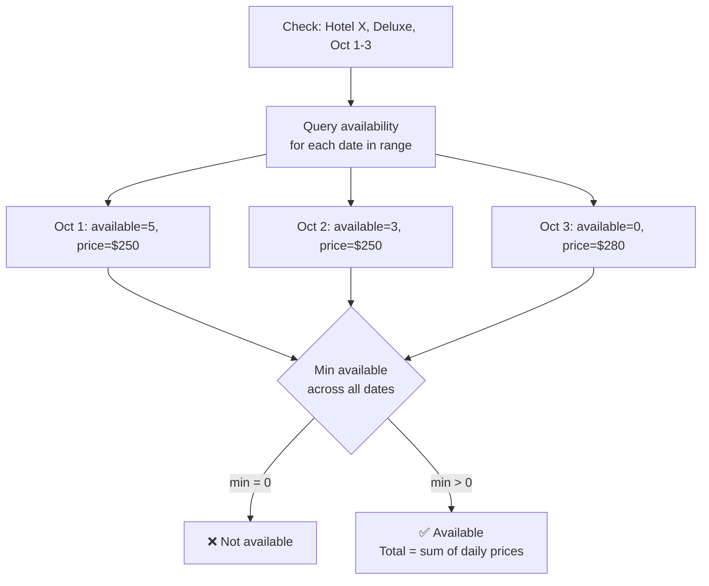
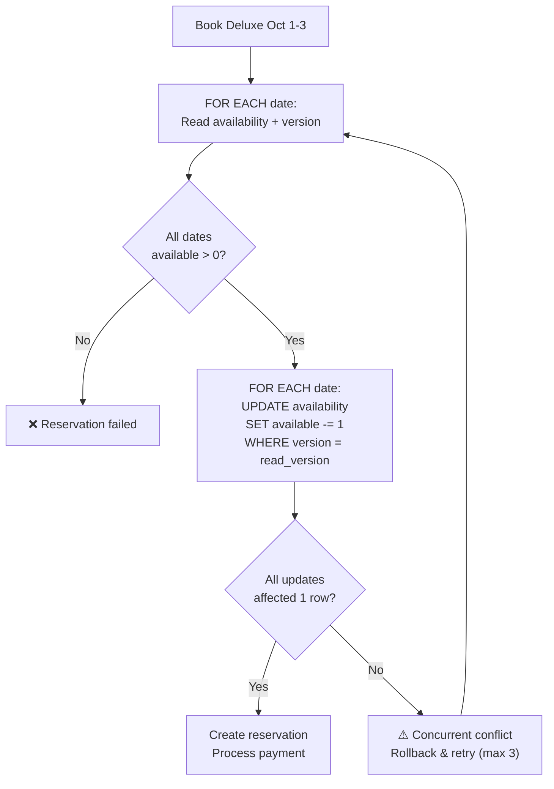
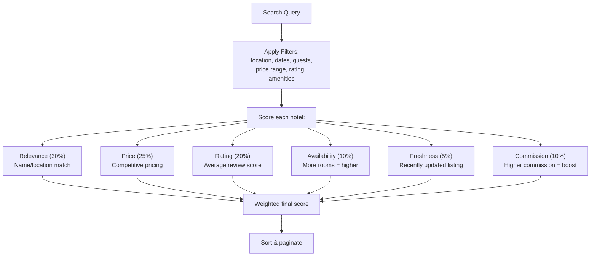
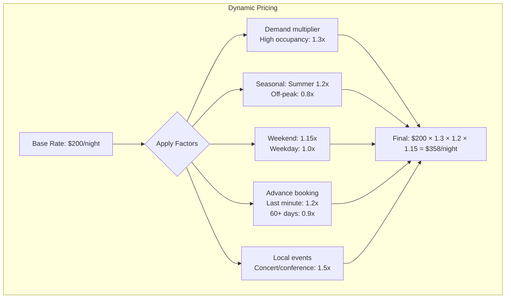

# 18. Hotel Reservation System

> **Difficulty**: Medium | **Asked by**: Airbnb, Booking.com, Expedia, Amazon, Google

## Table of Contents
- [Requirements](#requirements)
- [Capacity Estimation](#capacity-estimation)
- [High-Level Design](#high-level-design)
- [Low-Level Design](#low-level-design)
- [Implementation](#implementation)
- [Limitations & Improvements](#limitations--improvements)

---

## Requirements

### Functional Requirements
1. Search hotels by location, dates, guests, filters
2. View hotel details, room types, photos, reviews
3. Check room availability for date range
4. Book rooms with payment
5. Cancel/modify reservations
6. Hotel management portal (manage rooms, rates, availability)

### Non-Functional Requirements
1. **No Double-Booking**: Same room never booked twice for same dates
2. **High Availability**: 99.99% (bookings = revenue)
3. **Low Latency**: Search < 500ms, booking < 2s
4. **Scalability**: 5,000 cities, 1M hotels, 100M rooms
5. **Consistency**: Strong for reservations; eventual for search/reviews

---

## Capacity Estimation

```
Hotels: 1M
Rooms: 100M total
Daily searches: 500M
Daily bookings: 5M
Booking QPS: ~58 (avg), 500 (peak)
Search QPS: ~5,800 (avg), 20K (peak)
Average stay: 3 nights
Room-nights/day: 15M

Storage:
  Hotels: 1M × 10KB = 10 GB
  Rooms: 100M × 1KB = 100 GB
  Reservations: 5M/day × 2KB = 10 GB/day (3.6 TB/year)
  Availability: 100M rooms × 365 days × 20B = 730 GB
```

---

## High-Level Design

### Architecture Overview



### Search & Booking Flow



---

## Low-Level Design

### Data Models



### Availability Check Strategy



### Reservation with Optimistic Locking



### Search Ranking



### Rate Management



---

## Implementation

### Booking Service

```python
from decimal import Decimal
from datetime import date, timedelta
from typing import Optional
import uuid

class BookingService:
    """Handles hotel room reservations with consistency guarantees."""
    
    MAX_RETRIES = 3
    
    def __init__(self, db, availability_svc, payment_svc, 
                 notification_svc, event_bus):
        self.db = db
        self.availability = availability_svc
        self.payment = payment_svc
        self.notify = notification_svc
        self.events = event_bus
    
    async def create_reservation(self, user_id: int, hotel_id: int,
                                  room_type_id: int, check_in: date,
                                  check_out: date, num_guests: int,
                                  payment_info: dict) -> dict:
        """Create a reservation with optimistic locking."""
        
        reservation_id = str(uuid.uuid4())
        
        for attempt in range(self.MAX_RETRIES):
            try:
                # 1. Get availability and prices for date range
                dates = self._get_date_range(check_in, check_out)
                availability = await self.availability.get_for_dates(
                    hotel_id, room_type_id, dates
                )
                
                # 2. Check all dates have availability
                total_price = Decimal("0")
                versions = {}
                for day_avail in availability:
                    if day_avail["available_count"] <= 0:
                        return {"status": "unavailable",
                                "date": str(day_avail["date"])}
                    total_price += day_avail["price"]
                    versions[day_avail["date"]] = day_avail["version"]
                
                # 3. Reserve rooms (optimistic locking)
                async with self.db.transaction() as tx:
                    all_reserved = True
                    for d in dates:
                        rows = await tx.execute("""
                            UPDATE room_availability 
                            SET available_count = available_count - 1,
                                version = version + 1
                            WHERE hotel_id = %s AND room_type_id = %s
                              AND date = %s AND version = %s
                              AND available_count > 0
                        """, (hotel_id, room_type_id, d, versions[d]))
                        
                        if rows == 0:
                            all_reserved = False
                            break
                    
                    if not all_reserved:
                        # Rollback transaction, retry
                        raise OptimisticLockException()
                    
                    # 4. Process payment
                    payment = await self.payment.charge(
                        user_id=user_id,
                        amount=total_price,
                        idempotency_key=f"booking-{reservation_id}",
                        **payment_info
                    )
                    
                    if not payment["success"]:
                        raise PaymentFailedException(payment["reason"])
                    
                    # 5. Create reservation record
                    await tx.execute("""
                        INSERT INTO reservations 
                        (id, user_id, hotel_id, room_type_id, check_in,
                         check_out, num_guests, total_price, status, payment_id)
                        VALUES (%s, %s, %s, %s, %s, %s, %s, %s, 'confirmed', %s)
                    """, (reservation_id, user_id, hotel_id, room_type_id,
                          check_in, check_out, num_guests, total_price,
                          payment["payment_id"]))
                
                # 6. Publish event & notify
                await self.events.publish("reservation.confirmed", {
                    "reservation_id": reservation_id,
                    "hotel_id": hotel_id
                })
                await self.notify.send_confirmation(user_id, reservation_id)
                
                return {
                    "status": "confirmed",
                    "reservation_id": reservation_id,
                    "total_price": str(total_price)
                }
            
            except OptimisticLockException:
                if attempt == self.MAX_RETRIES - 1:
                    return {"status": "conflict",
                            "message": "Room no longer available"}
                continue  # Retry
    
    async def cancel_reservation(self, reservation_id: str, 
                                  user_id: int) -> dict:
        """Cancel reservation and release inventory."""
        reservation = await self.db.get_reservation(reservation_id)
        
        if reservation["user_id"] != user_id:
            return {"status": "unauthorized"}
        
        if reservation["status"] != "confirmed":
            return {"status": "cannot_cancel"}
        
        # Calculate refund based on cancellation policy
        refund_amount = self._calculate_refund(reservation)
        
        async with self.db.transaction() as tx:
            # Release inventory
            dates = self._get_date_range(
                reservation["check_in"], reservation["check_out"]
            )
            for d in dates:
                await tx.execute("""
                    UPDATE room_availability 
                    SET available_count = available_count + 1
                    WHERE hotel_id = %s AND room_type_id = %s AND date = %s
                """, (reservation["hotel_id"], 
                      reservation["room_type_id"], d))
            
            # Update reservation
            await tx.execute("""
                UPDATE reservations SET status = 'cancelled' 
                WHERE id = %s
            """, (reservation_id,))
        
        # Process refund
        if refund_amount > 0:
            await self.payment.refund(
                reservation["payment_id"], refund_amount
            )
        
        return {"status": "cancelled", "refund_amount": str(refund_amount)}
    
    def _get_date_range(self, check_in: date, check_out: date):
        dates = []
        current = check_in
        while current < check_out:
            dates.append(current)
            current += timedelta(days=1)
        return dates
    
    def _calculate_refund(self, reservation) -> Decimal:
        days_until_checkin = (reservation["check_in"] - date.today()).days
        if days_until_checkin > 7:
            return reservation["total_price"]  # Full refund
        elif days_until_checkin > 2:
            return reservation["total_price"] * Decimal("0.5")  # 50%
        else:
            return Decimal("0")  # No refund
```

---

## Limitations & Improvements

### Current Limitations

| Limitation | Impact | Severity |
|-----------|--------|----------|
| Optimistic locking conflicts during flash sales | Failed bookings for users | High |
| Availability cache staleness | Ghost availability | Medium |
| No overbooking support | Lost opportunity vs airlines | Low |
| Single-currency pricing | Complex for international users | Medium |
| Static cancellation policies | One-size-fits-all | Low |

### Improvement Areas

1. **Controlled Overbooking** — Allow 5% overbooking (airline model) with fallback hotels
2. **Real-time Pricing** — ML-based dynamic pricing considering demand, competition
3. **Geo-distributed** — Regional DB replicas for lower search latency
4. **Loyalty Program** — Points, tier-based pricing, exclusive inventory
5. **Multi-property Packages** — Flight + hotel bundles with distributed transactions

---

## Key Interview Discussion Points

1. **How to prevent double-booking?** Optimistic locking (version column) + DB constraint
2. **Pessimistic vs optimistic for bookings?** Optimistic: better throughput, retry on conflict
3. **How to handle availability cache inconsistency?** Short TTL + event-driven invalidation
4. **What about overbooking?** Hotels commonly overbook 5-10%; system tracks committed vs physical
5. **How to scale search?** Elasticsearch with geo queries + Redis cache for availability counts
