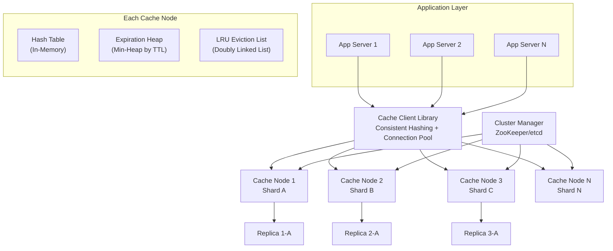
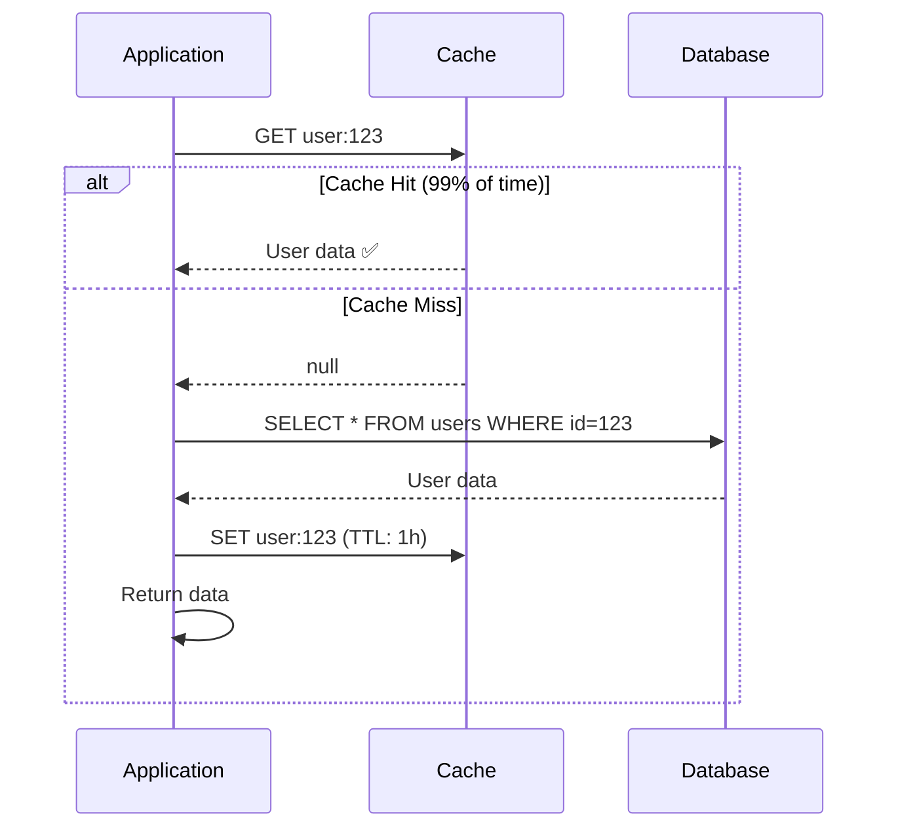
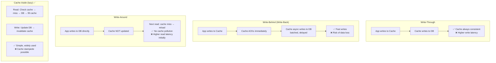
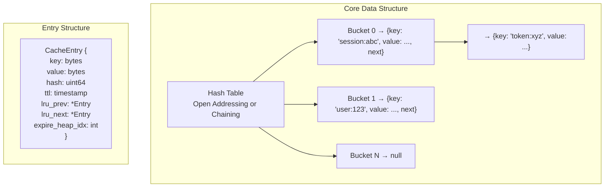
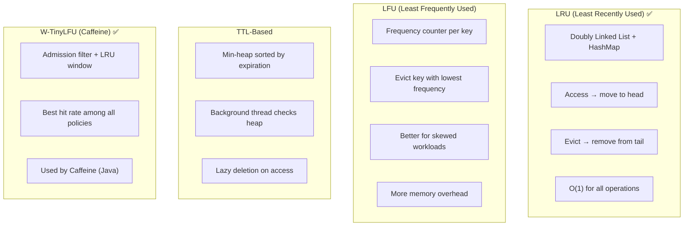
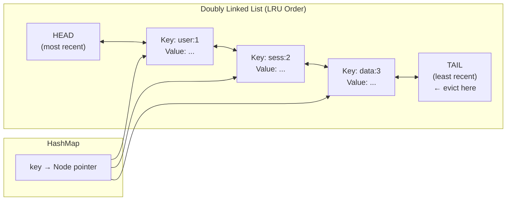
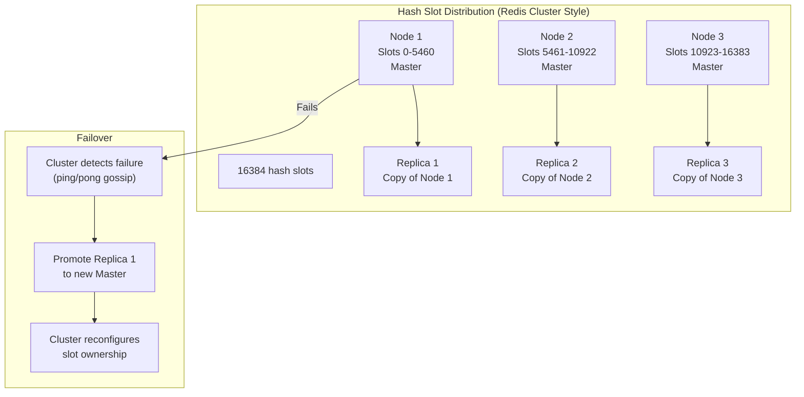
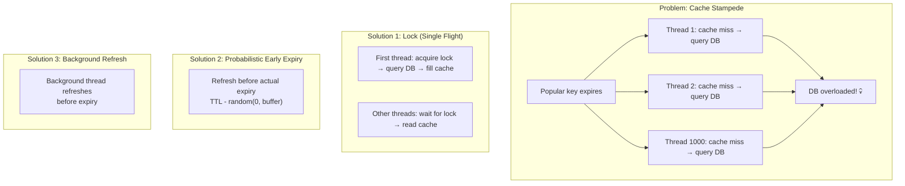

# 19. Distributed Cache (Redis/Memcached-like)

> **Difficulty**: Hard | **Asked by**: Amazon, Google, Netflix, Meta, Twitter

## Table of Contents
- [Requirements](#requirements)
- [Capacity Estimation](#capacity-estimation)
- [High-Level Design](#high-level-design)
- [Low-Level Design](#low-level-design)
- [Implementation](#implementation)
- [Limitations & Improvements](#limitations--improvements)

---

## Requirements

### Functional Requirements
1. `GET(key)` — Retrieve cached value by key
2. `SET(key, value, TTL)` — Store key-value with optional expiration
3. `DELETE(key)` — Remove a key
4. Support data structures (strings, lists, sets, hashes)
5. Atomic operations (increment, CAS)
6. Pub/Sub for cache invalidation

### Non-Functional Requirements
1. **Ultra-Low Latency**: < 1ms for reads, < 2ms for writes
2. **High Throughput**: 1M+ operations/second per node
3. **High Availability**: 99.99%, automatic failover
4. **Scalability**: Linear scaling with more nodes
5. **Tunable Consistency**: Strong within partition, eventual across replicas

---

## Capacity Estimation

```
Cached entries: 10 Billion key-value pairs
Average key size: 100 bytes
Average value size: 1 KB
Total memory: 10B × 1.1 KB ≈ 11 TB
Operations: 10M ops/sec cluster-wide
Nodes (64 GB each): 11 TB / 64 GB ≈ 172 nodes + replicas
With replication (factor 2): ~344 nodes
Network: 10M × 1KB = 10 GB/sec
```

---

## High-Level Design

### Architecture Overview



### Cache-Aside Pattern (Most Common)



### Write Strategies



---

## Low-Level Design

### Hash Table Design



### Eviction Policies



### LRU + Hash Table Implementation



### Cluster Topology



### Cache Stampede Prevention



---

## Implementation

### LRU Cache with TTL

```python
import time
import threading
import heapq
from collections import OrderedDict
from typing import Optional, Any

class LRUCache:
    """Thread-safe LRU cache with TTL support."""
    
    def __init__(self, max_size: int = 10000, default_ttl: int = 3600):
        self.max_size = max_size
        self.default_ttl = default_ttl
        self.cache = OrderedDict()  # key → (value, expire_at)
        self.lock = threading.RLock()
        self.stats = {"hits": 0, "misses": 0, "evictions": 0}
    
    def get(self, key: str) -> Optional[Any]:
        """Get value by key. O(1)."""
        with self.lock:
            if key not in self.cache:
                self.stats["misses"] += 1
                return None
            
            value, expire_at = self.cache[key]
            
            # Check TTL
            if expire_at and time.time() > expire_at:
                del self.cache[key]
                self.stats["misses"] += 1
                return None
            
            # Move to end (most recently used)
            self.cache.move_to_end(key)
            self.stats["hits"] += 1
            return value
    
    def set(self, key: str, value: Any, ttl: Optional[int] = None):
        """Set key-value with optional TTL. O(1)."""
        with self.lock:
            if key in self.cache:
                self.cache.move_to_end(key)
            
            expire_at = time.time() + (ttl or self.default_ttl) if (ttl or self.default_ttl) else None
            self.cache[key] = (value, expire_at)
            
            # Evict if over capacity
            while len(self.cache) > self.max_size:
                evicted_key, _ = self.cache.popitem(last=False)
                self.stats["evictions"] += 1
    
    def delete(self, key: str) -> bool:
        """Delete a key. O(1)."""
        with self.lock:
            if key in self.cache:
                del self.cache[key]
                return True
            return False
    
    def get_or_set(self, key: str, loader, ttl: Optional[int] = None):
        """Get from cache or load from source (prevents stampede)."""
        value = self.get(key)
        if value is not None:
            return value
        
        # Single-flight: only one thread loads
        with self.lock:
            # Double-check after acquiring lock
            value = self.get(key)
            if value is not None:
                return value
            
            value = loader()
            self.set(key, value, ttl)
            return value


class DistributedCache:
    """Client-side distributed cache with consistent hashing."""
    
    def __init__(self, nodes: list, virtual_nodes: int = 150):
        from consistent_hashing import ConsistentHashRing
        self.ring = ConsistentHashRing(virtual_nodes)
        self.connections = {}
        
        for node in nodes:
            self.ring.add_node(node)
            self.connections[node] = self._connect(node)
    
    def get(self, key: str) -> Optional[Any]:
        node = self.ring.get_node(key)
        conn = self.connections[node]
        return conn.get(key)
    
    def set(self, key: str, value: Any, ttl: int = 3600):
        node = self.ring.get_node(key)
        conn = self.connections[node]
        conn.set(key, value, ex=ttl)
    
    def delete(self, key: str):
        node = self.ring.get_node(key)
        conn = self.connections[node]
        conn.delete(key)
    
    def get_multi(self, keys: list) -> dict:
        """Batch get from multiple nodes."""
        # Group keys by node
        node_keys = {}
        for key in keys:
            node = self.ring.get_node(key)
            node_keys.setdefault(node, []).append(key)
        
        # Parallel fetch from each node
        results = {}
        for node, node_key_list in node_keys.items():
            conn = self.connections[node]
            values = conn.mget(node_key_list)
            for k, v in zip(node_key_list, values):
                if v is not None:
                    results[k] = v
        
        return results
    
    def _connect(self, node):
        import redis
        host, port = node.split(":")
        return redis.Redis(host=host, port=int(port), 
                          decode_responses=True,
                          socket_connect_timeout=2)
```

---

## Limitations & Improvements

### Current Limitations

| Limitation | Impact | Severity |
|-----------|--------|----------|
| Memory-only (volatile) | Data lost on restart | High |
| Cold start after failure | Cache miss storm hits DB | High |
| Cross-datacenter consistency | Stale data in remote regions | Medium |
| Hot key problem | Single node overloaded | High |
| Large values degrade performance | Network + serialization overhead | Medium |

### Improvement Areas

1. **Persistence** — AOF (Append-Only File) + RDB snapshots for recovery
2. **Hot Key Mitigation** — Client-side local cache + key replication across nodes
3. **Multi-tier Cache** — L1 (local process) → L2 (Redis) → L3 (database)
4. **Cache Warming** — Pre-populate cache on deployment using previous traffic patterns
5. **Compression** — Compress large values (zstd/snappy) to reduce memory and network

---

## Key Interview Discussion Points

1. **When NOT to cache?** Write-heavy data, highly dynamic data, large objects, data requiring strong consistency
2. **LRU vs LFU?** LRU for general workloads; LFU when few keys are extremely popular
3. **How to handle cache invalidation?** TTL-based (simple) + event-driven (accurate) + versioned keys
4. **Redis vs Memcached?** Redis: data structures, persistence, replication; Memcached: simpler, multi-threaded
5. **How to prevent thundering herd?** Locking (single-flight), probabilistic early refresh, stale-while-revalidate
